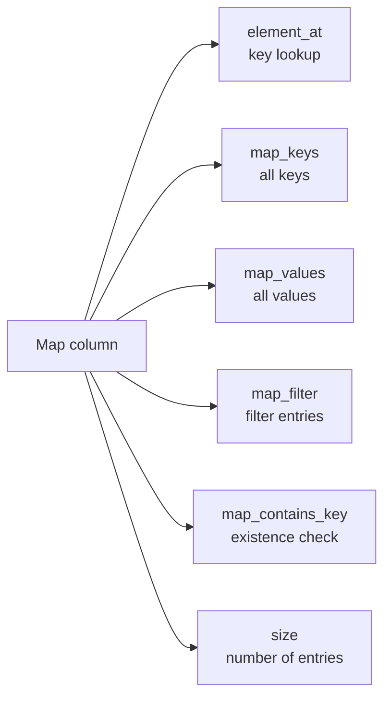

# :material-code-json: Map Filters

Map columns store key-value pairs. Spark SQL provides `element_at`, `map_keys`, `map_values`, `map_filter`, and `map_contains_key` for filtering and interrogating map columns.

______________________________________________________________________

## Setup

```sql
CREATE OR REPLACE TEMP VIEW orders AS
SELECT * FROM VALUES
  (1, 'shipped',   MAP('priority', 'high',   'promo', 'true',  'region', 'US')),
  (2, 'pending',   MAP('priority', 'low',    'region', 'EU')),
  (3, 'shipped',   MAP('priority', 'medium', 'promo', 'false', 'region', 'US')),
  (4, 'cancelled', MAP('region', 'APAC')),
  (5, 'shipped',   MAP('priority', 'high',   'region', 'EU')),
  (6, 'pending',   MAP('priority', 'low',    'promo', 'true',  'region', 'US'))
AS t(order_id, status, attributes);
```

______________________________________________________________________

## :material-sitemap: Overview



### :material-animation-play: Interactive Visualization — Map Key Filters

<div id="viz-filter-map" class="ts-viz"></div>

Choose a key lookup strategy and watch how missing keys and `NULL` maps behave. The badges reflect Spark 4.2 results for `element_at`, `map_contains_key`, and `map_filter`.

______________________________________________________________________

## Map Functions Reference

| Function                               | Description                                      |
| -------------------------------------- | ------------------------------------------------ |
| `element_at(map, key)`                 | Returns the value for `key`; NULL if key absent  |
| `map_keys(map)`                        | Returns an array of all keys                     |
| `map_values(map)`                      | Returns an array of all values                   |
| `map_filter(map, (k, v) -> condition)` | Returns sub-map of entries satisfying the lambda |
| `size(map)`                            | Returns the number of key-value pairs            |
| `map_contains_key(map, key)`           | Returns TRUE if the key exists                   |

______________________________________________________________________

## :material-magnify: Behavior Notes

1. **element_at returns NULL for missing keys** — `element_at(attributes, 'promo')` returns NULL when the key is absent; always guard comparisons with `IS NOT NULL` or `map_contains_key`.
2. **`map_contains_key` for existence** — Prefer `map_contains_key` over comparing `element_at(...) IS NOT NULL` for readability; note that a `NULL` map returns `NULL`, not `FALSE`.
3. **CAST for numeric comparisons** — Map values are strings when created from `VALUES`; use `CAST(element_at(map, key) AS DOUBLE)` for numeric predicates.
4. **map_filter returns a map** — The `map_filter` HOF returns a new map; use `size(map_filter(...)) > 0` to use as a row predicate.
5. **map_keys / map_values return arrays** — Combine with `array_contains` to check for key or value membership.

______________________________________________________________________

## :material-information-outline: Verified Behavior on Databricks SQL

1. **`map_contains_key` keeps three-valued logic** — on a real Databricks SQL warehouse, `map_contains_key(CAST(NULL AS MAP<STRING, STRING>), 'promo')` returned `NULL`, not `FALSE`.
2. **Duplicate keys are rejected by default** — `MAP('a', 1, 'a', 2)` and `map_concat(...)` with overlapping keys both failed on Databricks SQL with `DUPLICATED_MAP_KEY`. Do not rely on silent "last wins" behavior unless the session owner explicitly changes `spark.sql.mapKeyDedupPolicy`.

______________________________________________________________________

## :material-flask-outline: Examples

### :material-numeric-1-circle: Filter by exact key value

```sql
SELECT order_id, status, element_at(attributes, 'priority') AS priority
FROM orders
WHERE element_at(attributes, 'priority') = 'high';
-- Result:
-- order_id | status  | priority
-- ---------|---------|----------
-- 1        | shipped | high
-- 5        | shipped | high
```

### :material-numeric-2-circle: map_contains_key existence check

```sql
SELECT order_id, status, attributes
FROM orders
WHERE map_contains_key(attributes, 'promo');
-- Result:
-- order_id | status  | attributes
-- ---------|---------|-------------------------------------------
-- 1        | shipped | {priority->high, promo->true, region->US}
-- 3        | shipped | {priority->medium, promo->false, region->US}
-- 6        | pending | {priority->low, promo->true, region->US}
```

### :material-numeric-3-circle: Numeric comparison after CAST

```sql
-- Illustrative: treat priority as a score (high=3, medium=2, low=1)
SELECT
    order_id,
    element_at(attributes, 'priority') AS priority_label,
    CASE element_at(attributes, 'priority')
        WHEN 'high'   THEN 3
        WHEN 'medium' THEN 2
        WHEN 'low'    THEN 1
    END AS priority_score
FROM orders
WHERE
    CASE element_at(attributes, 'priority')
        WHEN 'high'   THEN 3
        WHEN 'medium' THEN 2
        WHEN 'low'    THEN 1
    END >= 2;
-- Result:
-- order_id | priority_label | priority_score
-- ---------|----------------|---------------
-- 1        | high           | 3
-- 3        | medium         | 2
-- 5        | high           | 3
```

### :material-numeric-4-circle: map_filter to keep only high-priority entries, then check size

```sql
SELECT
    order_id,
    map_filter(attributes, (k, v) -> k = 'priority' AND v = 'high') AS high_priority_map
FROM orders
WHERE size(map_filter(attributes, (k, v) -> k = 'priority' AND v = 'high')) > 0;
-- Result:
-- order_id | high_priority_map
-- ---------|-------------------
-- 1        | {priority->high}
-- 5        | {priority->high}
```

### :material-numeric-5-circle: Filter by map size

```sql
SELECT order_id, status, size(attributes) AS attr_count
FROM orders
WHERE size(attributes) >= 3;
-- Result:
-- order_id | status  | attr_count
-- ---------|---------|----------
-- 1        | shipped | 3
-- 3        | shipped | 3
-- 6        | pending | 3
```

______________________________________________________________________

## :material-brain: When to Use

| Scenario                               | Recommended                            |
| -------------------------------------- | -------------------------------------- |
| Filter by a specific key's value       | `element_at(map, key) = value`         |
| Check whether a key exists             | `map_contains_key(map, key)`           |
| Filter map entries by condition        | `map_filter` HOF                       |
| Check if any value matches a condition | `array_contains(map_values(map), val)` |
| Filter rows by number of map entries   | `size(map) >= N`                       |

______________________________________________________________________

## :material-merge: map_concat — Merge Non-Overlapping Maps

```sql
-- Merge disjoint maps safely
SELECT order_id,
       map_concat(MAP('channel', 'web', 'source', 'checkout'), attributes) AS merged_attrs
FROM orders;
```

!!! note "Databricks duplicate-key rule"

    On Databricks SQL warehouses, `map_concat` does **not** silently let the right map
    win when keys overlap. If both inputs contain the same key, Databricks raises
    `DUPLICATED_MAP_KEY` unless the session policy is changed.

______________________________________________________________________

## :material-function-variant: transform_values and transform_keys HOFs

```sql
-- Uppercase all values in the map
SELECT order_id, transform_values(attributes, (k, v) -> UPPER(v)) AS upper_attrs
FROM orders;

-- Add a prefix to all keys
SELECT order_id, transform_keys(attributes, (k, v) -> 'attr_' || k) AS prefixed_attrs
FROM orders;

-- Numeric conversion: replace priority label with numeric score
SELECT order_id,
       transform_values(attributes, (k, v) ->
           CASE WHEN k = 'priority' THEN
               CASE v WHEN 'high' THEN '3' WHEN 'medium' THEN '2' ELSE '1' END
           ELSE v END
       ) AS scored_attrs
FROM orders;
```

______________________________________________________________________

## :material-text-box-search: str_to_map — Parse a Delimited String into a Map

```sql
-- Parse 'key1=val1,key2=val2' into a map
SELECT str_to_map('priority=high,region=US,promo=true', ',', '=') AS parsed;
-- Result: {priority -> high, region -> US, promo -> true}

-- Practical: parse a config column stored as a string
SELECT order_id,
       element_at(str_to_map(config_string, ';', ':'), 'timeout') AS timeout_value
FROM order_configs;
```

______________________________________________________________________

## :material-alert-circle: Common Pitfalls

| Mistake                                                               | Behaviour                                             | Fix                                                   |
| --------------------------------------------------------------------- | ----------------------------------------------------- | ----------------------------------------------------- |
| `element_at(map, 'missing_key') = 'x'`                                | NULL comparison → UNKNOWN → row excluded              | Guard with `map_contains_key` first                   |
| Duplicate keys in `MAP(...)` or overlapping keys in `map_concat(...)` | Databricks SQL raises `DUPLICATED_MAP_KEY` by default | Keep keys unique, or dedupe before concatenating maps |
| `map_filter` returning empty map treated as false                     | `size({}) = 0` but map itself is not NULL             | Use `size(map_filter(...)) > 0` explicitly            |
| Comparing map values with numeric ops without CAST                    | ClassCastException or wrong type coercion             | `CAST(element_at(map,'score') AS INT)`                |

<script src="../../../../assets/js/querying-filter-viz.js"></script>
