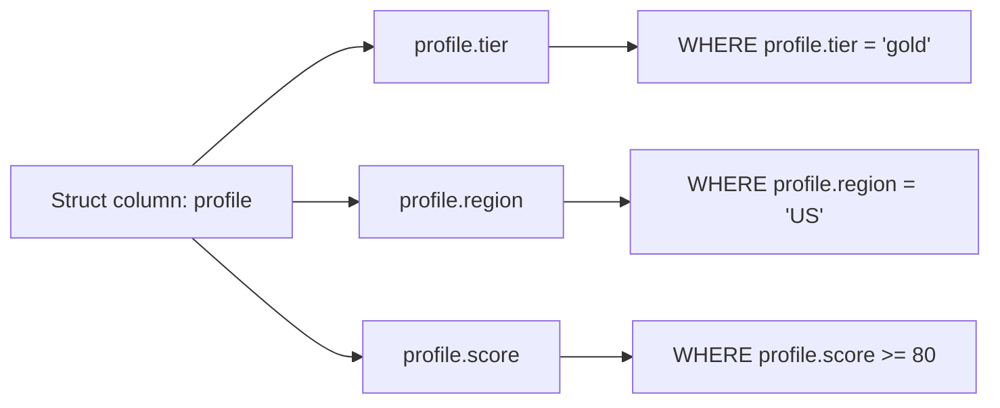

# :material-code-braces: Struct Filters

Struct columns store named, typed fields. Access individual fields with dot notation (`column.field`) and filter on them like any scalar column.

______________________________________________________________________

## Setup

```sql
CREATE OR REPLACE TEMP VIEW customers AS
SELECT * FROM VALUES
  (1, 'Alice', named_struct('tier', 'gold',   'region', 'US',   'score', 95)),
  (2, 'Bob',   named_struct('tier', 'silver', 'region', 'EU',   'score', 72)),
  (3, 'Carol', named_struct('tier', 'bronze', 'region', 'US',   'score', 45)),
  (4, 'Dave',  named_struct('tier', 'gold',   'region', 'APAC', 'score', 88)),
  (5, 'Eve',   CAST(NULL AS STRUCT<tier: STRING, region: STRING, score: INT>))
AS t(id, name, profile);
-- profile fields: tier (STRING), region (STRING), score (INT)
```

______________________________________________________________________

## :material-sitemap: Overview



### :material-animation-play: Interactive Visualization — Dot-Notation Filters

<div id="viz-filter-struct" class="ts-viz"></div>

Select a nested-field predicate to see which rows survive and how a `NULL` struct propagates. The outcomes match Spark 4.2 queries against the verified named-field setup above.

______________________________________________________________________

## :material-magnify: Behavior Notes

1. **Dot notation** — Access struct fields with `column.field`; nested structs chain: `a.b.c`.
2. **NULL struct propagation** — If the struct column itself is NULL, all field accesses return NULL; comparisons yield UNKNOWN and the row is excluded by `WHERE`.
3. **NULL guard pattern** — Use `profile IS NOT NULL AND profile.score >= 80` to safely filter when the struct may be NULL.
4. **Pushdown support** — Catalyst can push predicates on struct fields down to Parquet and Delta scans when the field name resolves correctly.

______________________________________________________________________

## :material-flask-outline: Examples

### :material-numeric-1-circle: Basic nested field filter

```sql
SELECT id, name, profile.tier AS tier
FROM customers
WHERE profile.tier = 'gold';
-- Result:
-- id | name  | tier
-- ---|-------|-----
-- 1  | Alice | gold
-- 4  | Dave  | gold
```

### :material-numeric-2-circle: Multiple nested field conditions

```sql
SELECT id, name, profile.tier AS tier, profile.score AS score
FROM customers
WHERE profile.tier = 'gold' AND profile.score >= 90;
-- Result:
-- id | name  | tier | score
-- ---|-------|------|------
-- 1  | Alice | gold | 95
```

### :material-numeric-3-circle: NULL struct guard

```sql
SELECT id, name
FROM customers
WHERE profile IS NOT NULL AND profile.score < 50;
-- Result:
-- id | name
-- ---|-----
-- 3  | Carol
```

### :material-numeric-4-circle: Mix nested and top-level columns in filter

```sql
SELECT id, name, profile.region AS region, profile.score AS score
FROM customers
WHERE profile.region = 'US' AND profile.score > 50 AND name != 'Carol';
-- Result:
-- id | name  | region | score
-- ---|-------|--------|------
-- 1  | Alice | US     | 95
```

### :material-numeric-5-circle: Struct field pushdown — EXPLAIN note

```sql
-- On a file-backed source with the same schema
EXPLAIN FORMATTED
SELECT id
FROM parquet.`/path/to/customers`
WHERE profile.tier = 'gold';
-- Result (excerpt):
-- PushedFilters: [IsNotNull(profile.tier), EqualTo(profile.tier,gold)]
-- Struct field predicates are pushed to the scan layer when the source supports it.
```

______________________________________________________________________

## :material-brain: When to Use

| Scenario                                 | Recommended                                           |
| ---------------------------------------- | ----------------------------------------------------- |
| Filter on a single nested field          | `WHERE struct_col.field = value`                      |
| Combine multiple nested field predicates | `AND` / `OR` with dot-notation fields                 |
| Safely filter when struct may be NULL    | `struct_col IS NOT NULL AND struct_col.field = value` |
| Deep nesting                             | Chain dot notation: `a.b.c = value`                   |

______________________________________________________________________

## :material-layers: Deeply Nested Structs

```sql
CREATE OR REPLACE TEMP VIEW orders AS
SELECT * FROM VALUES
  (1, named_struct('delivery', named_struct('status', 'shipped',  'delivered_on', '2024-06-01'),
                    'loyalty',  named_struct('tier',   'gold',     'score',        95))),
  (2, named_struct('delivery', named_struct('status', 'pending',  'delivered_on', NULL),
                    'loyalty',  named_struct('tier',   'silver',   'score',        72))),
  (3, named_struct('delivery', named_struct('status', 'returned', 'delivered_on', '2024-05-20'),
                    'loyalty',  named_struct('tier',   'bronze',   'score',        40)))
AS t(order_id, meta);

-- Access three-level nesting with chained dot notation
SELECT order_id, meta.delivery.status AS del_status
FROM orders
WHERE meta.delivery.status = 'shipped'
  AND meta.loyalty.score >= 80;
```

______________________________________________________________________

## :material-function-variant: named_struct — Build Structs in Queries

`named_struct` lets you construct or reconstruct struct values inline.

```sql
-- Assemble a new struct from scalar columns
SELECT
    id,
    named_struct('tier', tier, 'region', region, 'score', score) AS profile
FROM customer_flat;

-- Filter on a computed struct field
SELECT id,
       named_struct('full_name', first_name || ' ' || last_name, 'age', age) AS person
FROM people
WHERE age >= 18;
```

______________________________________________________________________

## :material-unfold-more-horizontal: Struct Wildcard Unpacking (`.*`)

```sql
-- Expand all struct fields into top-level columns
SELECT id, profile.*
FROM customers;
-- Equivalent to: SELECT id, profile.tier, profile.region, profile.score FROM customers

-- Unpack multiple nested structs
SELECT order_id, meta.delivery.*, meta.loyalty.*
FROM orders;
```

______________________________________________________________________

## :material-alert-circle: Common Pitfalls

| Mistake                                            | Behaviour                                    | Fix                                                            |
| -------------------------------------------------- | -------------------------------------------- | -------------------------------------------------------------- |
| `WHERE struct_col.field = val` when struct is NULL | NULL propagation → row excluded              | Add `struct_col IS NOT NULL AND ...`                           |
| Modifying a struct field (no update-in-place)      | Struct is immutable                          | Rebuild with `named_struct` or `struct_col.* EXCEPT`-style CTE |
| Pushdown blocked by function on struct field       | e.g. `UPPER(profile.tier)` prevents pushdown | Filter on raw field value, transform in SELECT                 |
| Accessing missing field after schema evolution     | Analysis error                               | Confirm schema with `DESCRIBE table` before querying           |

<script src="../../../../assets/js/querying-filter-viz.js"></script>
