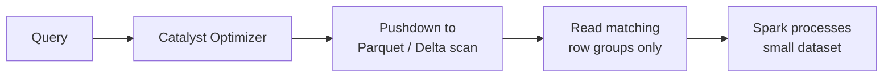
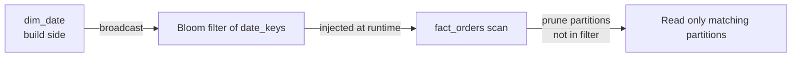

# :material-lightning-bolt: Predicate Pushdown

Predicate pushdown is a Catalyst optimizer technique that moves filter predicates as close to the data source as possible, minimising the bytes read from storage.

______________________________________________________________________

## :material-sitemap: Overview

### With Pushdown



### Without Pushdown


### :material-animation-play: Interactive Visualization — Pushdown Eligibility

<div id="viz-filter-pp" class="ts-viz"></div>

Choose a predicate shape to see whether Spark can push it into a file scan. The outcomes match Spark 4.2 `EXPLAIN FORMATTED` checks on Parquet.

______________________________________________________________________

## :material-information-outline: Verified Behavior on Databricks SQL Warehouse

1. **Photon / Delta plans expose different filter fields** — on a live Databricks SQL warehouse, `EXPLAIN FORMATTED` for Delta scans surfaced `DictionaryFilters`, `RequiredDataFilters`, and `PartitionFilters` rather than the open-source Spark `PushedFilters` string shown in many local examples.
2. **Simple SQL UDFs can still be pushed down** — a SQL UDF defined as `is_us(r STRING) RETURNS BOOLEAN RETURN r = 'US'` was inlined on Databricks, and the plan still showed `DictionaryFilters: [(region = US)]`.
3. **Wrapped expressions still reduce pushdown opportunities** — `amount * 1.1 > 1000` stayed in `RequiredDataFilters`, while the rewritten bare-column predicate `amount > 909.09` appeared in `DictionaryFilters`.
4. **Date-part predicates may still appear in `PartitionFilters` on Delta** — `YEAR(event_date) = 2024` was not a reliable "no pruning" example on Databricks, so use `EXPLAIN FORMATTED` to confirm real behaviour on your table.
5. **Dynamic partition pruning was visible in the scan node** — the Databricks plan showed a `dynamicpruning...` entry inside `PartitionFilters` for a fact/dimension join.

______________________________________________________________________

## :material-pin: What Enables Pushdown

Predicates using the following operators on plain column references are pushed down:

| Operator / Pattern      | Example                          |
| ----------------------- | -------------------------------- |
| Equality                | `region = 'US'`                  |
| Comparison              | `amount > 500`, `amount <= 1000` |
| Not equal               | `status != 'cancelled'`          |
| BETWEEN                 | `amount BETWEEN 100 AND 500`     |
| IN (literal list)       | `region IN ('US', 'EU')`         |
| IS NULL                 | `region IS NULL`                 |
| IS NOT NULL             | `score IS NOT NULL`              |
| AND / OR combinations   | `region = 'US' AND amount > 500` |
| Partition column filter | `year = 2024 AND month = 1`      |

______________________________________________________________________

## :material-pin: What Blocks Pushdown

| Pattern                                                      | Why it blocks                                    |
| ------------------------------------------------------------ | ------------------------------------------------ |
| Opaque UDFs — `my_udf(col) = 1`                              | Catalyst cannot introspect runtime UDF logic     |
| Expression on column — `col + 1 > 5`                         | Column is wrapped; pushdown needs bare reference |
| `CAST(col AS ...)` on the left — `CAST(amount AS INT) > 500` | Wrapped expression                               |
| Non-deterministic functions — `RAND() < 0.5`                 | Varies per row; cannot be pushed                 |
| Python UDFs (PySpark)                                        | Opaque to JVM Catalyst                           |

______________________________________________________________________

## :material-flask-outline: Examples

### :material-numeric-1-circle: Verify pushdown with EXPLAIN FORMATTED

```sql
EXPLAIN FORMATTED
SELECT order_id, amount
FROM orders
WHERE region = 'US' AND amount > 500;
-- Result (excerpt from plan output):
-- == Physical Plan ==
-- ...
-- DictionaryFilters: [(region = US), (amount > 500.0)]
-- RequiredDataFilters: [isnotnull(region), isnotnull(amount),
--                      (region = US), (amount > 500.0)]
-- ...
```

### :material-numeric-2-circle: [Databricks] Simple SQL UDFs may be inlined

```sql
-- Define a simple UDF
CREATE OR REPLACE TEMPORARY FUNCTION is_us(r STRING) RETURNS BOOLEAN
RETURN r = 'US';

EXPLAIN FORMATTED
SELECT order_id FROM orders WHERE is_us(region);
-- Result (excerpt):
-- DictionaryFilters: [(region = US)]
-- RequiredDataFilters: [isnotnull(region), (region = US)]
```

!!! note "Databricks SQL vs PySpark UDFs"

    On a Databricks SQL warehouse, a simple SQL UDF like `is_us(region)` can be inlined,
    so it is **not** a reliable "pushdown blocker" example there. The stronger warning still
    applies to opaque runtime UDFs such as Python UDFs in Spark jobs.

### :material-numeric-3-circle: Expression on column blocks pushdown

```sql
EXPLAIN FORMATTED
SELECT order_id FROM orders WHERE amount * 1.1 > 1000;
-- Result (excerpt):
-- RequiredDataFilters: [isnotnull(amount), ((amount * 1.1) > 1000.0)]
-- No DictionaryFilters entry for the multiplied predicate

-- Rewrite as bare column reference to enable pushdown:
EXPLAIN FORMATTED
SELECT order_id FROM orders WHERE amount > 909.09;
-- Result (excerpt):
-- DictionaryFilters: [(amount > 909.09)]
```

______________________________________________________________________

## :material-arrow-collapse-down: Push Filters Before Joins and Windows

Predicate pushdown into the file scan is only half the story — once past the scan, a
filter can still read (and shuffle) far more data than necessary if it sits **above** a
join or window function instead of before it. Catalyst automatically pushes filters
below **inner** joins, but two cases still require writing the query so the filter comes
first.

### Inner joins: Catalyst already does this — verify, don't assume

```sql
EXPLAIN SELECT o.order_id, c.name
FROM orders o JOIN customers c ON o.customer_id = c.customer_id
WHERE o.region = 'US';
```

```text
+- Project [order_id, name]
   +- BroadcastHashJoin [customer_id], [customer_id], Inner, BuildRight
      :- Project [order_id, customer_id]
      :  +- Filter (isnotnull(region) AND (region = US))   ← pushed below the join
      :     +- FileScan parquet orders [...] PushedFilters: [EqualTo(region,US)]
      +- BroadcastExchange ...
         +- FileScan parquet customers [...]
```

`region = 'US'` is filtered — and pushed all the way into the Parquet scan's
`PushedFilters` — **before** the join runs, so the join only ever sees the reduced set
of US orders. This happens automatically for inner joins; writing the filter inside a
CTE before the `JOIN` produces the identical plan, but relying on the automatic pushdown
without verifying it via `EXPLAIN` is risky once the join type changes (see
[Outer Join Filter Pitfall](../joins/issues/outer-join-filter-pitfall.md) for the case
where a filter on the non-preserved side of an outer join changes join semantics
entirely rather than just failing to push down).

### Window functions: a filter on the window's own output cannot be pushed below it

```sql
EXPLAIN SELECT * FROM (
    SELECT order_id, region, amount,
           RANK() OVER (PARTITION BY region ORDER BY amount DESC) AS rnk
    FROM orders
) WHERE rnk <= 1;
```

```text
+- Filter (rnk <= 1)                              ← stays ABOVE the Window
   +- Window [rank(amount) ... AS rnk], [region], [amount DESC]
      +- WindowGroupLimit [region], [amount DESC], rank(amount), 1, Final
         +- Sort [region, amount DESC], false, 0
            +- Exchange hashpartitioning(region, 200)
               +- WindowGroupLimit [region], [amount DESC], rank(amount), 1, Partial
                  +- Sort [region, amount DESC], false, 0
                     +- FileScan parquet orders [...] PushedFilters: []
```

`rnk` doesn't exist until the `Window` node computes it, so `rnk <= 1` can never move
below the `Window`/`Sort`/`Exchange` — **every** row must be shuffled and sorted first.
(Spark 3.5+ does add a `WindowGroupLimit` optimization here that short-circuits each
partition once rank 1 is found, but the full shuffle and sort still happen.) This is
inherent to the technique, not a bug — but it means any filter that *can* be expressed
without the window's output should be applied separately, and first:

```sql
-- Filter on a column untouched by the window IS pushed below the Window/Sort/Exchange
EXPLAIN SELECT * FROM (
    SELECT order_id, region, amount,
           RANK() OVER (PARTITION BY region ORDER BY amount DESC) AS rnk
    FROM orders
) WHERE region = 'US';
```

```text
+- Window [rank(amount) ... AS rnk], [region], [amount DESC]
   +- Sort [region, amount DESC], false, 0
      +- Exchange hashpartitioning(region, 200)
         +- Filter (isnotnull(region) AND (region = US))   ← pushed below the Window
            +- FileScan parquet orders [...] PushedFilters: [EqualTo(region,US)]
```

!!! tip "Filter what you can before the window runs"

    If a query both restricts to a subset of rows (`region = 'US'`) **and** ranks within
    that subset, put the restriction in a `WHERE` clause on a CTE/subquery *before* the
    window function, even though Catalyst places it there automatically when the
    predicate doesn't touch the window's output. Combining an unrelated restriction with
    the window's own output column in a single `WHERE` (e.g. `WHERE region = 'US' AND rnk <= 1`) still pushes the `region` half down and leaves `rnk <= 1` above — Catalyst
    splits conjunctive (`AND`) predicates and pushes each part as far down as it can
    independently.

______________________________________________________________________

## Delta-Specific Optimisations

!!! note "[Databricks] Delta Lake extension"

    The section below describes Delta-specific behaviour. The Parquet pushdown examples above are the open-source Spark 4.2 baseline.

Delta Lake extends pushdown with file-level statistics (min/max per column) and Z-ORDER clustering:

```sql
-- Cluster the table by frequently filtered columns
OPTIMIZE orders ZORDER BY (region, status);

-- Spark now reads only Delta files whose region/status stats match the filter
SELECT order_id, amount
FROM orders
WHERE region = 'US' AND status = 'shipped';
```

Z-ORDER is most effective when filtering on two or three high-cardinality columns together.

______________________________________________________________________

## Configuration Reference

| Configuration key                                     | Default | Effect                                                   |
| ----------------------------------------------------- | ------- | -------------------------------------------------------- |
| `spark.sql.parquet.filterPushdown`                    | `true`  | Push predicates into Parquet row-group filters           |
| `spark.sql.orc.filterPushdown`                        | `true`  | Push predicates into ORC stripe filters                  |
| `spark.sql.optimizer.dynamicPartitionPruning.enabled` | `true`  | Prune partitions at runtime using broadcast join results |

______________________________________________________________________

## :material-brain: When to Use

| Scenario                              | Recommendation                                           |
| ------------------------------------- | -------------------------------------------------------- |
| Querying large Parquet / Delta tables | Always filter on bare column references                  |
| Partition columns available           | Filter on partition columns first                        |
| Frequently filtered columns           | Apply `OPTIMIZE ... ZORDER BY` on Delta                  |
| UDF required in filter                | Push additional bare-column predicates alongside the UDF |
| Checking if pushdown is active        | Use `EXPLAIN FORMATTED` and inspect scan filter fields   |

______________________________________________________________________

## :material-folder-multiple: Partition Pruning

Partition pruning is separate from row-group pushdown — it skips entire **directories**
on storage rather than row groups within a file.

```sql
-- Table partitioned by (year, month)
-- Spark reads ONLY the year=2024/month=6/ directory
SELECT order_id, amount
FROM orders
WHERE year = 2024 AND month = 6;
```

!!! tip "Always filter on partition columns first"

    Partition pruning eliminates I/O at the directory level — far cheaper than Parquet
    row-group filtering. Add partition column predicates even when other filters are present.

```sql
-- Good: partition prune first, then row-group filter
SELECT * FROM events
WHERE event_date = '2024-06-01'   -- partition prune
  AND event_type = 'click';       -- row-group filter within the partition

-- On Databricks Delta, this can still show up in PartitionFilters
SELECT * FROM events WHERE YEAR(event_date) = 2024;

-- Portable / clearer form: use a range predicate
SELECT * FROM events WHERE event_date >= '2024-01-01' AND event_date < '2025-01-01';
```

!!! note "Verify date-part pruning instead of assuming"

    On the Databricks warehouse used for verification, `EXPLAIN FORMATTED` still showed
    `PartitionFilters: [isnotnull(event_date), (year(event_date) = 2024)]` for the
    `YEAR(event_date) = 2024` example above. Prefer the explicit range form for clarity
    and portability, but confirm the real pruning behaviour with `EXPLAIN FORMATTED`.

### :material-close-circle-outline: When Partition Pruning Actually Fails

Verified against a local Spark 4.2 table partitioned by `event_date`, deterministic
built-in functions on the partition column (`YEAR(...)`, `CAST(... AS STRING)`,
`DATE_FORMAT(...)`) **still prune correctly** — `PartitionFilters` shows the wrapped
expression and only the matching directories are listed. This is because partition
pruning evaluates the predicate directly against the small, already-known list of
partition values at planning time; it does not need the same "bare column reference"
Parquet row-group pushdown requires (see [What Blocks Pushdown](#what-blocks-pushdown)
above for that separate, stricter rule).

Two patterns genuinely defeat partition pruning and cause a **full table scan**,
confirmed via `EXPLAIN`:

```sql
-- FAILS: OR mixes a partition-column predicate with a non-partition-column predicate
EXPLAIN SELECT * FROM events
WHERE event_date = DATE'2024-01-10' OR event_type = 'view';
-- PartitionFilters: []   ← empty; every partition directory is scanned
```

```sql
-- FAILS: an opaque UDF wrapping the partition column
CREATE FUNCTION py_year AS 'my.module.PyYear';   -- e.g. a registered Python UDF
EXPLAIN SELECT * FROM events WHERE py_year(event_date) = 2024;
-- PartitionFilters: []   ← Catalyst cannot introspect the UDF, so it cannot be
--                          evaluated against partition values at plan time
```

```sql
-- FIX: put the predicate directly on the partition column, deterministic and AND-ed
EXPLAIN SELECT * FROM events
WHERE event_date = DATE'2024-01-10' AND (event_type = 'view' OR event_type = 'click');
-- PartitionFilters: [isnotnull(event_date), (event_date = 2024-01-10)]
```

!!! danger "OR across partition and non-partition columns disables pruning entirely"

    `WHERE partition_col = X OR other_col = Y` can match rows in **any** partition
    (a row could satisfy `other_col = Y` regardless of its `partition_col` value), so
    Spark must scan every directory. If the business logic allows it, rewrite as a
    `UNION ALL` of two separately prunable queries instead:

    ```sql
    SELECT * FROM events WHERE event_date = DATE'2024-01-10'
    UNION ALL
    SELECT * FROM events WHERE event_type = 'view' AND event_date != DATE'2024-01-10';
    ```

!!! warning "Opaque UDFs on the partition column"

    Built-in functions (`YEAR`, `DATE_FORMAT`, `CAST`, ...) are known to Catalyst and can
    still be evaluated against partition values. A Python UDF, or any UDF Catalyst can't
    inline, is opaque — the predicate is evaluated only **after** every partition has
    already been scanned. Prefer the built-in equivalent, or filter on the raw partition
    column directly and apply the UDF-based logic as an additional filter afterward.

______________________________________________________________________

## :material-lightning-bolt-circle: Dynamic Partition Pruning (DPP)

DPP prunes partitions at **runtime** using values discovered during a broadcast join.
Enabled by default in Spark 3.x (`spark.sql.optimizer.dynamicPartitionPruning.enabled = true`).



```sql
-- DPP fires when joining a large partitioned fact table
-- against a small dimension table filtered by a predicate
SELECT f.order_id, f.amount, d.quarter
FROM fact_orders f
JOIN dim_date d ON f.order_date = d.date_key
WHERE d.year = 2024 AND d.quarter = 'Q2';
-- Spark broadcasts dim_date, then prunes fact_orders partitions at runtime
```

**Verify DPP in EXPLAIN:**

```sql
EXPLAIN FORMATTED
SELECT f.order_id, d.quarter
FROM fact_orders f
JOIN dim_date d ON f.order_date = d.date_key
WHERE d.year = 2024;
-- Look for: dynamicpruning... inside PartitionFilters / the scan node
```

______________________________________________________________________

## :material-magnify-expand: Reading EXPLAIN FORMATTED Output

| Section                                 | What to look for                                            |
| --------------------------------------- | ----------------------------------------------------------- |
| `DictionaryFilters` / `PushedFilters`   | Predicates pushed closest to the storage scan               |
| `PartitionFilters`                      | Partition pruning predicates                                |
| `RequiredDataFilters` / `DataFilters`   | Row-level filters the scan still has to evaluate            |
| `dynamicpruning...`                     | Runtime DPP filter injected into the scan                   |
| `ReadSchema`                            | Projected columns plus any filter columns the scan must use |
| `PhotonScan` / `BatchScan` / `FileScan` | Scan implementation chosen for the read                     |

```sql
EXPLAIN FORMATTED
SELECT order_id, amount
FROM orders
WHERE region = 'US' AND order_date = '2024-06-01' AND amount > 100;
-- Expected:
-- DictionaryFilters: [(region = US), (amount > 100.0), (order_date = 2024-06-01)]
-- RequiredDataFilters: [isnotnull(region), isnotnull(order_date), isnotnull(amount), ...]
-- ReadSchema: struct<order_id:int, region:string, amount:double, order_date:date>
```

______________________________________________________________________

## :material-speedometer: Performance Checklist

| Check                         | Command                                                                              |
| ----------------------------- | ------------------------------------------------------------------------------------ |
| Are predicates pushed?        | `EXPLAIN FORMATTED` → scan shows `DictionaryFilters` / `PushedFilters`               |
| Is partition pruning active?  | `EXPLAIN FORMATTED` → `PartitionFilters` not empty                                   |
| Is DPP firing?                | `EXPLAIN FORMATTED` → scan shows `dynamicpruning...`                                 |
| Are only needed columns read? | `EXPLAIN FORMATTED` → `ReadSchema` stays close to the projection plus filter columns |
| Is Z-ORDER effective?         | Check `numFilesSkipped` in `DESCRIBE HISTORY` after OPTIMIZE                         |

<script src="../../../assets/js/querying-filter-viz.js"></script>
