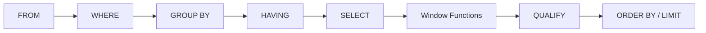

# :material-filter-check: QUALIFY

`QUALIFY` filters rows based on a window function result — without wrapping the query in a subquery.
It runs after `SELECT`, `WHERE`, `GROUP BY`, `HAVING`, and the window function computation.

______________________________________________________________________

## :material-code-tags: Syntax

```sql
SELECT col1, col2, window_fn() OVER (...) AS wf_col
FROM table
QUALIFY window_fn() OVER (...) condition;
```

| Parameter     | Description                                                                  |
| ------------- | ---------------------------------------------------------------------------- |
| `window_fn()` | Any window function (`ROW_NUMBER`, `RANK`, `DENSE_RANK`, `SUM`, `LAG`, etc.) |
| `OVER (...)`  | Window spec — `PARTITION BY` / `ORDER BY` / frame                            |
| `condition`   | Boolean expression on the window function result                             |

______________________________________________________________________

## :material-sitemap: Execution Order



`QUALIFY` is the **last row-level filter** — it sees the fully computed window function values.

### :material-animation-play: Interactive Visualization — Ranking Then Filtering

<div id="viz-filter-qualify" class="ts-viz"></div>

This demo ranks rows inside partitions, then applies the `QUALIFY` cutoff. It reflects Spark 4.2 behavior: window values are computed first, `QUALIFY` filters next, and `ORDER BY`/`LIMIT` run afterward.

______________________________________________________________________

## :material-information-outline: Behavior

1. **`SELECT` aliases are usable in Spark 4.2 `QUALIFY`** — a window expression aliased in the `SELECT` list can be referenced directly in `QUALIFY` (for example `QUALIFY rn = 1`).
2. **Replaces a subquery wrapper** — `QUALIFY ROW_NUMBER() OVER (...) = 1` is equivalent to wrapping the query and filtering on the rank column.
3. **Combines with WHERE and HAVING** — all three can appear in the same query; `WHERE` runs first, `HAVING` after aggregation, `QUALIFY` after window evaluation, and `ORDER BY` / `LIMIT` run later.
4. **Works with any window function** — not limited to ranking; aggregate window functions (`SUM`, `AVG`, `COUNT`) are equally valid.
5. **On Databricks, prefer the window alias in grouped queries** — when the window `ORDER BY` references grouped aggregates such as `SUM(amount)`, `QUALIFY monthly_rank <= 10` worked, while repeating the full `RANK() OVER (...)` expression in `QUALIFY` failed with `Cannot resolve QUALIFY ... QUALIFY does not support aggregate functions`.

______________________________________________________________________

## :material-flask-outline: Practical Examples

### :material-numeric-1-circle: Latest record per group (deduplication)

```sql
-- Keep only the most recent order per customer
SELECT customer_id, order_id, order_date, amount
FROM orders
QUALIFY ROW_NUMBER() OVER (PARTITION BY customer_id ORDER BY order_date DESC) = 1;

-- Result: one row per customer — the latest order
-- customer_id | order_id | order_date | amount
-- ------------|----------|------------|-------
-- 101         | 5001     | 2024-11-20 | 249.00
-- 102         | 5008     | 2024-12-01 |  89.50
```

### :material-numeric-2-circle: Top-N per partition (ranking)

```sql
-- Top-3 products by revenue within each category
SELECT category, product_id, product_name, revenue
FROM products
QUALIFY RANK() OVER (PARTITION BY category ORDER BY revenue DESC) <= 3;
```

### :material-numeric-3-circle: Remove duplicates — keep first by id

```sql
-- Keep the row with the lowest id when duplicates exist on (email)
SELECT id, email, name, created_at
FROM raw_users
QUALIFY ROW_NUMBER() OVER (PARTITION BY email ORDER BY id ASC) = 1;
```

### :material-numeric-4-circle: Running total threshold

```sql
-- Keep rows only up to the point where the running revenue exceeds 1 000 000
SELECT region, order_date, amount,
       SUM(amount) OVER (PARTITION BY region ORDER BY order_date
                         ROWS BETWEEN UNBOUNDED PRECEDING AND CURRENT ROW) AS running_total
FROM orders
QUALIFY SUM(amount) OVER (PARTITION BY region ORDER BY order_date
                          ROWS BETWEEN UNBOUNDED PRECEDING AND CURRENT ROW) <= 1000000;
```

### :material-numeric-5-circle: Outlier detection

```sql
-- Flag rows where the value is more than 2 standard deviations from the partition mean
SELECT product_id, sale_date, units_sold
FROM daily_sales
QUALIFY ABS(units_sold - AVG(units_sold) OVER (PARTITION BY product_id))
        > 2 * STDDEV(units_sold) OVER (PARTITION BY product_id);
```

### :material-numeric-6-circle: Combined WHERE + HAVING + QUALIFY

```sql
SELECT
    customer_id,
    DATE_TRUNC('month', order_date) AS month,
    SUM(amount)                      AS monthly_total,
    RANK() OVER (PARTITION BY DATE_TRUNC('month', order_date)
                 ORDER BY SUM(amount) DESC) AS monthly_rank
FROM orders
WHERE order_date >= '2024-01-01'              -- row filter: drop old data
GROUP BY customer_id, DATE_TRUNC('month', order_date)
HAVING SUM(amount) > 100                     -- group filter: drop low-value customers
QUALIFY monthly_rank <= 10                  -- window filter: top 10 per month
ORDER BY month, monthly_rank;
```

!!! note "[Databricks] Alias form verified"

    On the Databricks SQL warehouse used for verification, the query above executed
    successfully with `QUALIFY monthly_rank <= 10`. Repeating the full
    `RANK() OVER (PARTITION BY DATE_TRUNC('month', order_date) ORDER BY SUM(amount) DESC)`
    expression in `QUALIFY` failed with:

    `Cannot resolve QUALIFY: 'orders.order_date' is not present in GROUP BY and QUALIFY does not support aggregate functions.`

______________________________________________________________________

## :material-swap-horizontal: QUALIFY vs Subquery

```sql
-- Verbose subquery form
SELECT *
FROM (
    SELECT customer_id, order_id, order_date,
           ROW_NUMBER() OVER (PARTITION BY customer_id ORDER BY order_date DESC) AS rn
    FROM orders
) WHERE rn = 1;

-- Cleaner QUALIFY form
SELECT customer_id, order_id, order_date
FROM orders
QUALIFY ROW_NUMBER() OVER (PARTITION BY customer_id ORDER BY order_date DESC) = 1;
```

In Spark 4.2, `QUALIFY` removes the wrapper but expresses the same logical filter. It is usually clearer than carrying a rank alias through a subquery.

______________________________________________________________________

## :material-lightbulb-outline: When to Use

| Scenario                          | Pattern                                                                |
| --------------------------------- | ---------------------------------------------------------------------- |
| Deduplicate — keep latest per key | `QUALIFY ROW_NUMBER() OVER (PARTITION BY key ORDER BY ts DESC) = 1`    |
| Top-N per group                   | `QUALIFY RANK() OVER (PARTITION BY grp ORDER BY metric DESC) <= N`     |
| Remove ties (strict top-N)        | Use `ROW_NUMBER` instead of `RANK`                                     |
| Running aggregate threshold       | `QUALIFY SUM(x) OVER (...) <= limit`                                   |
| Statistical outlier removal       | `QUALIFY ABS(val - AVG(val) OVER (...)) <= 2 * STDDEV(val) OVER (...)` |
| Any ranking + dedup need          | Prefer `QUALIFY` over subquery wrappers                                |

______________________________________________________________________

## :material-shield-outline: Common Pitfalls

| Mistake                                               | Fix                                                                                        |
| ----------------------------------------------------- | ------------------------------------------------------------------------------------------ |
| Referencing a non-window alias in `QUALIFY`           | `QUALIFY` is for window-based filters; reference a window alias such as `rn`, or use a CTE |
| Using `QUALIFY` without `ORDER BY` in the window spec | Ranking functions (`ROW_NUMBER`, `RANK`) require `ORDER BY` inside `OVER ()`               |
| Expecting `QUALIFY` to run before `WHERE`             | `WHERE` always runs first — use `WHERE` for row predicates, `QUALIFY` for window results   |
| Forgetting `PARTITION BY` on large tables             | Without partition, the window spans the entire dataset — one partition, no parallelism     |

!!! note "Portability"

    `QUALIFY` is a Databricks / Spark SQL extension (also supported by BigQuery and Snowflake).
    It is not part of ANSI SQL — use the subquery pattern for cross-platform compatibility.

<script src="../../../assets/js/querying-filter-viz.js"></script>
