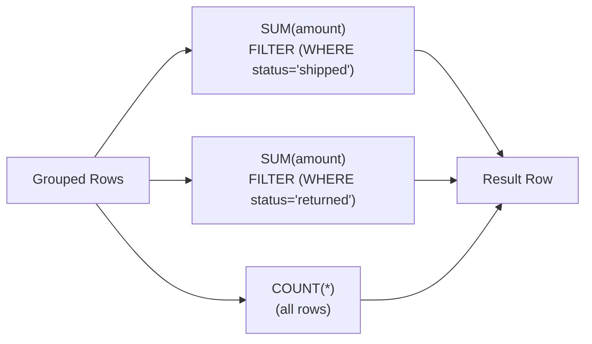

# :material-filter-plus-outline: FILTER Modifier

The `FILTER (WHERE ...)` modifier applies a predicate to one aggregate at a time. It is not a replacement for `HAVING`; instead, it lets you build conditional aggregates that `HAVING` can later compare.

______________________________________________________________________

### :material-animation-play: Interactive Visualization — Conditional Aggregate Lanes

<div id="viz-having-filter" class="ts-viz"></div>

Each lane represents one aggregate reading the same grouped rows with a different `FILTER`. This makes it easier to see why `FILTER` happens inside aggregation, while `HAVING` happens after the grouped values already exist.

<script src="../../assets/js/querying-having-viz.js"></script>

______________________________________________________________________

## :material-sitemap: How It Works



______________________________________________________________________

## :material-code-tags: Syntax

```sql
aggregate_function(expression) FILTER (WHERE boolean_condition)
```

Spark SQL supports `FILTER` on aggregate functions such as `SUM`, `COUNT`, `AVG`, `MIN`, `MAX`, `COUNT(DISTINCT ...)`, and collection aggregates.

______________________________________________________________________

## :material-flask-outline: Examples

### Multiple conditional sums in one grouped query

```sql
SELECT
    region,
    SUM(amount) AS total_sales,
    SUM(amount) FILTER (WHERE status = 'shipped') AS shipped_sales,
    SUM(amount) FILTER (WHERE status = 'returned') AS returned_sales,
    SUM(amount) FILTER (WHERE status = 'pending') AS pending_sales
FROM orders
GROUP BY region;
```

### Completion rate per department

```sql
SELECT
    department,
    COUNT(*) AS total_tasks,
    COUNT(*) FILTER (WHERE status = 'done') AS done_tasks,
    COUNT(*) FILTER (WHERE status = 'done') / NULLIF(COUNT(*), 0) AS completion_rate
FROM tasks
GROUP BY department;
```

### `FILTER` combined with `HAVING`

```sql
SELECT
    region,
    SUM(amount) AS total_revenue,
    SUM(amount) FILTER (WHERE status = 'shipped') AS shipped_revenue
FROM orders
GROUP BY region
HAVING SUM(amount) FILTER (WHERE status = 'shipped')
    / NULLIF(SUM(amount), 0) > 0.9;
```

This is the common pattern: compute several aggregates with `FILTER`, then let `HAVING` keep only the groups whose aggregate relationship matches your rule.

### `COLLECT_LIST` with `FILTER`

```sql
SELECT
    customer_id,
    COLLECT_LIST(order_id) FILTER (WHERE amount > 1000) AS big_order_ids
FROM orders
GROUP BY customer_id;
```

PySpark 4.2 accepts this form.

______________________________________________________________________

## :material-compare: FILTER vs CASE WHEN

Both patterns are valid in Spark SQL.

```sql
SELECT
    region,
    SUM(CASE WHEN status = 'shipped' THEN amount ELSE 0 END) AS shipped_sales,
    SUM(CASE WHEN status = 'returned' THEN amount ELSE 0 END) AS returned_sales
FROM orders
GROUP BY region;
```

```sql
SELECT
    region,
    SUM(amount) FILTER (WHERE status = 'shipped') AS shipped_sales,
    SUM(amount) FILTER (WHERE status = 'returned') AS returned_sales
FROM orders
GROUP BY region;
```

| Factor                   | FILTER                                    | CASE WHEN                                  |
| ------------------------ | ----------------------------------------- | ------------------------------------------ |
| Readability              | Keeps the predicate next to the aggregate | Repeats condition logic inside expressions |
| Multiple conditions      | Easy to scan                              | More verbose as conditions grow            |
| Aggregate support        | Direct aggregate syntax                   | Often expressible with `CASE` as well      |
| Best reason to prefer it | Clearer intent                            | Useful when you need custom per-row output |

______________________________________________________________________

## :material-magnify: Behavior Notes

1. The `FILTER` predicate is evaluated as part of each aggregate's input selection, not as a row-level query filter.
2. If no rows satisfy a `FILTER`, `COUNT` returns `0`, while `SUM`, `AVG`, `MIN`, and `MAX` return `NULL`.
3. The `FILTER` condition can reference columns that are not in `GROUP BY`, because it is still reading the group's underlying rows.
4. `FILTER` and `HAVING` complement each other: `FILTER` shapes individual aggregate values, then `HAVING` tests the finished group.
