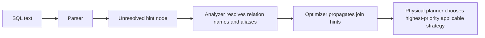

# :material-lightbulb-on: Hint Resolution

Spark parses hints early, resolves them against the visible relation names and aliases, and then lets physical planning choose the highest-priority applicable strategy. The details matter because a correctly spelled but out-of-scope relation name is still ignored.

### :material-animation-play: Interactive Visualization — Hint Resolution Outcomes

<div id="viz-join-resolver-core" class="ts-viz"></div>

Explore precedence, alias matching, and ignored-hint cases verified with PySpark 4.2.

<script src="../../../assets/js/querying-joins-core-viz.js"></script>

______________________________________________________________________

## :material-sitemap: Resolution Pipeline



______________________________________________________________________

## :material-cog-outline: Verified Resolution Rules

1. Hint names are case-insensitive. A tested `broadcast(right_t)` produced the same `BroadcastHashJoin` plan as uppercase `BROADCAST(right_t)`.
2. Spark resolves the hint argument against the relation name or alias visible in that query block.
3. A subquery alias works. In the verification run, `/*+ BROADCAST(dim) */` correctly broadcast a subquery aliased as `dim`.
4. The wrong name is ignored. In the verification run, `/*+ BROADCAST(right_t) */` did **not** apply when the table had been aliased as `r`; the plan fell back to `SortMergeJoin`.

______________________________________________________________________

## :material-sort-numeric-ascending: Verified Precedence

| Higher-priority hint | Lower-priority hint    | Verified winner     |
| -------------------- | ---------------------- | ------------------- |
| `BROADCAST`          | `MERGE`                | `BroadcastHashJoin` |
| `MERGE`              | `SHUFFLE_HASH`         | `SortMergeJoin`     |
| `SHUFFLE_HASH`       | `SHUFFLE_REPLICATE_NL` | `ShuffledHashJoin`  |

When both sides carried `BROADCAST`, the symmetric inner-join test built on the right side. Treat that as an observed result, not a universal rule: build-side choice still depends on join type and planning details.

______________________________________________________________________

## :material-flask-outline: Examples

```sql
SELECT /*+ BROADCAST(dim) */
    f.order_id,
    dim.region
FROM fact_orders AS f
JOIN dim_region AS dim
    ON f.region_id = dim.id;
```

```sql
SELECT /*+ BROADCAST(sub) */
    t.id,
    sub.name
FROM transactions AS t
JOIN (
    SELECT id, name
    FROM customers
    WHERE active = true
) AS sub
    ON t.customer_id = sub.id;
```

```sql
SELECT /*+ BROADCAST(dim_region) */
    f.order_id,
    dim.region
FROM fact_orders AS f
JOIN dim_region AS dim
    ON f.region_id = dim.id;
```

The last pattern looks plausible, but once `dim_region` is aliased to `dim`, the hint should target `dim`, not the base name.

______________________________________________________________________

## :material-alert-circle: Ignored or Rewritten Cases

| Situation                                          | Verified outcome                              |
| -------------------------------------------------- | --------------------------------------------- |
| Wrong or out-of-scope relation name                | Hint ignored; Spark chose the normal strategy |
| `FULL OUTER JOIN` with `BROADCAST`                 | Tested plan fell back to `SortMergeJoin`      |
| `[Databricks] RANGE_JOIN` in open-source Spark 4.2 | Parsed, but did not change the physical plan  |
| `[Databricks] SKEW(...)` in open-source Spark 4.2  | No join-strategy change in the test run       |

______________________________________________________________________

## :material-code-tags: What to Inspect

Use `EXPLAIN FORMATTED` to confirm the final physical operator:

```sql
EXPLAIN FORMATTED
SELECT /*+ MERGE(a), SHUFFLE_HASH(b) */ *
FROM large_a AS a
JOIN large_b AS b
    ON a.id = b.id;
```

If the chosen operator is not what you expected, check the alias names first, then check whether a higher-priority or unsupported join shape overruled the hint.
