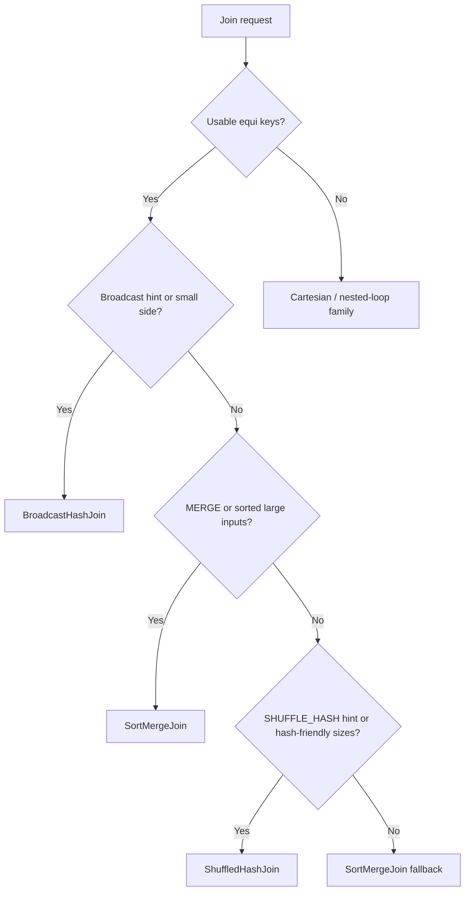

# :material-link: Join Overview

Joins combine rows from two relations according to a match predicate. In Spark 4.2, the predicate shape determines whether Catalyst can plan an equi-join operator such as `BroadcastHashJoin`, `SortMergeJoin`, or `ShuffledHashJoin`, or whether it must fall back to cartesian or nested-loop style execution.

### :material-animation-play: Interactive Visualization — Join Shape to Physical Plan

<div id="viz-joins-overview-core" class="ts-viz"></div>

Switch between common join shapes to see the physical operator that PySpark 4.2 produced during verification.

<script src="../../assets/js/querying-joins-core-viz.js"></script>

______________________________________________________________________

## :material-view-grid: In This Section

| Topic                                      | What You Will Learn                                                                            |
| ------------------------------------------ | ---------------------------------------------------------------------------------------------- |
| [Join Types](types/index.md)               | INNER, LEFT/RIGHT/FULL OUTER, LEFT SEMI, LEFT ANTI, CROSS, and non-equi joins                  |
| [Join Expressions](expression.md)          | `ON`, `USING`, `NATURAL JOIN`, comma syntax, and range predicates                              |
| [Join Strategies](strategy/index.md)       | Broadcast hash, sort-merge, shuffle hash, nested-loop, and cartesian plans                     |
| [Join Hints](hints/index.md)               | `BROADCAST`, `MERGE`, `SHUFFLE_HASH`, `SHUFFLE_REPLICATE_NL`, and how Spark resolves conflicts |
| [Join Issues](issues/index.md)             | Duplicate columns, skewed keys, fan-out, and null traps                                        |
| [Join Optimization](optimization/index.md) | Broadcast sizing, repartitioning, early filtering, and AQE                                     |

______________________________________________________________________

## :material-check-decagram: Verified Planner Behavior in PySpark 4.2

| Join shape                                | Example pattern                                       | Verified physical outcome                                          |
| ----------------------------------------- | ----------------------------------------------------- | ------------------------------------------------------------------ |
| Equi join with broadcast hint             | `... ON l.k = r.k` + `/*+ BROADCAST(r) */`            | `BroadcastHashJoin`                                                |
| Equi join with merge hint                 | `... ON l.k = r.k` + `/*+ MERGE(r) */`                | `SortMergeJoin`                                                    |
| Equi join with shuffle hash hint          | `... ON l.k = r.k` + `/*+ SHUFFLE_HASH(r) */`         | `ShuffledHashJoin`                                                 |
| Equi join with replicate-NL hint          | `... ON l.k = r.k` + `/*+ SHUFFLE_REPLICATE_NL(r) */` | `CartesianProduct` in `EXPLAIN FORMATTED`                          |
| Pure non-equi join                        | `... ON p >= start AND p < end`                       | `CartesianProduct` in the tested plan                              |
| Comma join with no predicate              | `FROM a, b`                                           | `CartesianProduct`                                                 |
| Comma join with equi predicate in `WHERE` | `FROM a, b WHERE a.id = b.id`                         | Optimized back into an equi join (`SortMergeJoin` in the test run) |

!!! note "What the plan names tell you"

    `EXPLAIN FORMATTED` prints the physical operator name that Spark actually chose. That is the most reliable way to confirm whether a hint or predicate shape changed the strategy.

______________________________________________________________________

## :material-table: Join Type Quick Reference

| Join type         | Rows returned                                  | Output columns | Typical use                          |
| ----------------- | ---------------------------------------------- | -------------- | ------------------------------------ |
| `INNER JOIN`      | Matched rows only                              | Left + right   | Combine related facts and dimensions |
| `LEFT JOIN`       | All left rows + right matches                  | Left + right   | Preserve the driving table           |
| `RIGHT JOIN`      | All right rows + left matches                  | Left + right   | Mirror of left outer join            |
| `FULL OUTER JOIN` | All rows from both sides                       | Left + right   | Reconciliation and gap analysis      |
| `LEFT SEMI JOIN`  | Left rows that have a match                    | Left only      | Existence filtering                  |
| `LEFT ANTI JOIN`  | Left rows with no match                        | Left only      | Missing-key detection                |
| `CROSS JOIN`      | Every left/right combination                   | Left + right   | Intentional cartesian expansion      |
| Non-equi join     | Rows satisfying range or inequality predicates | Left + right   | Interval matching and overlap logic  |

______________________________________________________________________

## :material-sitemap: Join Strategy Selection



______________________________________________________________________

## :material-flask-outline: Basic Example

```sql
SELECT
    o.order_id,
    o.amount,
    c.name AS customer_name
FROM orders AS o
JOIN customers AS c
    ON o.customer_id = c.customer_id;
```

```sql
SELECT /*+ BROADCAST(c) */
    o.order_id,
    o.amount,
    c.name AS customer_name
FROM orders AS o
JOIN customers AS c
    ON o.customer_id = c.customer_id;
```

______________________________________________________________________

## :material-magnify: Practical Notes

1. Standard `=` does not match `NULL` join keys; use `<=>` for null-safe equality.
2. `USING (col)` collapses only the listed join column from the output; other same-named columns still appear twice.
3. `NATURAL JOIN` matches on every common column name and collapses those common columns to one output copy.
4. Complex predicates such as ranges or `OR` conditions can prevent Spark from extracting equi keys, which is why they often land in cartesian or nested-loop style plans.
5. Hints influence planning, but unsupported combinations can still fall back; for example, a tested `FULL OUTER JOIN` with `BROADCAST` still planned as `SortMergeJoin`.

______________________________________________________________________

## :material-code-tags: EXPLAIN Tip

```sql
EXPLAIN FORMATTED
SELECT /*+ BROADCAST(c) */
    o.order_id,
    c.name
FROM orders AS o
JOIN customers AS c
    ON o.customer_id = c.customer_id;
```

Look for operator names such as `BroadcastHashJoin`, `SortMergeJoin`, `ShuffledHashJoin`, or `CartesianProduct`.
