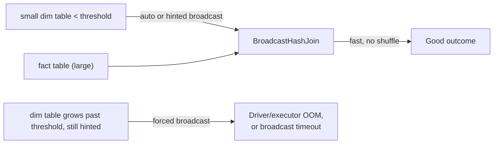

# :material-broadcast: Broadcast Join Pitfalls

Spark automatically **broadcasts** (ships a full copy to every executor) whichever join
side is smaller than `spark.sql.autoBroadcastJoinThreshold` (default `10MB`), avoiding an
expensive shuffle. This is usually a performance win — but broadcasting a table that
turns out to be larger than expected, or forcing a broadcast with a hint on a table that
outgrows the threshold, can crash the driver or every executor with an
out-of-memory error instead of merely running slower.

---

### :material-sitemap: Overview



---

## :material-pin: Common Symptoms

- A job that always ran fine suddenly fails with
  `org.apache.spark.SparkException: Could not execute broadcast in ... secs` or a driver
  / executor `OutOfMemoryError`, right after an upstream "small" table quietly grew.
- `EXPLAIN` shows `BroadcastHashJoin` / `BroadcastExchange` where you expected a
  `SortMergeJoin` — usually because of a `/*+ BROADCAST(t) */` hint or auto-detection
  based on stale table statistics that no longer reflect the table's real size.
- Disabling the hint or lowering `spark.sql.autoBroadcastJoinThreshold` "fixes" the crash
  by falling back to a shuffle-based join — direct confirmation the broadcast was the
  problem, not the join logic itself.

---

## :material-flask-outline: Practical Examples

### Setup

```sql
CREATE TABLE big_fact (
    id     INT,
    region STRING,
    amount DOUBLE
);
-- ~20,000 rows across 3 regions
INSERT INTO big_fact
SELECT id,
       CASE WHEN id % 3 = 0 THEN 'east' WHEN id % 3 = 1 THEN 'west' ELSE 'north' END,
       id * 1.5
FROM range(1, 20001) AS t(id);

CREATE TABLE region_dim (
    region      STRING,
    region_name STRING
);

INSERT INTO region_dim VALUES
    ('east', 'Eastern'),
    ('west', 'Western'),
    ('north', 'Northern');
```

### Example 1 — The Default: `region_dim` Is Small Enough to Auto-Broadcast

```sql
EXPLAIN
SELECT f.id, f.region, d.region_name, f.amount
FROM big_fact f
JOIN region_dim d ON f.region = d.region;
```

```text
== Physical Plan ==
AdaptiveSparkPlan isFinalPlan=false
+- Project [id#.., region#.., region_name#.., amount#..]
   +- BroadcastHashJoin [region#..], [region#..], Inner, BuildRight, false, false
      :- Filter isnotnull(region#..)
      :  +- FileScan parquet ... big_fact ...
      +- BroadcastExchange HashedRelationBroadcastMode(...)
         +- Filter isnotnull(region#..)
            +- FileScan parquet ... region_dim ...
```

`region_dim` (3 tiny rows) is well under the 10MB default threshold, so Spark's planner
picks `BroadcastHashJoin` automatically — no shuffle for the large `big_fact` side at all.

### Example 2 — The Pitfall: Forcing a Broadcast on a Table That Has Grown

```sql
-- Someone added /*+ BROADCAST(d) */ months ago when region_dim was tiny. Now suppose
-- region_dim has grown to include a much wider column (e.g. an embedded JSON blob per
-- region) or millions of rows after a schema change -- the hint still forces a
-- broadcast, regardless of the table's current size.
SELECT /*+ BROADCAST(d) */ f.id, f.region, d.region_name, f.amount
FROM big_fact f
JOIN region_dim d ON f.region = d.region;
-- If region_dim no longer fits comfortably in executor memory, this either fails with
-- a broadcast timeout / OOM, or succeeds but starves other jobs of executor memory.
```

### Example 3 — Fix: Disable Auto-Broadcast to See the Shuffle-Based Plan

```sql
SET spark.sql.autoBroadcastJoinThreshold = -1;

EXPLAIN
SELECT f.id, f.region, d.region_name, f.amount
FROM big_fact f
JOIN region_dim d ON f.region = d.region;
```

```text
== Physical Plan ==
AdaptiveSparkPlan isFinalPlan=false
+- Project [id#.., region#.., region_name#.., amount#..]
   +- SortMergeJoin [region#..], [region#..], Inner
      :- Sort [region#.. ASC NULLS FIRST], false, 0
      :  +- Exchange hashpartitioning(region#.., 200), ...
      :     +- Filter isnotnull(region#..)
      :        +- FileScan parquet ... big_fact ...
      +- Sort [region#.. ASC NULLS FIRST], false, 0
         +- Exchange hashpartitioning(region#.., 200), ...
            +- Filter isnotnull(region#..)
               +- FileScan parquet ... region_dim ...
```

`SortMergeJoin` shuffles **both** sides instead — slower than a broadcast for a truly
small dimension table, but it scales safely as `region_dim` grows, since neither side
needs to fit entirely in a single executor's memory.

### Example 4 — Fix: Remove the Stale Hint, Let the Optimizer Decide

```sql
-- Remove the /*+ BROADCAST(d) */ hint entirely and let Spark's cost-based optimizer
-- (backed by up-to-date table statistics) choose BroadcastHashJoin only while
-- region_dim genuinely fits, and fall back to SortMergeJoin automatically once it
-- outgrows the threshold.
ANALYZE TABLE region_dim COMPUTE STATISTICS;

SELECT f.id, f.region, d.region_name, f.amount
FROM big_fact f
JOIN region_dim d ON f.region = d.region;
```

---

## :material-brain: When to Use

| Scenario | Recommended Pattern |
|----------|---------------------|
| Dimension table is small and stable in size | Let Spark auto-broadcast — no hint needed; `ANALYZE TABLE ... COMPUTE STATISTICS` keeps size estimates accurate |
| Dimension table's size is unpredictable or grows over time | Avoid a hard-coded `/*+ BROADCAST(t) */` hint — it forces the broadcast even after the table outgrows safe limits |
| A broadcast job starts failing with OOM / timeout | Set `spark.sql.autoBroadcastJoinThreshold = -1` (Example 3) to confirm the broadcast is the cause, then investigate why the "small" side grew |
| Need broadcast behavior back after a table shrinks again or after fixing upstream | Re-enable via the default threshold or a scoped hint, and re-run `ANALYZE TABLE` so estimates reflect the current size |

!!! tip "Broadcast failures often masquerade as unrelated errors"
    A broadcast OOM can surface as a generic executor lost / heartbeat timeout error
    rather than an explicit "broadcast too large" message, especially under memory
    pressure from other concurrent jobs. If a previously stable join job starts failing
    intermittently after an upstream table's size changed, broadcast sizing is one of
    the first things to check with `EXPLAIN`.
