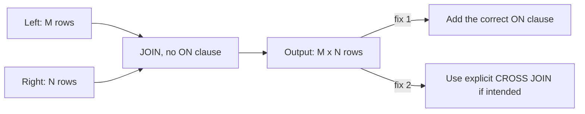

# :material-vector-combine: Accidental Cross Join

An **accidental cross join** happens when a `JOIN` is written without an `ON`/`USING`
condition (or with a condition that references the wrong columns), so Spark pairs
**every** row on the left with **every** row on the right — a Cartesian product.


### :material-sitemap: Overview



---

## :material-pin: Common Symptoms

- The job hangs or runs far longer than the input sizes suggest.
- The shuffle/output row count is roughly `left_rows * right_rows` — often billions of
  rows from two modestly sized tables.
- `EXPLAIN` shows `CartesianProduct` (or a `BroadcastNestedLoopJoin` with no join keys)
  in the physical plan.
- Depending on `spark.sql.crossJoin.enabled`, Spark may instead raise:
  `AnalysisException: Detected implicit cartesian product... consider using CROSS JOIN`.

---

## :material-flask-outline: Practical Examples

### Setup

```sql
CREATE TABLE orders (
    order_id    INT,
    customer_id INT,
    amount      DOUBLE
) USING DELTA;

INSERT INTO orders VALUES
    (1, 101, 250.00),
    (2, 102, 175.50),
    (3, 103, 310.00);

CREATE TABLE customers (
    customer_id INT,
    name        STRING
) USING DELTA;

INSERT INTO customers VALUES
    (101, 'Alice'),
    (102, 'Bob'),
    (103, 'Charlie');
```

### Example 1 — The Bug: Comma Join With No WHERE/ON Condition

```sql
-- Old-style comma join, missing the filter that was supposed to relate the tables.
SELECT o.order_id, c.name
FROM orders o, customers c;
-- Result: 9 rows (3 orders x 3 customers) -- every order paired with every customer,
-- not just its own.
-- order_id  name
-- 1         Alice
-- 1         Bob
-- 1         Charlie
-- 2         Alice
-- 2         Bob
-- 2         Charlie
-- 3         Alice
-- 3         Bob
-- 3         Charlie
```

### Example 2 — The Bug: JOIN Keyword Without ON

```sql
-- Same problem with explicit JOIN syntax -- the ON clause was simply forgotten.
SELECT o.order_id, c.name
FROM orders o
JOIN customers c;
-- Result: identical 9-row Cartesian product as Example 1.
```

### Example 3 — Diagnose: Confirm the Plan Is a Cartesian Product

```sql
EXPLAIN SELECT o.order_id, c.name
FROM orders o, customers c;
-- Physical plan includes "CartesianProduct" with no join keys listed -- the
-- tell-tale sign this is unconditional, not an intentionally small equi-join.
```

### Example 4 — Fix: Add the Correct ON Clause

```sql
SELECT o.order_id, c.name
FROM orders o
JOIN customers c ON o.customer_id = c.customer_id
ORDER BY o.order_id;
-- Result: 3 rows -- one per order, matched to its own customer.
-- order_id  name
-- 1         Alice
-- 2         Bob
-- 3         Charlie
```

### Example 5 — When a Cross Join Is Actually Intended

```sql
-- Make it explicit so the next reader (and Spark's planner) knows this is deliberate,
-- e.g. generating every (product, region) combination for a planning grid.
SELECT p.product_name, r.region_name
FROM products p
CROSS JOIN regions r;
```

---

## :material-brain: When to Use

| Scenario | Recommended Pattern |
|----------|---------------------|
| Every `JOIN` in a query | Always pair with an explicit `ON`/`USING` clause |
| Legacy comma-style joins (`FROM a, b`) | Migrate to explicit `JOIN ... ON` syntax — the missing condition is much easier to spot |
| A full cross product is genuinely required | Use explicit `CROSS JOIN` so the intent is unambiguous in review |
| Unsure whether a plan has an accidental cross join | Run `EXPLAIN` and look for `CartesianProduct` with no join key |
