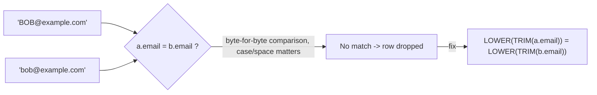

# :material-format-letter-case: Case & Whitespace Mismatch

String join keys that look identical to a human — `alice@example.com` vs
`ALICE@example.com`, or `"carol@example.com "` with a trailing space — are **not equal**
under standard SQL `=` comparison. This is one of the most common causes of silently
missed matches when join keys originate from free-text input, CSV exports, or systems
with inconsistent casing conventions.

______________________________________________________________________

## :material-sitemap: Overview



______________________________________________________________________

### :material-animation-play: Interactive Visualization — Raw vs. Normalized String Keys

<div id="viz-joins-issues-case-whitespace-mismatch" class="ts-viz"></div>

This demo shows the two silent failure modes verified in Spark 4.2: case-sensitive comparison and invisible trailing spaces. The normalized view fixes both but hints at the performance trade-off discussed later.

<script src="../../../assets/js/querying-joins-issues-viz.js"></script>

## :material-pin: Common Symptoms

- A join produces fewer matches than expected, but a manual visual inspection of the
    values "looks fine" — the mismatch (case or whitespace) isn't visible without
    inspecting raw bytes or using a function like `LENGTH()`.
- The problem appears only for rows sourced from a particular upstream system (e.g. a
    CSV export that preserves trailing spaces, or a form field that doesn't normalize case).
- Re-running the same join after a data cleanup (`TRIM`/`LOWER`) "fixes itself" —
    a strong signal the original issue was case/whitespace, not a real missing record.

______________________________________________________________________

## :material-flask-outline: Practical Examples

### Setup

```sql
CREATE TABLE customers_raw (
    customer_id INT,
    email       STRING
);

INSERT INTO customers_raw VALUES
    (1, 'alice@example.com'),
    (2, 'BOB@example.com'),        -- different case from marketing_opt_in
    (3, 'carol@example.com ');     -- trailing space from a CSV export

CREATE TABLE marketing_opt_in (
    email    STRING,
    opted_in BOOLEAN
);

INSERT INTO marketing_opt_in VALUES
    ('alice@example.com', true),
    ('bob@example.com', true),
    ('carol@example.com', false);
```

### Example 1 — The Bug: Naive Join Misses 2 of 3 Customers

```sql
SELECT c.customer_id, c.email, m.opted_in
FROM customers_raw c
LEFT JOIN marketing_opt_in m ON c.email = m.email
ORDER BY c.customer_id;
```

| customer_id | email             | opted_in |
| :---------: | ----------------- | :------: |
|      1      | alice@example.com |   true   |
|      2      | BOB@example.com   |   NULL   |
|      3      | carol@example.com |   NULL   |

Bob and Carol both exist in `marketing_opt_in`, but neither matched — Bob's case
differs and Carol's value carries a trailing space that isn't visible in most result
grids.

### Example 2 — Diagnose: Reveal the Hidden Difference

```sql
SELECT customer_id, email, LENGTH(email) AS raw_len, LENGTH(TRIM(email)) AS trimmed_len
FROM customers_raw;
-- Result: customer_id 3 has raw_len = 18 but trimmed_len = 17 -- a trailing
-- character that TRIM() removes. Comparing LOWER(email) side by side for
-- customer_id 2 and marketing_opt_in also reveals the case difference.
```

### Example 3 — Fix: Normalize Both Sides Before Comparing

```sql
SELECT c.customer_id, c.email, m.opted_in
FROM customers_raw c
LEFT JOIN marketing_opt_in m
    ON LOWER(TRIM(c.email)) = LOWER(TRIM(m.email))
ORDER BY c.customer_id;
```

| customer_id | email             | opted_in |
| :---------: | ----------------- | :------: |
|      1      | alice@example.com |   true   |
|      2      | BOB@example.com   |   true   |
|      3      | carol@example.com |  false   |

All 3 customers now resolve correctly once both sides are normalized to the same case
and stripped of surrounding whitespace.

### Example 4 — Better Fix: Normalize Once, Upstream

```sql
-- Normalize at write time (e.g. in the ingestion/ETL job) so every downstream join
-- gets clean keys without needing LOWER(TRIM(...)) sprinkled everywhere.
CREATE OR REPLACE TABLE customers AS
SELECT customer_id, LOWER(TRIM(email)) AS email
FROM customers_raw;
```

______________________________________________________________________

## :material-brain: When to Use

| Scenario                                                                       | Recommended Pattern                                                                                                                      |
| ------------------------------------------------------------------------------ | ---------------------------------------------------------------------------------------------------------------------------------------- |
| Join keys may differ only in case                                              | `LOWER(a.key) = LOWER(b.key)` (or `UPPER`, consistently)                                                                                 |
| Join keys may carry leading/trailing whitespace                                | `TRIM(a.key) = TRIM(b.key)`                                                                                                              |
| Both problems are possible (the common case for free-text/email/username keys) | `LOWER(TRIM(a.key)) = LOWER(TRIM(b.key))`                                                                                                |
| The same join runs repeatedly against the same tables                          | Normalize once at ingestion (Example 4) instead of re-normalizing on every query — cheaper and prevents the bug from recurring elsewhere |

!!! warning "Normalizing in the `ON` clause defeats some join optimizations"

    Wrapping both sides of a join key in `LOWER(TRIM(...))` prevents Spark from using
    partition pruning, bucket pruning, or pre-computed statistics on the raw column.
    For large, frequently-joined tables, normalize the column once when the data is
    written (Example 4) rather than on every query. See
    [Functions on Join Keys](functions-on-join-keys.md) for the full performance and
    correctness treatment of function-wrapped keys.
