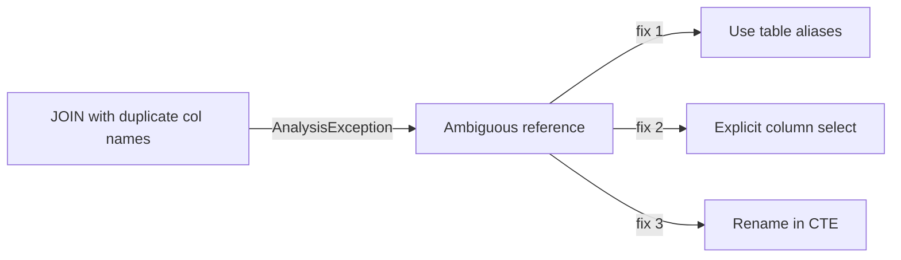

# :material-alert-circle: Duplicate Columns in Joins

When two joined tables contain columns with the same name, Spark can throw
**ambiguous column** errors or silently overwrite one column.


### :material-sitemap: Overview



---

## :material-pin: Common Symptoms

- `AnalysisException: Reference 'id' is ambiguous`
- Unexpected values after `SELECT *`

---

## :material-flask-outline: Practical Fixes

### Setup

```sql
-- Both tables use `id` as their primary key column name -- a common source
-- of ambiguity once they're joined together.
CREATE TABLE orders (
    id          INT,   -- order_id, but just called "id"
    customer_id INT,
    amount      DOUBLE
) USING DELTA;

INSERT INTO orders VALUES
    (1, 101, 250.00),
    (2, 102, 175.50);

CREATE TABLE customers (
    id   INT,          -- customer_id, but also just called "id"
    name STRING
) USING DELTA;

INSERT INTO customers VALUES
    (101, 'Alice'),
    (102, 'Bob');
```

### The Bug

```sql
SELECT id FROM orders JOIN customers ON orders.customer_id = customers.id;
-- AnalysisException: Reference 'id' is ambiguous, could be: orders.id, customers.id.
```

```sql
-- SELECT * is worse: it silently returns BOTH `id` columns with no way to
-- tell which is which from the column name alone.
SELECT * FROM orders JOIN customers ON orders.customer_id = customers.id;
-- id  customer_id  amount  id   name
-- 1   101          250.00  101  Alice
-- 2   102          175.50  102  Bob
```

### 1) Use Table Aliases

```sql
SELECT a.id AS order_id, b.id AS customer_id
FROM orders a
JOIN customers b
ON a.customer_id = b.id;
-- Result:
-- order_id  customer_id
-- 1         101
-- 2         102
```

### 2) Select Explicit Columns

```sql
SELECT o.id AS order_id, o.amount, c.name AS customer_name
FROM orders o
JOIN customers c
ON o.customer_id = c.id;
-- Result:
-- order_id  amount  customer_name
-- 1         250.00  Alice
-- 2         175.50  Bob
```

### 3) Rename Columns Before Join

```sql
WITH c AS (
  SELECT id AS customer_id, name FROM customers
)
SELECT o.id AS order_id, c.customer_id, c.name
FROM orders o
JOIN c ON o.customer_id = c.customer_id;
-- Result:
-- order_id  customer_id  name
-- 1         101          Alice
-- 2         102          Bob
```

---

## :material-brain: When to Use

| Scenario | Recommended Pattern |
|----------|---------------------|
| Avoid ambiguity | Use aliases and explicit selects |
| Prepare for star select | Rename columns in CTE |
