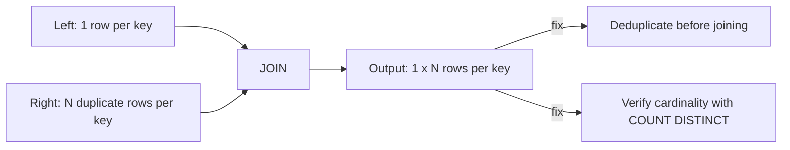

# :material-arrow-expand-all: Data Explosion (Fan-Out Joins)

**Data explosion** on this page means the join key is unique on one side but matches
multiple rows on the other, so one input row fans out into several output rows. The
both-sides-duplicate `N x M` variant is covered separately in
[Duplicate-Key Explosion](duplicate-key-explosion.md).

## :material-sitemap: Overview



______________________________________________________________________

### :material-animation-play: Interactive Visualization — One-Sided Fan-Out

<div id="viz-joins-issues-data-explosion" class="ts-viz"></div>

This view focuses on the verified one-to-many case: one left row pairing with multiple right rows. The duplicated facts then inflate downstream aggregates even though the query never errors.

<script src="../../../assets/js/querying-joins-issues-viz.js"></script>

## :material-pin: Common Symptoms

- `COUNT(*)` after the join is a multiple of the expected row count (e.g. 3x, 10x).
- Downstream aggregates (`SUM(amount)`) are inflated because the same fact row was
    duplicated by a multi-row match on the other side.
- The query runs correctly (no error) — this is a **silent correctness bug**, not a
    runtime failure, which makes it more dangerous than a skew or ambiguity issue.

______________________________________________________________________

## :material-flask-outline: Practical Examples

### Setup

```sql
CREATE TABLE orders (
    order_id    INT,
    customer_id INT,
    amount      DOUBLE
);

INSERT INTO orders VALUES
    (1, 101, 250.00),
    (2, 102, 175.50),
    (3, 103, 310.00);

-- payments has THREE rows for order_id=1 (e.g. an initial charge, a partial refund,
-- and a retry) -- a one-to-many relationship the join author didn't expect.
CREATE TABLE payments (
    order_id       INT,
    payment_status STRING
);

INSERT INTO payments VALUES
    (1, 'AUTHORIZED'),
    (1, 'CAPTURED'),
    (1, 'REFUNDED'),
    (2, 'CAPTURED'),
    (3, 'CAPTURED');
```

### Example 1 — The Bug: Silent Row Duplication

```sql
SELECT o.order_id, o.amount, p.payment_status
FROM orders o
JOIN payments p ON o.order_id = p.order_id;
-- Result: 5 rows, not 3 -- order_id=1 appears THREE times.
-- order_id  amount  payment_status
-- 1         250.00  AUTHORIZED
-- 1         250.00  CAPTURED
-- 1         250.00  REFUNDED
-- 2         175.50  CAPTURED
-- 3         310.00  CAPTURED
```

```sql
-- The bug compounds silently in an aggregate: SUM(amount) triple-counts order 1.
SELECT SUM(o.amount) AS total
FROM orders o
JOIN payments p ON o.order_id = p.order_id;
-- Result: 250.00 * 3 + 175.50 + 310.00 = 1235.50 (should be 735.50)
```

### Example 2 — Diagnose: Verify Cardinality Before Trusting a Join

```sql
SELECT COUNT(*) AS row_count, COUNT(DISTINCT order_id) AS distinct_keys
FROM payments;
-- Result:
-- row_count  distinct_keys
-- 5          3              <- row_count > distinct_keys means duplicates per key
```

To predict the joined row count *before* running the join, sum the per-key counts on
the many side — when the other side is unique on the key, this total equals the exact
output row count:

```sql
SELECT SUM(cnt) AS predicted_join_rows
FROM (SELECT order_id, COUNT(*) AS cnt FROM payments GROUP BY order_id) t;
-- predicted_join_rows
-- 5                     <- matches the actual join's row count exactly
```

### Example 2b — Why `EXPLAIN` Won't Warn You

```sql
EXPLAIN
SELECT o.order_id, o.amount, p.payment_status
FROM orders o
JOIN payments p ON o.order_id = p.order_id;
```

```text
== Physical Plan ==
AdaptiveSparkPlan isFinalPlan=false
+- Project [order_id#20, amount#22, payment_status#24]
   +- BroadcastHashJoin [order_id#20], [order_id#23], Inner, BuildLeft, false, false
      :- BroadcastExchange ...
      :  +- Filter isnotnull(order_id#20)
      :     +- FileScan parquet ... orders ...
      +- Filter isnotnull(order_id#23)
         +- FileScan parquet ... payments ...
```

This is an entirely ordinary `BroadcastHashJoin` — Spark has no way to know your
*intent* was one row per order, so the plan never flags a fan-out. `EXPLAIN` tells you
*how* the join will execute, not whether the result cardinality matches what you
expected; only the `COUNT(*)` vs `COUNT(DISTINCT key)` check in Example 2 catches this
ahead of time.

### Example 2c — Guardrail: Reconcile the Metric Before and After the Join

Row-count checks (Example 2) catch the fan-out, but a metric like `SUM(amount)` is
what actually shows up wrong in a dashboard. Add an automated reconciliation query
that computes the metric at its correct grain independently, and compares it to the
value produced by the (possibly fanned-out) join — any mismatch is a hard signal that
the join changed the grain of the aggregate:

```sql
WITH source_total AS (
    -- correct grain: one row per order, computed with no join at all
    SELECT SUM(amount) AS total FROM orders
),
joined_total AS (
    -- same metric, but computed after the join under test
    SELECT SUM(o.amount) AS total
    FROM orders o
    JOIN payments p ON o.order_id = p.order_id
)
SELECT s.total AS expected, j.total AS actual, s.total = j.total AS matches
FROM source_total s, joined_total j;
-- expected  actual    matches
-- 735.50    1235.50   false   <- inflated by the payments fan-out; ship this as a CI/DQ check
```

Wire a query like this into a data-quality suite (or an assertion in a test) for any
join that feeds a metric — it fails loudly in CI instead of silently in a dashboard,
and it doesn't require knowing in advance which side has duplicates.

### Example 3 — Fix: Deduplicate the Many Side Before Joining

```sql
WITH latest_payment AS (
    SELECT order_id, payment_status
    FROM (
        SELECT *,
               ROW_NUMBER() OVER (
                   PARTITION BY order_id
                   ORDER BY CASE payment_status
                       WHEN 'REFUNDED'   THEN 3
                       WHEN 'CAPTURED'   THEN 2
                       WHEN 'AUTHORIZED' THEN 1
                   END DESC
               ) AS rn
        FROM payments
    )
    WHERE rn = 1
)
SELECT o.order_id, o.amount, lp.payment_status
FROM orders o
JOIN latest_payment lp ON o.order_id = lp.order_id
ORDER BY o.order_id;
-- Result: 3 rows -- one per order, using each order's most advanced payment status.
-- order_id  amount  payment_status
-- 1         250.00  REFUNDED
-- 2         175.50  CAPTURED
-- 3         310.00  CAPTURED
```

### Example 3b — Pitfall: An Incomplete `ORDER BY` Makes "Latest" Non-Deterministic

Picking "the latest row per key" is only as deterministic as the `ORDER BY` inside
`ROW_NUMBER()`. Real-world sources routinely have **ties** on the timestamp alone (e.g.
CDC events loaded in the same batch, or a source system with second-level precision):

```sql
CREATE TABLE payments_cdc (
    order_id       INT,
    payment_status STRING,
    updated_at     TIMESTAMP,
    event_id       INT
);

-- Two events for order 1 share the SAME updated_at -- a common batch-load tie.
INSERT INTO payments_cdc VALUES
    (1, 'CAPTURED', TIMESTAMP'2024-06-01 10:00:00', 501),
    (1, 'REFUNDED', TIMESTAMP'2024-06-01 10:00:00', 502);

-- RISK: ORDER BY updated_at DESC alone has no rule for breaking the tie between
-- event_id 501 and 502 -- Spark is free to pick either row, and which one you get can
-- change across re-runs, re-partitionings, or Spark versions since it depends on
-- physical row order, not query intent.
SELECT order_id, payment_status
FROM (
    SELECT *, ROW_NUMBER() OVER (
        PARTITION BY order_id ORDER BY updated_at DESC
    ) AS rn
    FROM payments_cdc
) WHERE rn = 1;

-- FIX: add a deterministic tiebreaker (a monotonically increasing id, sequence
-- number, or ingestion offset) so ties resolve the same way every time.
SELECT order_id, payment_status
FROM (
    SELECT *, ROW_NUMBER() OVER (
        PARTITION BY order_id ORDER BY updated_at DESC, event_id DESC
    ) AS rn
    FROM payments_cdc
) WHERE rn = 1;
-- Always returns event_id=502 (REFUNDED), regardless of partitioning or re-run.
```

Never assume a timestamp column alone is fine-grained enough to be unique. Whenever
`ROW_NUMBER()`/`RANK()` picks "the latest" or "the best" row, add a secondary,
genuinely unique tiebreaker column to the `ORDER BY` — otherwise a tie is resolved
arbitrarily rather than deterministically, and the "wrong" duplicate can be silently
selected on any given run.

### Example 4 — Fix (Aggregation-Friendly): Pre-Aggregate Before Joining

```sql
WITH payment_summary AS (
    SELECT order_id, COUNT(*) AS attempt_count
    FROM payments
    GROUP BY order_id
)
SELECT o.order_id, o.amount, ps.attempt_count
FROM orders o
JOIN payment_summary ps ON o.order_id = ps.order_id
ORDER BY o.order_id;
-- Result: 3 rows, and SUM(amount) is now correct at 735.50.
```

______________________________________________________________________

## :material-brain: When to Use

| Scenario                                              | Recommended Pattern                                                                                                                                                           |
| ----------------------------------------------------- | ----------------------------------------------------------------------------------------------------------------------------------------------------------------------------- |
| Before joining, unsure if a side is unique on the key | Always run `COUNT(*)` vs `COUNT(DISTINCT key)` first                                                                                                                          |
| Need "the latest/best" row per key on the many side   | `ROW_NUMBER() OVER (PARTITION BY key ORDER BY ...)` then filter `rn = 1` — always include a genuinely unique tiebreaker column so ties resolve deterministically (Example 3b) |
| Need a derived metric (count, sum) per key            | `GROUP BY` into a summary CTE, then join the summary — never the raw many-side rows                                                                                           |
| Join is expected to be many-to-many                   | Confirm downstream aggregates account for the fan-out, or aggregate *after* the join deliberately                                                                             |

!!! note "Duplicates on both sides multiply instead of add"

    This page covers duplicates on **one** side. When **both** sides of the join have
    duplicate rows for the same key, the blowup is multiplicative (`N x M`), not
    additive — a far more severe and easy-to-underestimate variant. See
    [Duplicate-Key Explosion](duplicate-key-explosion.md) for that case.

!!! danger "SELECT DISTINCT does not fix this"

    `SELECT DISTINCT` only removes rows that are byte-for-byte identical across every
    selected column. In Example 1, `payment_status` differs per duplicate row
    (`AUTHORIZED` / `CAPTURED` / `REFUNDED`), so `SELECT DISTINCT o.order_id, o.amount, p.payment_status ...` still returns all 5 rows — the row count doesn't change.
    `DISTINCT` after the join cannot restore the cardinality you lost; you must fix it
    before the join, with the dedup or pre-aggregate patterns in Examples 3 and 4.
