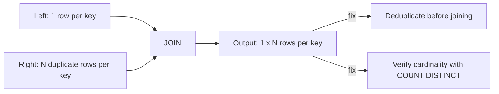

# :material-arrow-expand-all: Data Explosion (Fan-Out Joins)

**Data explosion** happens when a join condition matches more than one row on both
sides for the same key, so the output has far more rows than either input —
often called a **fan-out** or unintended **many-to-many** join.


### :material-sitemap: Overview



---

## :material-pin: Common Symptoms

- `COUNT(*)` after the join is a multiple of the expected row count (e.g. 3x, 10x).
- Downstream aggregates (`SUM(amount)`) are inflated because the same fact row was
  duplicated by a multi-row match on the other side.
- The query runs correctly (no error) — this is a **silent correctness bug**, not a
  runtime failure, which makes it more dangerous than a skew or ambiguity issue.

---

## :material-flask-outline: Practical Examples

### Setup

```sql
CREATE TABLE orders (
    order_id    INT,
    customer_id INT,
    amount      DOUBLE
) USING DELTA;

INSERT INTO orders VALUES
    (1, 101, 250.00),
    (2, 102, 175.50),
    (3, 103, 310.00);

-- payments has THREE rows for order_id=1 (e.g. an initial charge, a partial refund,
-- and a retry) -- a one-to-many relationship the join author didn't expect.
CREATE TABLE payments (
    order_id       INT,
    payment_status STRING
) USING DELTA;

INSERT INTO payments VALUES
    (1, 'AUTHORIZED'),
    (1, 'CAPTURED'),
    (1, 'REFUNDED'),
    (2, 'CAPTURED'),
    (3, 'CAPTURED');
```

### Example 1 — The Bug: Silent Row Duplication

```sql
SELECT o.order_id, o.amount, p.payment_status
FROM orders o
JOIN payments p ON o.order_id = p.order_id;
-- Result: 5 rows, not 3 -- order_id=1 appears THREE times.
-- order_id  amount  payment_status
-- 1         250.00  AUTHORIZED
-- 1         250.00  CAPTURED
-- 1         250.00  REFUNDED
-- 2         175.50  CAPTURED
-- 3         310.00  CAPTURED
```

```sql
-- The bug compounds silently in an aggregate: SUM(amount) triple-counts order 1.
SELECT SUM(o.amount) AS total
FROM orders o
JOIN payments p ON o.order_id = p.order_id;
-- Result: 250.00 * 3 + 175.50 + 310.00 = 1235.50 (should be 735.50)
```

### Example 2 — Diagnose: Verify Cardinality Before Trusting a Join

```sql
SELECT COUNT(*) AS row_count, COUNT(DISTINCT order_id) AS distinct_keys
FROM payments;
-- Result:
-- row_count  distinct_keys
-- 5          3              <- row_count > distinct_keys means duplicates per key
```

### Example 3 — Fix: Deduplicate the Many Side Before Joining

```sql
WITH latest_payment AS (
    SELECT order_id, payment_status
    FROM (
        SELECT *,
               ROW_NUMBER() OVER (
                   PARTITION BY order_id
                   ORDER BY CASE payment_status
                       WHEN 'REFUNDED'   THEN 3
                       WHEN 'CAPTURED'   THEN 2
                       WHEN 'AUTHORIZED' THEN 1
                   END DESC
               ) AS rn
        FROM payments
    )
    WHERE rn = 1
)
SELECT o.order_id, o.amount, lp.payment_status
FROM orders o
JOIN latest_payment lp ON o.order_id = lp.order_id
ORDER BY o.order_id;
-- Result: 3 rows -- one per order, using each order's most advanced payment status.
-- order_id  amount  payment_status
-- 1         250.00  REFUNDED
-- 2         175.50  CAPTURED
-- 3         310.00  CAPTURED
```

### Example 4 — Fix (Aggregation-Friendly): Pre-Aggregate Before Joining

```sql
WITH payment_summary AS (
    SELECT order_id, COUNT(*) AS attempt_count
    FROM payments
    GROUP BY order_id
)
SELECT o.order_id, o.amount, ps.attempt_count
FROM orders o
JOIN payment_summary ps ON o.order_id = ps.order_id
ORDER BY o.order_id;
-- Result: 3 rows, and SUM(amount) is now correct at 735.50.
```

---

## :material-brain: When to Use

| Scenario | Recommended Pattern |
|----------|---------------------|
| Before joining, unsure if a side is unique on the key | Always run `COUNT(*)` vs `COUNT(DISTINCT key)` first |
| Need "the latest/best" row per key on the many side | `ROW_NUMBER() OVER (PARTITION BY key ORDER BY ...)` then filter `rn = 1` |
| Need a derived metric (count, sum) per key | `GROUP BY` into a summary CTE, then join the summary — never the raw many-side rows |
| Join is expected to be many-to-many | Confirm downstream aggregates account for the fan-out, or aggregate *after* the join deliberately |

!!! note "Duplicates on both sides multiply instead of add"
    This page covers duplicates on **one** side. When **both** sides of the join have
    duplicate rows for the same key, the blowup is multiplicative (`N x M`), not
    additive — a far more severe and easy-to-underestimate variant. See
    [Duplicate-Key Explosion](duplicate_key_explosion.md) for that case.
