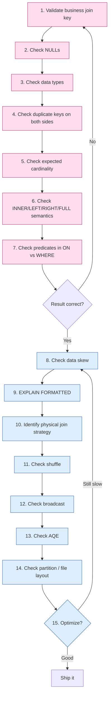

# :material-clipboard-check: Join Debugging Workflow

A single ordered checklist for diagnosing *any* join problem — correctness first, then
performance. Work top to bottom: the **correctness** checks (steps 1–7) make sure the
join returns the *right rows*, and the **performance** checks (steps 8–15) make sure it
returns them *efficiently*. Each step links to the deep-dive page for the issue it
uncovers. Never optimize a join (steps 8–15) before its result is provably correct
(steps 1–7) — a fast wrong answer is still wrong. For an at-a-glance symptom → root
cause → fix lookup, see the companion [Join Troubleshooting Matrix](troubleshooting-matrix.md).

______________________________________________________________________

## :material-sitemap: The 15-Step Flow



______________________________________________________________________

### :material-animation-play: Interactive Visualization — Correctness-First Checklist

<div id="viz-joins-issues-debugging-workflow" class="ts-viz"></div>

Use this as a compact mental model before diving into the full checklist: validate keys and semantics first, then inspect the plan, distribution, and runtime strategy.

<script src="../../../assets/js/querying-joins-issues-viz.js"></script>

## :material-format-list-numbered: Step-by-Step Checklist

### :material-check-circle-outline: Correctness (steps 1–7)

|  #  | Step                                      | What to check                                                                                                                                                 | If it's wrong, see                                                                                                                                                                          |
| :-: | ----------------------------------------- | ------------------------------------------------------------------------------------------------------------------------------------------------------------- | ------------------------------------------------------------------------------------------------------------------------------------------------------------------------------------------- |
|  1  | **Validate business join key**            | Is the key you're joining on actually the *unique business identifier*? Watch for partial composite keys, versioned/SCD keys, and functions wrapping the key. | [Incomplete Join Conditions](incomplete-join-conditions.md), [SCD Type 2](scd-type2-join.md), [Functions on Join Keys](functions-on-join-keys.md), [Duplicate Columns](column-duplicate.md) |
|  2  | **Check NULLs**                           | Do either side's keys contain `NULL`? `NULL = NULL` is `UNKNOWN`, so those rows silently drop.                                                                | [Null Key Trap](null-key-trap.md)                                                                                                                                                           |
|  3  | **Check data types**                      | Are both key columns the *same* type? Implicit casts, string case/whitespace, and floating-point keys all cause silent mismatches.                            | [Type Mismatch](type-mismatch.md), [Case & Whitespace](case-whitespace-mismatch.md), [Floating-Point Equality](floating-point-join.md)                                                      |
|  4  | **Check duplicate keys on both sides**    | Is the key unique per side? Duplicates on one side fan out; duplicates on **both** multiply (`N x M`).                                                        | [Data Explosion](data-explosion.md), [Duplicate-Key Explosion](duplicate-key-explosion.md)                                                                                                  |
|  5  | **Check expected cardinality**            | Does the output row count match your 1:1 / 1:N / N:M expectation?                                                                                             | [Data Explosion](data-explosion.md), [Duplicate-Key Explosion](duplicate-key-explosion.md)                                                                                                  |
|  6  | **Check INNER/LEFT/RIGHT/FULL semantics** | Is the join *type* right for the intent? A missing `ON` gives a cross join; the wrong outer direction drops rows.                                             | [Accidental Cross Join](cartesian-join.md), [Outer Join Filter Pushdown](outer-join-filter-pitfall.md)                                                                                      |
|  7  | **Check predicates in `ON` vs `WHERE`**   | On outer joins, a filter on the null-able side belongs in `ON`, not `WHERE`, or the outer join degrades to inner.                                             | [Predicate vs. Filter](predicate-vs-filter.md), [Outer Join Filter Pushdown](outer-join-filter-pitfall.md)                                                                                  |

### :material-speedometer: Performance (steps 8–15)

|  #  | Step                                | What to check                                                                                               | If it's wrong, see                                                                                |
| :-: | ----------------------------------- | ----------------------------------------------------------------------------------------------------------- | ------------------------------------------------------------------------------------------------- |
|  8  | **Check data skew**                 | Is one key value far more frequent than others, making a few tasks run for hours?                           | [Skewed Join Keys](skewed-keys.md)                                                                |
|  9  | **`EXPLAIN FORMATTED`**             | Read the numbered physical-plan tree and per-node details to see exactly what Spark will run.               | *(this page, Example below)*                                                                      |
| 10  | **Identify physical join strategy** | Is it `BroadcastHashJoin`, `SortMergeJoin`, or a `BroadcastNestedLoopJoin`/`CartesianProduct` (range join)? | [Range / Non-Equi Join](range-join-pitfalls.md), [Broadcast Join Pitfalls](broadcast-pitfalls.md) |
| 11  | **Check shuffle**                   | Is a large shuffle happening, and into how many partitions (default 200)?                                   | [Partition-Count Problems](partition-count.md)                                                    |
| 12  | **Check broadcast**                 | Is the broadcast side genuinely small, or at risk of OOM / a stale `BROADCAST` hint?                        | [Broadcast Join Pitfalls](broadcast-pitfalls.md)                                                  |
| 13  | **Check AQE**                       | Is Adaptive Query Execution on? It fixes strategy/skew/coalescing at runtime — but not join *order*.        | [Join Order / Optimizer](join-order-optimizer.md), [Partition-Count Problems](partition-count.md) |
| 14  | **Check partition / file layout**   | Too many tiny partitions/files, or a few oversized ones spilling to disk?                                   | [Partition-Count Problems](partition-count.md)                                                    |
| 15  | **Optimize?**                       | Reorder joins (CBO + stats), filter early, add hints; re-measure and loop back to step 8 if still slow.     | [Join Order / Optimizer](join-order-optimizer.md)                                                 |

______________________________________________________________________

## :material-flask-outline: Diagnostic Queries

### Steps 2 & 5 — NULLs and Cardinality in One Pass

```sql
-- On each side's join key, before joining:
SELECT
    COUNT(*)                         AS total_rows,
    COUNT(customer_id)               AS non_null_keys,   -- COUNT(col) skips NULLs
    COUNT(*) - COUNT(customer_id)    AS null_keys,        -- step 2
    COUNT(DISTINCT customer_id)      AS distinct_keys     -- step 4 & 5
FROM orders;
-- null_keys > 0                -> Null Key Trap risk (step 2)
-- distinct_keys < non_null_keys -> duplicate keys on this side (step 4)
```

For a table with 3 orders where one `customer_id` is `NULL` and the rest repeat one key,
this returns `total_rows = 3`, `non_null_keys = 2`, `null_keys = 1`,
`distinct_keys = 1` — immediately flagging both a NULL key *and* duplication.

### Steps 1 & 6 — Unmatched Rows on Each Side

Before choosing a join type, quantify how many rows would be *dropped* by an inner join —
run a `LEFT ANTI JOIN` from each side. Non-zero counts mean an inner join silently loses
those rows (switch to an outer join to keep them):

```sql
-- Left rows with no match on the right:
SELECT COUNT(*) AS unmatched_left
FROM orders o
LEFT ANTI JOIN customers c ON o.customer_id = c.customer_id;

-- Right rows with no match on the left (swap the tables):
SELECT COUNT(*) AS unmatched_right
FROM customers c
LEFT ANTI JOIN orders o ON c.customer_id = o.customer_id;
```

### Step 5 — Actual Join Cardinality

Materialize the real joined row count and compare it against each input's size. A result
far larger than both inputs signals duplicate-key or many-to-many explosion:

```sql
SELECT COUNT(*) AS joined_rows
FROM orders o
JOIN customers c ON o.customer_id = c.customer_id;
```

### Step 8 — Skew Detection

List the hottest keys on the large side. A handful of keys with counts orders of
magnitude above the rest is the signature of the skew that stalls one straggler task:

```sql
SELECT customer_id, COUNT(*) AS cnt
FROM orders
GROUP BY customer_id
ORDER BY cnt DESC
LIMIT 20;
```

### Step 9 — Reading `EXPLAIN FORMATTED`

```sql
EXPLAIN FORMATTED
SELECT o.order_id, c.name
FROM orders o
JOIN customers c ON o.customer_id = c.customer_id;
```

```text
== Physical Plan ==
AdaptiveSparkPlan (8)
+- Project (7)
   +- BroadcastHashJoin Inner BuildRight (6)     <- step 10: the join STRATEGY
      :- Filter (2)
      :  +- Scan parquet ... orders (1)
      +- BroadcastExchange (5)                    <- step 12: broadcast side
         +- Filter (4)
            +- Scan parquet ... customers (3)

(1) Scan parquet ... orders
    ... per-node details (pushed filters, output columns, partition filters) ...
```

`EXPLAIN FORMATTED` gives a numbered operator tree plus a detail block per node. Scan it
top-down: the join operator name is your **strategy** (step 10), a `BroadcastExchange`
means a **broadcast** (step 12), and an `Exchange hashpartitioning` means a **shuffle**
(step 11). `AdaptiveSparkPlan` at the root confirms **AQE** is active (step 13).

______________________________________________________________________

## :material-brain: When to Use

| Situation                                                  | Where to start                                                                                   |
| ---------------------------------------------------------- | ------------------------------------------------------------------------------------------------ |
| Join returns wrong / missing / duplicated rows             | Steps 1–7 in order — never skip ahead to performance                                             |
| Join is correct but slow                                   | Steps 8–15; begin with `EXPLAIN FORMATTED` (step 9) to see the real plan                         |
| Not sure whether it's a correctness or performance problem | Run the step 2 & 5 diagnostic query first — it's cheap and rules out the most common silent bugs |
| Tuned everything and it's still slow                       | Loop: step 15 → step 8, re-measuring after each change rather than stacking guesses              |

!!! danger "Correctness gates performance — always"

    Steps 1–7 must pass **before** you touch steps 8–15. Optimizing a join that returns
    the wrong rows just makes a wrong answer arrive faster. Once the result is verified,
    the performance steps are safe to iterate on, because they change *how* the join
    runs, not *what* it returns. Every issue in this section is cross-referenced from the
    checklist above — follow the links for runnable, Spark-verified data examples of each.

!!! tip "Judge the fix against all six axes, not just the one that failed"

    This 15-step checklist maps onto the broader
    [Six-Axis Quality Rubric](../../../optimization/optimization.md#the-six-axis-quality-rubric):
    steps 1–7 cover **logical correctness** and **cardinality**, steps 9–10 cover the
    **physical plan**, steps 11–12 cover **shuffle**/**memory**, and step 8 covers
    **data distribution**. A join that's fast can still be wrong on an axis you didn't
    check.
