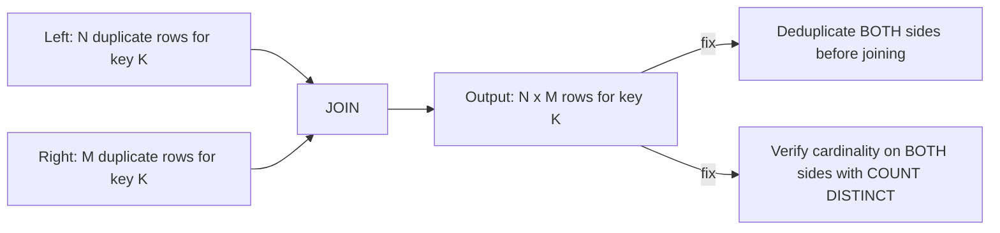

# :material-lightning-bolt: Duplicate-Key Explosion (Both Sides)

[Data Explosion](data-explosion.md) covers the common case of duplicates on **one**
side of a join. This page covers the more severe variant: when **both** sides have
duplicate rows for the same key, the output multiplies rather than adds — `N` left
rows x `M` right rows for a single key becomes `N x M` output rows for that key alone.
A key with modest duplication on both sides (say, 100 and 100) doesn't produce 200
rows — it produces **10,000**. The fix is always the same: establish the **grain**
of each side (what a single row represents) and enforce a 1:1 or 1:N relationship
before joining — never join two tables that are both grain-ambiguous on the key.

______________________________________________________________________

## :material-sitemap: Overview



______________________________________________________________________

### :material-animation-play: Interactive Visualization — N × M Explosion

<div id="viz-joins-issues-duplicate-key-explosion" class="ts-viz"></div>

This demo turns the math into a concrete row count: a modest 3-by-2 duplication for one key already produces six output rows. The repaired view uses one deterministic row per side.

<script src="../../../assets/js/querying-joins-issues-viz.js"></script>

## :material-pin: Common Symptoms

- Row counts don't just look "a bit high" — they explode combinatorially for specific
    keys, sometimes turning a million-row job into a multi-billion-row job that never
    finishes or blows executor memory.
- Unlike a plain fan-out (duplicates on one side only), deduplicating **just one** side
    isn't enough — the output still multiplies by however many duplicates remain on the
    other side.
- `COUNT(*)` vs `COUNT(DISTINCT key)` looks slightly "off" on *both* input tables, not
    just one — a signal this is the multiplicative variant, not the simple fan-out.
- The join's own shuffle stage looks unremarkable (it's sized to the *inputs*, before
    they multiply) — the "massive shuffle" surprise hits *downstream*, in whatever
    stage (a `GROUP BY`, another join, a table write) has to move or persist the
    already-exploded `N x M` output.

______________________________________________________________________

## :material-flask-outline: Practical Examples

### Example 0 — Contrast: Safe 1:N Join vs. Unsafe N:M Join

The same `LEFT JOIN ... GROUP BY` shape is completely safe when only **one** side has
duplicate keys, and silently wrong when **both** sides do. Verified on Spark 4.2 with a
`customer_id = 101` that has 3 raw rows on the customer side and 5 orders:

```sql
-- customers: one row per customer_id -- SAFE grain
CREATE TABLE customers (customer_id INT);
INSERT INTO customers VALUES (101), (102);

-- orders: many rows per customer_id -- fine, this is the expected "many" side
CREATE TABLE orders (customer_id INT, order_id INT);
INSERT INTO orders VALUES (101,1),(101,2),(101,3),(101,4),(101,5),(102,10);

SELECT c.customer_id, COUNT(o.order_id) AS order_count
FROM customers c
LEFT JOIN orders o ON c.customer_id = o.customer_id
GROUP BY c.customer_id;
-- 101 -> 5, 102 -> 1   -- correct: customers is 1 row/key, so COUNT just counts orders
```

```sql
-- customer_raw: a data-quality problem introduces 3 rows for customer_id 101
-- (e.g. re-ingested with slightly different name casing/spacing each run)
CREATE TABLE customer_raw (customer_id INT, customer_name STRING);
INSERT INTO customer_raw VALUES
    (101, 'Acme Corp'), (101, 'ACME CORP'), (101, 'Acme  Corp'), (102, 'Globex');

SELECT c.customer_id, COUNT(o.order_id) AS order_count
FROM customer_raw c
LEFT JOIN orders o ON c.customer_id = o.customer_id
GROUP BY c.customer_id;
-- 101 -> 15 (3 customer rows x 5 orders), 102 -> 1   -- WRONG: should be 5, not 15
```

Nothing about the *query* changed — only the grain of `customer_raw` did. **Adding
`DISTINCT` does not fix this**: the 3 `customer_raw` rows for 101 are not
byte-identical (`customer_name` differs), so `DISTINCT` keeps all 3. The correct,
architectural fix is to establish the grain of each side and reduce it to one row per
key **before** joining — aggregating on a representative non-key column, not just
`COUNT`:

```sql
WITH customer AS (
    SELECT customer_id, MAX(customer_name) AS customer_name   -- pick one deterministically
    FROM customer_raw
    GROUP BY customer_id
),
orders_by_customer AS (
    SELECT customer_id, COUNT(*) AS order_count
    FROM orders
    GROUP BY customer_id
)
SELECT c.customer_id, c.customer_name, COALESCE(o.order_count, 0) AS order_count
FROM customer c
LEFT JOIN orders_by_customer o ON c.customer_id = o.customer_id;
-- 101 -> 'Acme Corp', 5   -- correct again
```

### Setup

```sql
-- clicks has 3 rows for session s1 (a normal browsing session)
CREATE TABLE clicks (
    session_id STRING,
    click_ts   STRING,
    page       STRING
);

INSERT INTO clicks VALUES
    ('s1', '10:00', 'home'),
    ('s1', '10:01', 'search'),
    ('s1', '10:02', 'product'),
    ('s2', '11:00', 'home');

-- purchases has 2 rows for session s1 (e.g. the user checked out twice, or a retry
-- created a duplicate purchase record) -- duplicates on THIS side too.
CREATE TABLE purchases (
    session_id  STRING,
    purchase_ts STRING,
    item        STRING
);

INSERT INTO purchases VALUES
    ('s1', '10:05', 'shoes'),
    ('s1', '10:10', 'socks'),
    ('s2', '11:05', 'hat');
```

### Example 1 — The Bug: Multiplicative Row Blowup

```sql
SELECT c.session_id, c.click_ts, c.page, p.purchase_ts, p.item
FROM clicks c
JOIN purchases p ON c.session_id = p.session_id
ORDER BY c.session_id, c.click_ts, p.purchase_ts;
```

| session_id | click_ts | page    | purchase_ts | item  |
| :--------: | :------: | ------- | :---------: | ----- |
|     s1     |  10:00   | home    |    10:05    | shoes |
|     s1     |  10:00   | home    |    10:10    | socks |
|     s1     |  10:01   | search  |    10:05    | shoes |
|     s1     |  10:01   | search  |    10:10    | socks |
|     s1     |  10:02   | product |    10:05    | shoes |
|     s1     |  10:02   | product |    10:10    | socks |
|     s2     |  11:00   | home    |    11:05    | hat   |

`s1` has **3 clicks x 2 purchases = 6 rows**, not `3 + 2 = 5` and not the 3 rows you'd
get if you were expecting one purchase per session. Every click is now paired with
every purchase, even though there's no real relationship between *which* click led to
*which* purchase — the join key alone can't express that.

### Example 2 — Diagnose: Check Cardinality on *Both* Sides

```sql
SELECT session_id, COUNT(*) AS click_count
FROM clicks GROUP BY session_id;
-- s1: 3, s2: 1

SELECT session_id, COUNT(*) AS purchase_count
FROM purchases GROUP BY session_id;
-- s1: 2, s2: 1
```

Whenever a key has `COUNT(*) > 1` on **both** input tables simultaneously, expect
multiplicative — not additive — row growth for that key once joined. Run this check on
both sides *before* joining, especially before joining two fact-like tables (event logs,
transaction logs) rather than a fact-to-dimension join.

To predict the **exact** joined row count *before* running the join, multiply the
per-key counts and sum across keys — `SUM(left.cnt * right.cnt)`:

```sql
SELECT SUM(l.cnt * r.cnt) AS theoretical_join_rows
FROM (SELECT session_id, COUNT(*) AS cnt FROM clicks    GROUP BY session_id) l
JOIN (SELECT session_id, COUNT(*) AS cnt FROM purchases GROUP BY session_id) r
  ON l.session_id = r.session_id;
-- theoretical_join_rows
-- 7          (s1: 3*2=6, s2: 1*1=1)
```

If this number is far larger than either input's row count, you have a many-to-many
explosion. It matches the actual `COUNT(*)` of the join exactly — a cheap way to size
the blast radius before materializing the result.

### Example 2b — Why `EXPLAIN` Won't Warn You (and Where the Shuffle Actually Hurts)

```sql
EXPLAIN
SELECT c.session_id, c.click_ts, c.page, p.purchase_ts, p.item
FROM clicks c
JOIN purchases p ON c.session_id = p.session_id;
```

```text
-- With a small broadcast side:
== Physical Plan ==
AdaptiveSparkPlan isFinalPlan=false
+- Project [...]
   +- BroadcastHashJoin [session_id], [session_id], Inner, BuildRight, false, false
      :- Filter isnotnull(session_id) +- FileScan parquet ... clicks ...
      +- BroadcastExchange ...
         +- Filter isnotnull(session_id) +- FileScan parquet ... purchases ...

-- With autoBroadcastJoinThreshold disabled (forces a shuffle join):
== Physical Plan ==
AdaptiveSparkPlan isFinalPlan=false
+- Project [...]
   +- SortMergeJoin [session_id], [session_id], Inner
      :- Sort [session_id ASC], false, 0
      :  +- Exchange hashpartitioning(session_id, 200), ...
      :     +- Filter isnotnull(session_id) +- FileScan parquet ... clicks ...
      +- Sort [session_id ASC], false, 0
         +- Exchange hashpartitioning(session_id, 200), ...
            +- Filter isnotnull(session_id) +- FileScan parquet ... purchases ...
```

Neither plan shape is unusual — both look like an ordinary join, whether Spark
broadcasts or shuffles. That's the trap: the `Exchange`/shuffle stages you see *here*
are sized to the **input** row counts (3 and 3 clicks/purchases in this toy example),
not the `N x M` output. The "massive shuffle" this issue is known for doesn't happen
in the join itself — it hits the **next** stage that touches the joined output (a
`GROUP BY`, another join, a repartition, or a table write), because that stage now has
to move/persist the already-multiplied row count, which can be orders of magnitude
larger than either input.

```sql
WITH last_click AS (
    SELECT session_id, MAX(click_ts) AS last_click_ts
    FROM clicks
    GROUP BY session_id
),
first_purchase AS (
    SELECT session_id, purchase_ts AS first_purchase_ts, item
    FROM (
        SELECT *,
               ROW_NUMBER() OVER (PARTITION BY session_id ORDER BY purchase_ts) AS rn
        FROM purchases
    )
    WHERE rn = 1
)
SELECT c.session_id, c.last_click_ts, p.first_purchase_ts, p.item
FROM last_click c
JOIN first_purchase p ON c.session_id = p.session_id
ORDER BY c.session_id;
```

| session_id | last_click_ts | first_purchase_ts | item  |
| :--------: | :-----------: | :---------------: | ----- |
|     s1     |     10:02     |       10:05       | shoes |
|     s2     |     11:00     |       11:05       | hat   |

Reducing **each** side to one row per key (here: last click before checkout, first
purchase attempt) restores a 1-to-1 relationship — the join now produces exactly one
row per session, matching the real-world intent.

### :material-database-cog: Databricks/Spark-Specific Considerations

- **[Databricks] `MERGE INTO` rejects this outright, rather than silently exploding.**
    If the *source* side of a `MERGE` has duplicate keys matching a single target row,
    Delta raises `UnsupportedOperationException: Cannot perform Merge as multiple source   rows matched` instead of applying the update multiple times. This is Delta's
    equivalent safety net for the exact problem this page describes — the fix is the
    same: pre-aggregate/dedupe the source to one row per merge key before the `MERGE`.
    ```sql
    -- [Databricks] Deduplicate the source before MERGE, using the same
    -- ROW_NUMBER()/aggregate patterns as Examples 3 and 4
    MERGE INTO customer_dim t
    USING (
        SELECT customer_id, MAX(customer_name) AS customer_name
        FROM customer_raw
        GROUP BY customer_id
    ) s
    ON t.customer_id = s.customer_id
    WHEN MATCHED THEN UPDATE SET t.customer_name = s.customer_name
    WHEN NOT MATCHED THEN INSERT (customer_id, customer_name)
        VALUES (s.customer_id, s.customer_name);
    ```
- **[Databricks] `OPTIMIZE`/`ZORDER BY` does not fix duplicate-key explosion.**
    Both only change physical file layout for faster scans/skipping — they have no
    effect on row-level duplication, which is a data-quality/grain problem, not a
    layout problem. Don't reach for `OPTIMIZE` when the symptom is an inflated row
    count; verify cardinality (Example 2) first.
- **Open-source Spark** has no equivalent guard: a plain `INSERT`/`UPDATE ... FROM` (or
    a hand-written `MERGE`-like upsert via `UNION ALL` + window dedup) will happily
    apply the same update `N x M` times if the source isn't deduplicated first — the
    responsibility to catch this stays entirely on the query author.

### Example 3b — `EXPLAIN FORMATTED` Signature Checklist

`EXPLAIN FORMATTED` numbers every operator and lists its inputs/outputs, which makes it
easy to scan for the shapes that matter here. Verified on the customer/orders case
above (Example 0):

```text
-- Small tables (default broadcast threshold):
AdaptiveSparkPlan (9)
+- HashAggregate (8)
   +- Exchange (7)                              <- 1 shuffle: to combine partial counts
      +- HashAggregate (6)
         +- Project (5)
            +- BroadcastHashJoin LeftOuter BuildRight (4)   <- one side broadcast
               :- LocalTableScan (1)
               +- BroadcastExchange (3)
                  +- LocalTableScan (2)

-- Same query, broadcast disabled (autoBroadcastJoinThreshold = -1):
AdaptiveSparkPlan (11)
+- HashAggregate (10)
   +- HashAggregate (9)
      +- Project (8)
         +- SortMergeJoin LeftOuter (7)
            :- Sort (3)                          <- pattern: Exchange -> Sort -> SortMergeJoin
            :  +- Exchange (2)                   <- 1st shuffle (left side)
            :     +- LocalTableScan (1)
            +- Sort (6)                          <- same pattern, other side
               +- Exchange (5)                   <- 2nd shuffle (right side)
                  +- LocalTableScan (4)
```

What each signature tells you:

| Pattern                                                     | Meaning                                                                                                                                                                                                                   |
| ----------------------------------------------------------- | ------------------------------------------------------------------------------------------------------------------------------------------------------------------------------------------------------------------------- |
| `Exchange` → `Sort` → `SortMergeJoin`, on **both** branches | Neither side was small enough to broadcast — expect two full shuffles before the join even starts comparing rows                                                                                                          |
| `BroadcastHashJoin` where the broadcast side looks large    | The "small" side may not be small — check its actual size; a stale `BROADCAST` hint on a table that grew is a common cause ([Broadcast Join Pitfalls](broadcast-pitfalls.md))                                             |
| **Multiple `Exchange` nodes** stacked in one plan           | Each one is a real shuffle boundary; count them — a plan with 3+ `Exchange` nodes for what should be a simple join/aggregate usually means a fixable join order or a missing pre-aggregation, not just "Spark being slow" |
| `HashAggregate` appearing twice (partial, then final)       | Normal — Spark always does a map-side partial aggregate before the shuffle; this is not itself a problem                                                                                                                  |

None of these signatures tell you whether the **result is correct** — that's Examples
1–2's job. `EXPLAIN FORMATTED` only tells you how the (possibly already-wrong) query
will execute, which is exactly why cardinality checks have to come first.

### Example 4 — Fix (Alternative): Aggregate Both Sides to Summaries

```sql
WITH click_summary AS (
    SELECT session_id, COUNT(*) AS click_count
    FROM clicks
    GROUP BY session_id
),
purchase_summary AS (
    SELECT session_id, COUNT(*) AS purchase_count, SUM(1) AS item_count
    FROM purchases
    GROUP BY session_id
)
SELECT cs.session_id, cs.click_count, ps.purchase_count
FROM click_summary cs
JOIN purchase_summary ps ON cs.session_id = ps.session_id
ORDER BY cs.session_id;
-- Result: one row per session, with counts as metrics instead of raw duplicated rows --
-- appropriate when you need "how many clicks / purchases per session", not the
-- individual event rows themselves.
```

______________________________________________________________________

## :material-brain: When to Use

| Scenario                                                                                   | Recommended Pattern                                                                                                                                                                                                                                                                                                        |
| ------------------------------------------------------------------------------------------ | -------------------------------------------------------------------------------------------------------------------------------------------------------------------------------------------------------------------------------------------------------------------------------------------------------------------------- |
| Joining two event/log-style tables that can each have multiple rows per key                | Check `COUNT(*)` vs `COUNT(DISTINCT key)` on **both** sides before joining — see Example 2                                                                                                                                                                                                                                 |
| Need a specific record per key from each side (e.g. "the latest")                          | Reduce **each** side to one row per key first, with `ROW_NUMBER()`/`MAX()`/`MIN()`, then join (Example 3)                                                                                                                                                                                                                  |
| Need counts/metrics per key, not the raw rows                                              | Pre-aggregate **both** sides into summary CTEs before joining (Example 4)                                                                                                                                                                                                                                                  |
| A "dimension" side that should be 1 row/key has accidental duplicates (data-quality issue) | Aggregate on a representative attribute (`MAX(name)`, etc.), not just `COUNT` — see Example 0                                                                                                                                                                                                                              |
| Unsure whether `SortMergeJoin` or `BroadcastHashJoin` is doing something unexpected        | Read `EXPLAIN FORMATTED` for the shuffle/broadcast/multi-`Exchange` signatures in Example 3b                                                                                                                                                                                                                               |
| Genuinely need every combination (e.g. a deliberate matrix/cross reference)                | Confirm the multiplicative output is expected, and consider whether the key alone can even express which pairs are "real" — the join key may need extra join conditions ([Range Join](../types/non_equi_join/range_join/point-in-interval.md)) to correlate clicks to purchases by time proximity instead of session alone |

!!! danger "One-sided dedup silently under-fixes this"

    If you only deduplicate the side you noticed had duplicates, the join still
    multiplies by whatever duplication remains on the *other* side — the row count will
    look better but is often still wrong. Always check and fix **both** sides of a join
    that appears to have duplicate-key explosion, not just the more obvious one.

!!! danger "SELECT DISTINCT does not fix this"

    `SELECT DISTINCT` only collapses rows that are byte-for-byte identical across every
    selected column. In Example 1, `click_ts`/`page`/`purchase_ts`/`item` all differ
    per pairing, so `SELECT DISTINCT c.session_id, c.click_ts, c.page, p.purchase_ts, p.item ...` still returns all 7 rows unchanged — the multiplicative row count
    survives `DISTINCT` untouched. You must establish the grain and enforce a 1:1 or
    1:N relationship **before** the join (Examples 3 and 4); `DISTINCT` after the join
    cannot undo it.

!!! note "SQL syntax alone doesn't tell you if a query is right *or* fast"

    A join can be syntactically valid, pass a quick eyeball test, and still be silently
    wrong (Example 1) or silently slow (Example 2b) — the query text carries none of
    that information on its own. Judge a Spark SQL solution against all six axes
    together: **logical correctness**, **cardinality**, **physical plan**, **shuffle**,
    **data distribution**, and **memory** — see the
    [Six-Axis Quality Rubric](../../../optimization/optimization.md#the-six-axis-quality-rubric)
    for the full checklist and the [Problem-to-Validation Workflow](../../../optimization/optimization.md)
    it feeds into.
