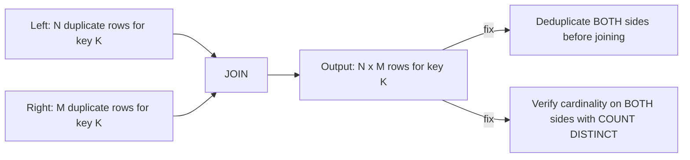

# :material-lightning-bolt: Duplicate-Key Explosion (Both Sides)

[Data Explosion](data_explosion.md) covers the common case of duplicates on **one**
side of a join. This page covers the more severe variant: when **both** sides have
duplicate rows for the same key, the output multiplies rather than adds — `N` left
rows x `M` right rows for a single key becomes `N x M` output rows for that key alone.
A key with modest duplication on both sides (say, 100 and 100) doesn't produce 200
rows — it produces **10,000**.

---

### :material-sitemap: Overview



---

## :material-pin: Common Symptoms

- Row counts don't just look "a bit high" — they explode combinatorially for specific
  keys, sometimes turning a million-row job into a multi-billion-row job that never
  finishes or blows executor memory.
- Unlike a plain fan-out (duplicates on one side only), deduplicating **just one** side
  isn't enough — the output still multiplies by however many duplicates remain on the
  other side.
- `COUNT(*)` vs `COUNT(DISTINCT key)` looks slightly "off" on *both* input tables, not
  just one — a signal this is the multiplicative variant, not the simple fan-out.

---

## :material-flask-outline: Practical Examples

### Setup

```sql
-- clicks has 3 rows for session s1 (a normal browsing session)
CREATE TABLE clicks (
    session_id STRING,
    click_ts   STRING,
    page       STRING
);

INSERT INTO clicks VALUES
    ('s1', '10:00', 'home'),
    ('s1', '10:01', 'search'),
    ('s1', '10:02', 'product'),
    ('s2', '11:00', 'home');

-- purchases has 2 rows for session s1 (e.g. the user checked out twice, or a retry
-- created a duplicate purchase record) -- duplicates on THIS side too.
CREATE TABLE purchases (
    session_id  STRING,
    purchase_ts STRING,
    item        STRING
);

INSERT INTO purchases VALUES
    ('s1', '10:05', 'shoes'),
    ('s1', '10:10', 'socks'),
    ('s2', '11:05', 'hat');
```

### Example 1 — The Bug: Multiplicative Row Blowup

```sql
SELECT c.session_id, c.click_ts, c.page, p.purchase_ts, p.item
FROM clicks c
JOIN purchases p ON c.session_id = p.session_id
ORDER BY c.session_id, c.click_ts, p.purchase_ts;
```

| session_id | click_ts | page | purchase_ts | item |
|:---:|:---:|---|:---:|---|
| s1 | 10:00 | home | 10:05 | shoes |
| s1 | 10:00 | home | 10:10 | socks |
| s1 | 10:01 | search | 10:05 | shoes |
| s1 | 10:01 | search | 10:10 | socks |
| s1 | 10:02 | product | 10:05 | shoes |
| s1 | 10:02 | product | 10:10 | socks |
| s2 | 11:00 | home | 11:05 | hat |

`s1` has **3 clicks x 2 purchases = 6 rows**, not `3 + 2 = 5` and not the 3 rows you'd
get if you were expecting one purchase per session. Every click is now paired with
every purchase, even though there's no real relationship between *which* click led to
*which* purchase — the join key alone can't express that.

### Example 2 — Diagnose: Check Cardinality on *Both* Sides

```sql
SELECT session_id, COUNT(*) AS click_count
FROM clicks GROUP BY session_id;
-- s1: 3, s2: 1

SELECT session_id, COUNT(*) AS purchase_count
FROM purchases GROUP BY session_id;
-- s1: 2, s2: 1
```

Whenever a key has `COUNT(*) > 1` on **both** input tables simultaneously, expect
multiplicative — not additive — row growth for that key once joined. Run this check on
both sides *before* joining, especially before joining two fact-like tables (event logs,
transaction logs) rather than a fact-to-dimension join.

To predict the **exact** joined row count *before* running the join, multiply the
per-key counts and sum across keys — `SUM(left.cnt * right.cnt)`:

```sql
SELECT SUM(l.cnt * r.cnt) AS theoretical_join_rows
FROM (SELECT session_id, COUNT(*) AS cnt FROM clicks    GROUP BY session_id) l
JOIN (SELECT session_id, COUNT(*) AS cnt FROM purchases GROUP BY session_id) r
  ON l.session_id = r.session_id;
-- theoretical_join_rows
-- 7          (s1: 3*2=6, s2: 1*1=1)
```

If this number is far larger than either input's row count, you have a many-to-many
explosion. It matches the actual `COUNT(*)` of the join exactly — a cheap way to size
the blast radius before materializing the result.

### Example 3 — Fix: Deduplicate Both Sides Before Joining

```sql
WITH last_click AS (
    SELECT session_id, MAX(click_ts) AS last_click_ts
    FROM clicks
    GROUP BY session_id
),
first_purchase AS (
    SELECT session_id, MIN(purchase_ts) AS first_purchase_ts, MIN(item) AS item
    FROM purchases
    GROUP BY session_id
)
SELECT c.session_id, c.last_click_ts, p.first_purchase_ts, p.item
FROM last_click c
JOIN first_purchase p ON c.session_id = p.session_id
ORDER BY c.session_id;
```

| session_id | last_click_ts | first_purchase_ts | item |
|:---:|:---:|:---:|---|
| s1 | 10:02 | 10:05 | hat |
| s2 | 11:00 | 11:05 | hat |

Reducing **each** side to one row per key (here: last click before checkout, first
purchase attempt) restores a 1-to-1 relationship — the join now produces exactly one
row per session, matching the real-world intent.

### Example 4 — Fix (Alternative): Aggregate Both Sides to Summaries

```sql
WITH click_summary AS (
    SELECT session_id, COUNT(*) AS click_count
    FROM clicks
    GROUP BY session_id
),
purchase_summary AS (
    SELECT session_id, COUNT(*) AS purchase_count, SUM(1) AS item_count
    FROM purchases
    GROUP BY session_id
)
SELECT cs.session_id, cs.click_count, ps.purchase_count
FROM click_summary cs
JOIN purchase_summary ps ON cs.session_id = ps.session_id
ORDER BY cs.session_id;
-- Result: one row per session, with counts as metrics instead of raw duplicated rows --
-- appropriate when you need "how many clicks / purchases per session", not the
-- individual event rows themselves.
```

---

## :material-brain: When to Use

| Scenario | Recommended Pattern |
|----------|---------------------|
| Joining two event/log-style tables that can each have multiple rows per key | Check `COUNT(*)` vs `COUNT(DISTINCT key)` on **both** sides before joining — see Example 2 |
| Need a specific record per key from each side (e.g. "the latest") | Reduce **each** side to one row per key first, with `ROW_NUMBER()`/`MAX()`/`MIN()`, then join (Example 3) |
| Need counts/metrics per key, not the raw rows | Pre-aggregate **both** sides into summary CTEs before joining (Example 4) |
| Genuinely need every combination (e.g. a deliberate matrix/cross reference) | Confirm the multiplicative output is expected, and consider whether the key alone can even express which pairs are "real" — the join key may need extra join conditions ([Range Join](../types/non_equi_join/range_join/point_in_interval.md)) to correlate clicks to purchases by time proximity instead of session alone |

!!! danger "One-sided dedup silently under-fixes this"
    If you only deduplicate the side you noticed had duplicates, the join still
    multiplies by whatever duplication remains on the *other* side — the row count will
    look better but is often still wrong. Always check and fix **both** sides of a join
    that appears to have duplicate-key explosion, not just the more obvious one.
