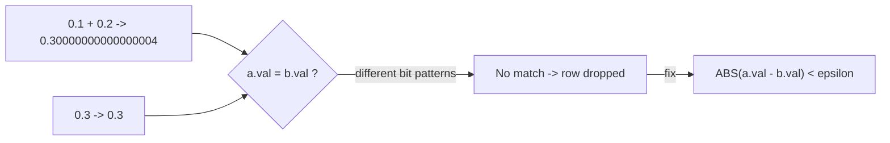

# :material-decimal: Floating-Point Equality Join

Joining on a `FLOAT`/`DOUBLE` column with `=` is fragile: binary floating-point can't
exactly represent most decimal fractions, so a value computed as `0.1 + 0.2` is **not**
bit-for-bit equal to the literal `0.3`, even though they print the same by default. A
join key that looks identical can silently fail to match.

______________________________________________________________________

## :material-sitemap: Overview



______________________________________________________________________

### :material-animation-play: Interactive Visualization — Floating-Point Equality Failure

<div id="viz-joins-issues-floating-point-join" class="ts-viz"></div>

The side-by-side panels use the exact Spark 4.2 values from the verified query: `0.30000000000000004` fails `=` against `0.3`, then succeeds once a tolerance is introduced.

<script src="../../../assets/js/querying-joins-issues-viz.js"></script>

## :material-pin: Common Symptoms

- A join on a computed numeric column (a sum, an average, a unit conversion) misses
    rows that are "obviously" the same value when printed.
- The mismatch is invisible in `SELECT val`-style output because the default display
    format rounds/truncates — it only shows up with a full-precision cast
    (`printf('%.17f', val)`) or by comparing `HASH(val)` across sides.
- The bug appears only for values that arose from arithmetic (sums, divisions, unit
    conversions), never for values inserted as plain literals — a strong signal it's a
    floating-point representation issue.

______________________________________________________________________

## :material-flask-outline: Practical Examples

### Setup

```sql
CREATE TABLE readings_a (id INT, val DOUBLE);

INSERT INTO readings_a VALUES
    (1, CAST(0.1 AS DOUBLE) + CAST(0.2 AS DOUBLE)),  -- arithmetic result
    (2, 1.0),
    (3, 3.3000001);

CREATE TABLE readings_b (id INT, val DOUBLE);

INSERT INTO readings_b VALUES
    (1, CAST(0.3 AS DOUBLE)),  -- looks identical to row 1 above, but isn't
    (2, 1.0),
    (3, 3.3);
```

### Example 1 — Reveal the Hidden Difference

```sql
SELECT id, val, printf('%.17f', val) AS full_precision
FROM readings_a
ORDER BY id;
```

| id  | val                 | full_precision      |
| :-: | ------------------- | ------------------- |
|  1  | 0.30000000000000004 | 0.30000000000000004 |
|  2  | 1.0                 | 1.00000000000000000 |
|  3  | 3.3000001           | 3.30000010000000000 |

`readings_b.val` for `id=1` is exactly `0.3` (`0.30000000000000000`) — a different bit
pattern from `readings_a`'s `0.30000000000000004`.

### Example 2 — The Bug: Naive Equality Join Drops the Row

```sql
SELECT a.id, a.val AS val_a, b.val AS val_b
FROM readings_a a
LEFT JOIN readings_b b ON a.val = b.val
ORDER BY a.id;
```

| id  | val_a               | val_b |
| :-: | ------------------- | ----- |
|  1  | 0.30000000000000004 | NULL  |
|  2  | 1.0                 | 1.0   |
|  3  | 3.3000001           | NULL  |

Rows 1 and 3 fail to match even though they represent "the same" measurement within any
reasonable real-world tolerance.

### Example 3 — Fix: Tolerance-Based Join

```sql
SELECT a.id, a.val AS val_a, b.val AS val_b
FROM readings_a a
LEFT JOIN readings_b b ON ABS(a.val - b.val) < 0.0001
ORDER BY a.id;
```

| id  | val_a               | val_b |
| :-: | ------------------- | ----- |
|  1  | 0.30000000000000004 | 0.3   |
|  2  | 1.0                 | 1.0   |
|  3  | 3.3000001           | 3.3   |

All 3 rows now match — this is exactly the
[point-in-interval / fixed-distance range join](../types/non_equi_join/range_join/point-in-interval.md#8-using-join-points-within-a-fixed-distance)
pattern applied to a single numeric column instead of a timestamp.

### Example 4 — Alternative Fix: Round to a Fixed Scale Before Joining

```sql
SELECT a.id, a.val AS val_a, b.val AS val_b
FROM readings_a a
LEFT JOIN readings_b b ON ROUND(a.val, 4) = ROUND(b.val, 4)
ORDER BY a.id;
-- Same 3-row result as Example 3. Simpler to read, but choose the rounding scale
-- carefully -- too coarse and unrelated values start colliding; too fine and the
-- original problem returns.
```

______________________________________________________________________

## :material-brain: When to Use

| Scenario                                                                | Recommended Pattern                                                                                                       |
| ----------------------------------------------------------------------- | ------------------------------------------------------------------------------------------------------------------------- |
| Join key is a `DECIMAL` with a fixed, small scale                       | Plain `=` is safe — `DECIMAL` is exact, unlike `FLOAT`/`DOUBLE`                                                           |
| Join key is a computed `FLOAT`/`DOUBLE` (sums, averages, conversions)   | `ABS(a.val - b.val) < epsilon` (Example 3) — pick `epsilon` based on the unit's real-world precision                      |
| Values are always rounded to the same number of decimal places upstream | `ROUND(a.val, n) = ROUND(b.val, n)` (Example 4) — simpler, but rounding is a blunt instrument                             |
| Correctness-critical numeric keys (money, quantities)                   | Store as `DECIMAL(p, s)` instead of `DOUBLE` in the first place — this class of bug doesn't exist for exact numeric types |

!!! danger "Never store money as `DOUBLE`"

    The root cause here is using a binary floating-point type for values that are
    conceptually exact decimals. Prefer `DECIMAL(p, s)` for money, quantities, and any
    other value that must compare equal reliably — it sidesteps this entire class of bug.
