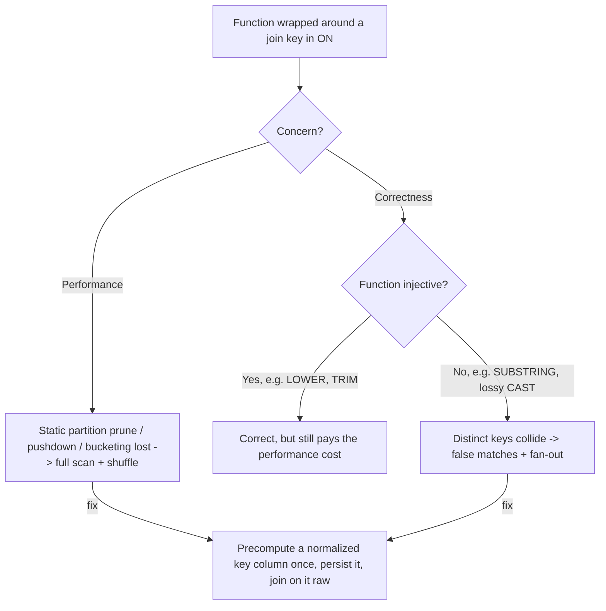

# :material-function-variant: Functions on Join Keys

Wrapping a join key in a function inside the `ON` clause — `ON UPPER(a.k) = UPPER(b.k)`,
`ON CAST(a.id AS STRING) = b.id`, `ON SUBSTRING(a.code, 4) = b.code` — is sometimes
*necessary* to reconcile keys (see [Case & Whitespace Mismatch](case_whitespace_mismatch.md)
and [Type Mismatch](type_mismatch.md)), but it carries two hidden costs:

- **Performance:** a function on a key defeats **partition pruning**, **filter
  pushdown**, and **bucketing/pre-sort reuse**, because the engine can no longer reason
  about the raw column values or the physical layout.
- **Correctness:** a **non-injective** function (one that maps different inputs to the
  same output — `SUBSTRING`, a lossy `CAST`, `ROUND`) can make **distinct keys collide**,
  producing false matches and silent fan-out.

---

### :material-sitemap: Overview



---

## :material-pin: Common Symptoms

- A join against a **partitioned** table scans every partition even though you filtered
  on the partition column — the filter got wrapped in a function.
- A join that "should" be a fast broadcast or bucketed join instead shows a full
  `SortMergeJoin` with a large shuffle in `EXPLAIN`.
- Row counts inflate and pairings look wrong after switching to a function-based join
  key — a sign the function collapsed distinct keys together.
- The same query is dramatically slower after someone "fixed" a key-mismatch bug by
  wrapping both sides in `UPPER()`/`TRIM()`/`CAST()` directly in the `ON` clause.

---

## :material-flask-outline: Practical Examples

### Setup

```sql
-- Partitioned fact table; region is the partition column.
CREATE TABLE events (id INT, region STRING, amount DOUBLE)
USING PARQUET PARTITIONED BY (region);

INSERT INTO events VALUES
    (1, 10.0, 'east'), (2, 20.0, 'west'), (3, 30.0, 'east'), (4, 40.0, 'north');

CREATE TABLE dim (region STRING, label STRING);
INSERT INTO dim VALUES ('east', 'E');
```

### Example 1 — Performance: A Function Defeats Partition Pruning

```sql
-- Plain equi-join on the raw partition column:
EXPLAIN SELECT e.id, d.label
FROM events e
JOIN dim d ON e.region = d.region
WHERE d.region = 'east';
```

```text
FileScan parquet ... events ...
  PartitionFilters: [(region#.. = east), isnotnull(region#..)]   <- prunes to ONE partition
```

```sql
-- Same query, but the key is wrapped in UPPER() on both sides:
EXPLAIN SELECT e.id, d.label
FROM events e
JOIN dim d ON UPPER(e.region) = UPPER(d.region)
WHERE UPPER(d.region) = 'EAST';
```

```text
FileScan parquet ... events ...
  PartitionFilters: [isnotnull(region#..),
                     dynamicpruningexpression(upper(region#..) IN dynamicpruning#..)]
  -- the clean static "region = east" prune is GONE; Spark can't map UPPER(region)
  -- back to a partition directory, so it falls back to a weaker dynamic filter.
```

Wrapping the partition column in `UPPER()` removes the direct `region = 'east'` partition
filter — the engine can no longer point at a single partition directory, so it reads far
more data than it needs to. The same effect defeats source-level `PushedFilters` and any
bucketing/sort that was built on the raw column.

### Example 2 — Correctness: A Non-Injective Function Collides Distinct Keys

```sql
CREATE TABLE accounts (acct_code STRING, owner STRING);
INSERT INTO accounts VALUES
    ('US-1001', 'Alice'), ('US-1002', 'Bob'), ('EU-1001', 'Carlos');

CREATE TABLE ledger (acct_code STRING, amount DOUBLE);
INSERT INTO ledger VALUES ('US-1001', 50.0), ('EU-1001', 70.0);

-- BUG: SUBSTRING(acct_code, 4, 4) strips the region prefix, so 'US-1001' and
-- 'EU-1001' both become '1001' and collide.
SELECT a.acct_code AS acct, a.owner, l.acct_code AS ledger_acct, l.amount
FROM accounts a
JOIN ledger l ON SUBSTRING(a.acct_code, 4, 4) = SUBSTRING(l.acct_code, 4, 4)
ORDER BY a.acct_code;
```

| acct | owner | ledger_acct | amount |
|---|---|---|:---:|
| EU-1001 | Carlos | US-1001 | 50.0 |
| EU-1001 | Carlos | EU-1001 | 70.0 |
| US-1001 | Alice | US-1001 | 50.0 |
| US-1001 | Alice | EU-1001 | 70.0 |

Alice (`US-1001`) is wrongly paired with `EU-1001`'s ledger row, and Carlos with
`US-1001`'s — 4 rows instead of 2, all built on a false-match collision. The stripped
substring `'1001'` is no longer a unique key, so the "join" is really a partial-key
match — closely related to [Incomplete Join Conditions](incomplete_join_conditions.md).

### Example 3 — Fix: Join on the Full Raw Key

```sql
SELECT a.acct_code AS acct, a.owner, l.amount
FROM accounts a
JOIN ledger l ON a.acct_code = l.acct_code
ORDER BY a.acct_code;
```

| acct | owner | amount |
|---|---|:---:|
| EU-1001 | Carlos | 70.0 |
| US-1001 | Alice | 50.0 |

If a function isn't genuinely required to reconcile the keys, don't use one — a raw-column
equi-join is both correct and the fastest option (it preserves pruning, pushdown, and
bucketing).

### Example 4 — Fix: When Normalization *Is* Needed, Materialize the Key Once

```sql
-- When you truly must normalize (mixed case, whitespace, type differences), compute the
-- normalized key ONCE as a stored column instead of inside every join's ON clause.
CREATE TABLE accounts_norm AS
SELECT *, UPPER(TRIM(acct_code)) AS acct_key FROM accounts;

CREATE TABLE ledger_norm AS
SELECT *, UPPER(TRIM(acct_code)) AS acct_key FROM ledger;

-- Now the join is a plain raw-column equi-join on the precomputed key:
SELECT a.acct_code, a.owner, l.amount
FROM accounts_norm a
JOIN ledger_norm l ON a.acct_key = l.acct_key
ORDER BY a.acct_code;
```

Materializing the normalized key (as a persisted column, a generated column, or an
upstream cleaning step) pays the function cost **once at write time** instead of on every
read, and lets the optimizer treat `acct_key` as an ordinary column — eligible for
partitioning, bucketing, pruning, and pushdown again. Apply the **exact same**
transformation to **both** sides so the normalized values line up.

---

## :material-brain: When to Use

| Scenario | Recommended Pattern |
|----------|---------------------|
| Keys already match exactly | Join on the raw columns — never add a function you don't need (Example 3) |
| Keys differ only by case/whitespace/type and you join them repeatedly | Precompute a normalized key column once and join on it raw (Example 4) |
| One-off ad-hoc query where normalization is unavoidable | An `ON f(a) = f(b)` is acceptable, but use an **injective** function (`LOWER`, `TRIM`, safe `CAST`) applied **symmetrically** to both sides |
| Tempted to use `SUBSTRING`, lossy `CAST`, `ROUND`, or hashing on a key | Stop — verify the function can't collapse distinct keys; if it can, it will produce false matches (Example 2) |
| Joining a **partitioned or bucketed** table | Keep the partition/bucket column raw in the `ON` clause so pruning/pushdown survives (Example 1) |

!!! warning "Correct-but-slow is still a real problem"
    Even an injective, symmetric function like `LOWER(TRIM(...))` on a join key is
    *correct* — but it silently disables partition pruning, filter pushdown, and
    bucketing for that join. On large partitioned tables this can turn a
    single-partition read into a full-table scan. When a normalized join is run more
    than once, materialize the normalized key (Example 4) rather than recomputing it in
    the `ON` clause every time.
