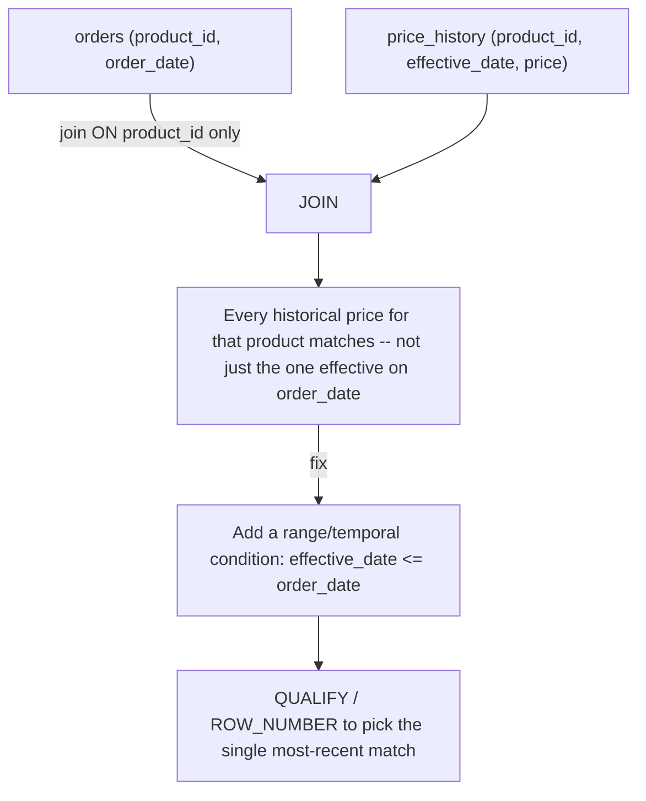

# :material-format-list-bulleted-square: Incomplete Join Conditions

A join key is often only *part* of what uniquely identifies a matching row — a
`product_id` without an `effective_date`, a `customer_id` without a `region`, an
`order_id` without a `version`. Joining on the partial key alone doesn't error and
doesn't necessarily explode rows dramatically; it just quietly matches **every**
candidate row that shares the partial key, producing wrong pairings (e.g. a July order
priced using a January price) or unexpected fan-out. Unlike an
[Accidental Cross Join](cartesian_join.md), there **is** an `ON` clause here — it's just
missing the extra predicate needed to pick the *one* correct match.

---

### :material-sitemap: Overview



---

## :material-pin: Common Symptoms

- A join against a slowly-changing dimension (prices, exchange rates, org hierarchies)
  returns **every historical version** for a key instead of the one version that was
  actually in effect at the time of the fact row.
- Row counts after the join are inflated, but not necessarily obviously so — the
  multiplier equals however many historical versions exist per key, which can look like
  ordinary [Data Explosion](data_explosion.md) rather than a missing predicate.
- Downstream reports use a plausible-looking but wrong value (e.g. today's price applied
  to a transaction from six months ago) with no error or warning.
- Adding an *unrelated* extra condition (e.g. matching dates exactly instead of "as of")
  can overcorrect and drop rows entirely — the fix has to be the **right** additional
  predicate, not just any additional predicate.

---

## :material-flask-outline: Practical Examples

### Setup

```sql
-- Product 1's price changed twice during the year.
CREATE TABLE price_history (
    product_id     INT,
    effective_date STRING,
    price          DOUBLE
);

INSERT INTO price_history VALUES
    (1, '2024-01-01', 10.00),
    (1, '2024-06-01', 12.00),
    (1, '2024-09-01', 15.00),
    (2, '2024-01-01', 20.00);

CREATE TABLE orders (
    order_id   INT,
    product_id INT,
    order_date STRING,
    qty        INT
);

INSERT INTO orders VALUES
    (100, 1, '2024-07-15', 5),   -- should price at the 2024-06-01 rate (12.00)
    (101, 2, '2024-03-10', 2);   -- only one price ever existed for product 2
```

### Example 1 — The Bug: Joining on `product_id` Alone

```sql
SELECT o.order_id, o.product_id, o.order_date, o.qty, p.effective_date, p.price
FROM orders o
JOIN price_history p ON o.product_id = p.product_id
ORDER BY o.order_id, p.effective_date;
```

| order_id | product_id | order_date | qty | effective_date | price |
|:---:|:---:|:---:|:---:|:---:|:---:|
| 100 | 1 | 2024-07-15 | 5 | 2024-01-01 | 10.0 |
| 100 | 1 | 2024-07-15 | 5 | 2024-06-01 | 12.0 |
| 100 | 1 | 2024-07-15 | 5 | 2024-09-01 | 15.0 |
| 101 | 2 | 2024-03-10 | 2 | 2024-01-01 | 20.0 |

Order 100 now matches **all three** historical prices for product 1, including a price
(`15.00`) that didn't even exist yet on the order date, and a price (`10.00`) that had
already been superseded. `product_id` alone isn't a unique key into `price_history` — the
join is missing the temporal predicate that narrows it down to one row.

### Example 2 — Diagnose: Row Count Grows Per Historical Version

```sql
SELECT COUNT(*) FROM orders;
-- Result: 2

SELECT COUNT(*)
FROM orders o
JOIN price_history p ON o.product_id = p.product_id;
-- Result: 4  -- product 1's order matched 3 price rows instead of 1
```

A join result with more rows than the "fact" side, against what should be a
one-row-per-key lookup table, is the signature of an incomplete join condition — check
whether the lookup table has a column (a date, version, or region) that the join key
alone doesn't account for.

### Example 3 — Fix: Add the Missing Temporal Condition

```sql
SELECT o.order_id, o.product_id, o.order_date, o.qty, p.effective_date, p.price
FROM orders o
JOIN price_history p
  ON o.product_id = p.product_id
 AND p.effective_date <= o.order_date
QUALIFY ROW_NUMBER() OVER (
    PARTITION BY o.order_id
    ORDER BY p.effective_date DESC
) = 1
ORDER BY o.order_id;
```

| order_id | product_id | order_date | qty | effective_date | price |
|:---:|:---:|:---:|:---:|:---:|:---:|
| 100 | 1 | 2024-07-15 | 5 | 2024-06-01 | 12.0 |
| 101 | 2 | 2024-03-10 | 2 | 2024-01-01 | 20.0 |

`p.effective_date <= o.order_date` narrows the candidates to every price that was
*already* in effect, and `QUALIFY ROW_NUMBER() ... = 1` picks the single most-recent one
— exactly one row per order, with the correct price for each order's date. This is the
same pattern documented in
[Range Join — Using Range Condition with Additional Join Conditions](../types/non_equi_join/range_join/point_in_interval.md#9-using-range-condition-with-additional-join-conditions).

### Example 4 — Caution: The "Obvious" Fix Can Overcorrect

```sql
-- Tempting "fix": just match the dates exactly instead of using a range.
SELECT o.order_id, o.product_id, o.order_date, p.price
FROM orders o
JOIN price_history p
  ON o.product_id = p.product_id
 AND o.order_date = p.effective_date;
-- Result: 0 rows -- neither order's date happens to exactly equal a price's
-- effective_date, so an exact match is too strict and silently drops every order.
```

Adding *some* extra condition isn't automatically correct — it has to express the real
relationship (`effective_date <= order_date`, "as of"), not just any equality that
happens to compile. An overly strict predicate is just as much an incomplete-condition
bug as no predicate at all — it just fails in the opposite direction (dropping rows
instead of duplicating them).

---

## :material-brain: When to Use

| Scenario | Recommended Pattern |
|----------|---------------------|
| Lookup/dimension table has multiple historical versions per natural key (SCD Type 2) | Add a temporal range condition (`effective_date <= fact_date [AND fact_date < end_date]`) plus `QUALIFY ROW_NUMBER()` if there's no explicit end-date column — see [SCD Type 2 Join Problems](scd_type2_join.md) |
| Lookup table is partitioned by an extra dimension (region, tenant, currency) not present in the naive join | Include that column explicitly in the `ON` clause, not just the primary id |
| Unsure whether a join key alone is unique in the right-hand table | Run `SELECT key, COUNT(*) FROM right_table GROUP BY key HAVING COUNT(*) > 1` before joining |
| An added condition drops all/most rows | Don't assume equality is right by default — check whether the true relationship is a range/"as of" condition instead (Example 4) |

!!! tip "This often masquerades as a Data Explosion or Skew issue"
    Because incomplete join conditions typically show up as *more* output rows than
    expected, they're easy to misdiagnose as [Data Explosion](data_explosion.md) or
    [Skewed Join Keys](skewed_keys.md). The distinguishing question: does the
    right-hand table have a column that legitimately varies per key (a date, version,
    or scope) that isn't part of the `ON` clause? If so, the real fix is adding that
    predicate — deduplication or salting won't solve it.
