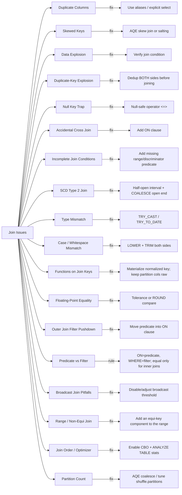

# :material-alert-circle: Join Issues

Common problems that surface as slow performance, incorrect results, or runtime errors.

!!! tip "Start here: the Join Debugging Workflow"
    Not sure which issue you have? Follow the
    [**Join Debugging Workflow**](debugging_workflow.md) — a 15-step, correctness-first
    checklist that routes each symptom to the right page below. For an at-a-glance
    symptom → root cause → fix lookup, use the
    [**Join Troubleshooting Matrix**](troubleshooting_matrix.md).

---

## :material-sitemap: Overview

---

## :material-table: Issue Reference

| Issue                                                      | Symptom                                                     | Fix                                                                    |
|------------------------------------------------------------|-------------------------------------------------------------|------------------------------------------------------------------------|
| [Duplicate column names](column_duplicate.md)              | `AnalysisException: Reference 'id' is ambiguous`            | Use table aliases or explicit column list                              |
| [Skewed join keys](skewed_keys.md)                         | One task runs for hours; others finish quickly              | Enable AQE skew join or use salting                                    |
| [Data explosion](data_explosion.md)                        | Output rows >> input rows                                   | Check join condition — likely a many-to-many                           |
| [Duplicate-key explosion](duplicate_key_explosion.md)      | Row count multiplies combinatorially for specific keys       | Dedup **both** sides before joining, or pre-aggregate both to summaries |
| [Null key trap](null_key_trap.md)                          | Rows silently excluded from join                            | Use `<=>` or `COALESCE(key, sentinel)` in ON clause                    |
| [Accidental cross join](cartesian_join.md)                 | Job hangs; enormous shuffle                                 | Ensure every `JOIN` has an `ON` clause                                 |
| [Incomplete join conditions](incomplete_join_conditions.md) | Wrong or duplicated matches from an SCD/versioned lookup | Add the missing range/temporal or discriminator predicate to `ON` |
| [SCD Type 2 join problems](scd_type2_join.md)              | Current attribute on historical facts, or boundary double-matches | Half-open `valid_from <= t < valid_to` + `COALESCE` open end |
| [Type mismatch / implicit cast](type_mismatch.md)          | `CAST_INVALID_INPUT` error, or silent `NULL`s dropping rows | `TRY_CAST`/`TRY_TO_DATE` with explicit formats, quarantine bad rows    |
| [Case & whitespace mismatch](case_whitespace_mismatch.md)  | String keys that "look" equal don't match                   | `LOWER(TRIM(key))` on both sides, or normalize upstream                |
| [Functions on join keys](functions_on_join_keys.md)        | Slow full scans, or false matches from lossy functions      | Keep keys raw; materialize a normalized key once; use only injective functions |
| [Floating-point equality](floating_point_join.md)          | `DOUBLE` keys that should be equal fail `=`                 | Tolerance join (`ABS(a-b) < ε`) or `ROUND()` both sides                |
| [Outer join filter pushdown](outer_join_filter_pitfall.md) | `LEFT JOIN` behaves like `INNER JOIN`                       | Move the right-side filter into the `ON` clause                        |
| [Predicate vs. filter](predicate_vs_filter.md) | Same condition in `ON` vs `WHERE` gives different outer-join results | Learn the rule: `ON` scopes matches, `WHERE` filters after — equal only for inner joins |
| [Broadcast join pitfalls](broadcast_pitfalls.md)           | Driver/executor OOM or broadcast timeout                    | Drop stale hints; use `autoBroadcastJoinThreshold` and `ANALYZE TABLE` |
| [Range / non-equi join](range_join_pitfalls.md)            | `BroadcastNestedLoopJoin`/`CartesianProduct`; quadratic slowdown | Add an equi-key component; bound both ends of the range |
| [Join order / optimizer](join_order_optimizer.md)          | Huge intermediate results; `EXPLAIN COST` shows no `rowCount`   | Enable CBO + join reorder; `ANALYZE TABLE ... COMPUTE STATISTICS` |
| [Partition-count problems](partition_count.md)             | 200 tiny partitions/files, or oversized partitions spilling/OOM | Keep AQE coalesce on; tune `spark.sql.shuffle.partitions` for the data volume |

---

## :material-shield-alert: Correctness vs. Performance

Not every issue on this page is the same kind of problem. Some **silently produce wrong
results** with no error at all — the most dangerous category, because nothing tells you
to look. Others **fail loudly** with an exception, which is annoying but safe: the bug
can't ship unnoticed. A third group is purely about **speed/resources** — the result is
correct either way, only slower or more expensive.

| Category | Issue | Why |
|----------|-------|-----|
| :material-eye-off: **Silent correctness bug** (wrong result, no error) | [Null Key Trap](null_key_trap.md) | `NULL = NULL` is `UNKNOWN`, not `TRUE` — matching rows vanish with no warning |
| :material-eye-off: **Silent correctness bug** | [Data Explosion](data_explosion.md) | Row counts multiply quietly; aggregates downstream look "plausible" but are wrong |
| :material-eye-off: **Silent correctness bug** | [Duplicate-Key Explosion](duplicate_key_explosion.md) | Duplicates on *both* sides multiply combinatorially (`N x M`), not additively — worse than plain fan-out and easy to under-fix |
| :material-eye-off: **Silent correctness bug** | [Case & Whitespace Mismatch](case_whitespace_mismatch.md) | Keys that are logically equal fail `=` byte-for-byte, dropping rows |
| :material-eye-off: **Silent correctness bug** | [Floating-Point Equality](floating_point_join.md) | Keys that "should" be equal differ in the last bits of `DOUBLE` precision |
| :material-eye-off: **Silent correctness bug** | [Outer Join Filter Pushdown](outer_join_filter_pitfall.md) | `LEFT JOIN` quietly degrades to `INNER JOIN`; no exception, just missing rows |
| :material-eye-off: **Silent correctness bug** | [Type Mismatch](type_mismatch.md) *(TRY_CAST path)* | `TRY_CAST`/`TRY_TO_DATE` turns a bad value into `NULL`, which then fails the join key match silently |
| :material-eye-off: **Silent correctness bug** | [Incomplete Join Conditions](incomplete_join_conditions.md) | Join key alone matches multiple candidate rows (versions/scopes); the "extra" row that slips through is wrong, not obviously missing |
| :material-eye-off: **Silent correctness bug** | [SCD Type 2 Join Problems](scd_type2_join.md) | `is_current` mislabels historical facts, and inclusive `BETWEEN` double-counts boundary-date facts — both silent |
| :material-eye-off::material-speedometer: **Silent correctness *and* performance** | [Functions on Join Keys](functions_on_join_keys.md) | Non-injective functions (`SUBSTRING`, lossy `CAST`) collide distinct keys into false matches; even safe functions silently disable partition pruning/pushdown/bucketing |
| :material-alert: **Loud correctness bug** (wrong result, but errors/hangs) | [Accidental Cross Join](cartesian_join.md) | Produces a wrong `M x N` result, but is usually caught quickly by runaway shuffle time or OOM |
| :material-alert: **Loud correctness bug** | [Type Mismatch](type_mismatch.md) *(plain `CAST` path)* | Under Spark 4 ANSI defaults, an invalid cast throws `CAST_INVALID_INPUT` instead of guessing |
| :material-alert-circle-outline: **Query error** (fails before producing any result) | [Duplicate Column Names](column_duplicate.md) | `AnalysisException: Reference '...' is ambiguous` — caught at analysis time, before execution |
| :material-speedometer: **Performance only** (result is correct either way) | [Skewed Join Keys](skewed_keys.md) | Same output, just one task takes far longer than the others |
| :material-speedometer: **Performance only** | [Broadcast Join Pitfalls](broadcast_pitfalls.md) | Same output whether broadcast or shuffled — the risk is OOM/timeout, not wrong data |
| :material-speedometer: **Performance only** | [Join Order / Optimizer](join_order_optimizer.md) | Same output regardless of join order — the risk is huge intermediate results when CBO/stats are off |
| :material-speedometer: **Performance only** | [Partition-Count Problems](partition_count.md) | Same output regardless of partition count — the risk is overhead/small files (too many) or spill/OOM (too few) |
| :material-speedometer::material-eye-off: **Performance *and* correctness** | [Range / Non-Equi Join](range_join_pitfalls.md) | Pure range conditions force `O(N x M)` nested-loop/Cartesian plans; one-sided ranges also silently over-match |
| :material-book-open-variant: **Foundational concept** (not a bug — the rule behind several above) | [Predicate vs. Filter](predicate_vs_filter.md) | Explains *why* `ON` and `WHERE` differ on outer joins and coincide on inner joins |

!!! danger "Prioritize the silent correctness bugs"
    An exception is a gift — it tells you something is wrong immediately. The **silent**
    category (null keys, data explosion, case/whitespace, floating-point, outer-join
    filter pushdown, and the `TRY_CAST` variant of type mismatch) is the one that ships
    to production dashboards and reports unnoticed. When reviewing a join, actively
    check for these six first, since nothing in the query's execution will flag them.

---

## :material-magnify: Duplicate Columns

See [Duplicate Columns](column_duplicate.md) for full runnable data examples and fixes
(table aliases, explicit column selection, renaming in a CTE).

---

## :material-scale-unbalanced: Skewed Keys

See [Skewed Join Keys](skewed_keys.md) for full runnable data examples — diagnosing hot
keys with `GROUP BY ... COUNT(*)`, and fixing with AQE skew join, manual salting, or a
broadcast hint.

---

## :material-arrow-expand-all: Data Explosion

See [Data Explosion](data_explosion.md) for full runnable data examples — a fan-out join
that silently triples a `SUM()`, how to diagnose it with `COUNT(*)` vs
`COUNT(DISTINCT key)`, and fixing with `ROW_NUMBER()` dedup or pre-aggregation.

---

## :material-lightning-bolt: Duplicate-Key Explosion

See [Duplicate-Key Explosion](duplicate_key_explosion.md) for full runnable data
examples — the more severe both-sides-duplicate variant of data explosion, where a key
with `N` rows on the left and `M` rows on the right produces `N x M` output rows, and
fixing by deduplicating or pre-aggregating **both** sides before joining.

---

## :material-null: Null Key Trap

See [Null Key Trap](null_key_trap.md) for full runnable data examples — rows with a
`NULL` join key silently dropped by `=`, and fixing with `<=>` or a `COALESCE` sentinel.

---

## :material-vector-combine: Accidental Cross Join

See [Accidental Cross Join](cartesian_join.md) for full runnable data examples — a
missing `ON` clause producing an `M x N` Cartesian product, and how to spot it with
`EXPLAIN` (`CartesianProduct` in the physical plan).

---

## :material-format-list-bulleted-square: Incomplete Join Conditions

See [Incomplete Join Conditions](incomplete_join_conditions.md) for full runnable data
examples — joining a fact table to a versioned/SCD lookup on the natural key alone
matches every historical version instead of the one in effect at the fact's date, and
fixing with a range/"as of" predicate plus `QUALIFY ROW_NUMBER()`, including a caution
against overcorrecting with an overly strict exact-match condition.

---

## :material-history: SCD Type 2 Join Problems

See [SCD Type 2 Join Problems](scd_type2_join.md) for full runnable data examples — the
four classic SCD2 mistakes: joining on `is_current` (returns today's attribute for old
facts), inclusive `BETWEEN` double-matching boundary-date facts, `NULL` open-ended
`valid_to` dropping current-version facts, and the half-open `valid_from <= t < valid_to`
+ `COALESCE` point-in-time fix.

---

## :material-swap-horizontal: Type Mismatch / Implicit Cast

See [Type Mismatch](type_mismatch.md) for full runnable data examples — a malformed
string failing `CAST(... AS DATE)` under Spark 4's ANSI defaults, `TRY_CAST` silently
turning it into a dropped `NULL` join key instead, and fixing with `TRY_TO_DATE` plus
explicit formats or an upstream quarantine step.

---

## :material-format-letter-case: Case & Whitespace Mismatch

See [Case & Whitespace Mismatch](case_whitespace_mismatch.md) for full runnable data
examples — emails that differ only by case or a trailing space silently failing a naive
`=` join, diagnosing with `LENGTH()`, and fixing with `LOWER(TRIM(...))` on both sides.

---

## :material-function-variant: Functions on Join Keys

See [Functions on Join Keys](functions_on_join_keys.md) for full runnable data examples —
`EXPLAIN` proof that wrapping a partition key in `UPPER()` defeats partition pruning, a
`SUBSTRING` that collapses distinct account codes into false matches, and fixing by
keeping keys raw or materializing a normalized key column once (so pruning/pushdown/
bucketing survive).

---

## :material-decimal: Floating-Point Equality

See [Floating-Point Equality](floating_point_join.md) for full runnable data examples —
`0.1 + 0.2 <> 0.3` in genuine `DOUBLE` arithmetic, revealing it with `printf('%.17f', ...)`,
and fixing with a tolerance join or `ROUND()` on both sides.

---

## :material-filter-remove: Outer Join Filter Pushdown

See [Outer Join Filter Pushdown](outer_join_filter_pitfall.md) for full runnable data
examples — a `LEFT JOIN` combined with a `WHERE` filter on a right-side column silently
behaving like an `INNER JOIN`, and fixing by moving the predicate into the `ON` clause.

---

## :material-scale-balance: Predicate vs. Filter

See [Predicate vs. Filter](predicate_vs_filter.md) for the underlying mental model — how
a condition in `ON` (a join predicate) differs from one in `WHERE` (a post-join filter),
with `EXPLAIN` proof that they're identical for inner joins but produce different results
for outer joins. Read this first if the outer-join filter pitfall above feels surprising.

---

## :material-broadcast: Broadcast Join Pitfalls

See [Broadcast Join Pitfalls](broadcast_pitfalls.md) for full runnable data examples —
comparing `BroadcastHashJoin` vs `SortMergeJoin` physical plans via `EXPLAIN`, and
avoiding OOM/timeout failures from stale broadcast hints on tables that outgrew the
threshold.

---

## :material-arrow-left-right: Range / Non-Equi Join

See [Range / Non-Equi Join](range_join_pitfalls.md) for full runnable data examples —
`EXPLAIN` proof that a pure `BETWEEN` join becomes a `BroadcastNestedLoopJoin` (or a
`CartesianProduct` when neither side broadcasts), fixing it by adding an equi-key
component so it hash-joins with the range as a residual, and avoiding one-sided ranges
that silently over-match.

---

## :material-sort: Join Order & Optimizer

See [Join Order & Optimizer Issues](join_order_optimizer.md) for full runnable data
examples — how `spark.sql.cbo.enabled` and join reorder are off by default, why
`EXPLAIN COST` shows no `rowCount` until you run `ANALYZE TABLE ... COMPUTE STATISTICS`,
what AQE does (strategy) versus doesn't (join order), and the manual filter-early
fallback when stats aren't available.

---

## :material-view-grid-plus: Partition-Count Problems

See [Partition-Count Problems](partition_count.md) for full runnable data examples — how
`spark.sql.shuffle.partitions` defaults to 200 regardless of data size, AQE coalescing
200 tiny partitions down to 1 (and staying pinned at 200 when AQE is off), and raising
the count so very large shuffles don't spill or OOM.

---

## :material-magnify: Behavior Notes

1. Validate join key nullability with `DESCRIBE TABLE` before writing the join.
2. Use `EXPLAIN` to confirm the join strategy and spot accidental cross joins (`CartesianProduct` in the plan).
3. Broadcast small tables to avoid shuffle — this also prevents skew from propagating to the large side.
4. Before trusting any join's row count, verify cardinality on the "many" side with
   `COUNT(*)` vs `COUNT(DISTINCT key)` — see [Data Explosion](data_explosion.md).
