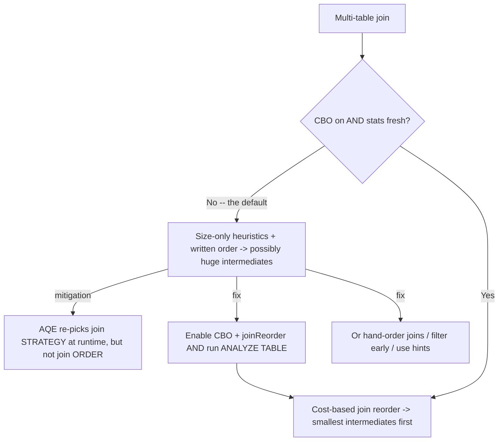

# :material-sort: Join Order & Optimizer Issues

In a multi-table join, the **order** the tables are combined determines how large the
intermediate results get — and a bad order can produce a giant intermediate table that
dwarfs every input. Spark *can* reorder joins for you, but only through the **Cost-Based
Optimizer (CBO)**, which is **disabled by default** and useless without table statistics
that are **also not collected by default**. The result: many Spark jobs run whatever join
order the SQL happens to be written in, guided only by rough file-size heuristics.

______________________________________________________________________

## :material-sitemap: Overview



______________________________________________________________________

### :material-animation-play: Interactive Visualization — Planner Defaults That Matter

<div id="viz-joins-issues-join-order-optimizer" class="ts-viz"></div>

This view surfaces the Spark 4.2 defaults that most influence multi-join planning: CBO and join reorder start off, while AQE starts on. That split explains why runtime strategy can improve even when written join order still matters.

<script src="../../../assets/js/querying-joins-issues-viz.js"></script>

## :material-pin: Common Symptoms

- A multi-join query shuffles or spills far more data than any single input table
    contains — an intermediate join result exploded before a later, more selective join
    or filter could shrink it.
- `EXPLAIN COST` shows only coarse size-based statistics — the optimizer is guessing
    from file size and can't reason well about join selectivity.
- Re-writing the same joins in a different textual order changes the runtime
    dramatically, which shouldn't happen if the optimizer were reordering for you.
- Adding `ANALYZE TABLE ... COMPUTE STATISTICS` or enabling CBO makes a slow query
    suddenly fast — direct evidence the original plan had a poor join order/strategy.

______________________________________________________________________

## :material-flask-outline: Practical Examples

### Setup

```sql
CREATE TABLE big_a (id INT, k INT) USING PARQUET;
INSERT INTO big_a SELECT id, id % 100 FROM range(1, 5001);

CREATE TABLE small_c (k INT, label STRING) USING PARQUET;
INSERT INTO small_c VALUES (1, 'x'), (2, 'y'), (3, 'z');
```

### Example 1 — The Root Cause: CBO and Stats Are Off by Default

```sql
SET spark.sql.cbo.enabled;                 -- false
SET spark.sql.cbo.joinReorder.enabled;     -- false
SET spark.sql.adaptive.enabled;            -- true
```

Out of the box, Spark will **not** cost-reorder your joins (`cbo.enabled = false`), and
even if you turn CBO on, it has no row-count statistics to work with until you run
`ANALYZE TABLE`. Adaptive Query Execution (AQE) *is* on — but as Example 4 explains, it
adjusts the join *strategy* at runtime, not the join *order*.

### Example 2 — Diagnose: Costing Is Thin Without Statistics

```sql
EXPLAIN COST SELECT * FROM big_a;
```

```text
Relation ... big_a ... Statistics(sizeInBytes=30.0 KiB)
```

On the local Spark 4.2 verification run, `EXPLAIN COST` exposed only coarse
size-based statistics for this Parquet table until richer stats were available. Without
row counts and column stats, the optimizer can't estimate join selectivity well, so it
falls back to size heuristics and the order you wrote.

### Example 3 — The Fix: Enable CBO and Collect Statistics

```sql
SET spark.sql.cbo.enabled = true;
SET spark.sql.cbo.joinReorder.enabled = true;

ANALYZE TABLE big_a  COMPUTE STATISTICS;
ANALYZE TABLE small_c COMPUTE STATISTICS;

EXPLAIN COST SELECT * FROM big_a;
```

With CBO and join reorder enabled, Spark can use any collected table and column stats to
rearrange a multi-table join toward the **smallest** intermediate results first. The
exact `EXPLAIN COST` fields you see depend on the catalog and which statistics have been
collected, so treat the actionable part as: CBO needs statistics, and both are off until
you enable or collect them. For per-column selectivity on filter/join keys, extend it
with `ANALYZE TABLE big_a COMPUTE STATISTICS FOR COLUMNS k`.

### Example 4 — What AQE Does and Doesn't Fix

```sql
-- AQE (on by default) re-optimizes at runtime using ACTUAL shuffle sizes: it can flip a
-- SortMergeJoin to a BroadcastHashJoin, coalesce shuffle partitions, and split skewed
-- partitions. It does NOT change the logical JOIN ORDER of a multi-table join.
SET spark.sql.adaptive.enabled = true;                       -- strategy, coalesce, skew
SET spark.sql.adaptive.autoBroadcastJoinThreshold = 30m;     -- runtime broadcast cutoff
```

AQE is a safety net for *strategy* mistakes, but it starts from the join *order* the
optimizer already chose. If that order builds a huge intermediate table, AQE can only
make each individual join cheaper — it can't restructure the tree. Getting the order
right still depends on CBO + statistics (Example 3) or writing the query so selective
joins/filters happen first.

### Example 5 — The Manual Fallback: Filter Early, Order Deliberately

```sql
-- When you can't rely on CBO (e.g. external tables without stats), pre-filter and
-- pre-aggregate so the smallest, most selective results feed the later joins.
WITH filtered_a AS (
    SELECT id, k FROM big_a WHERE k IN (1, 2, 3)   -- shrink BEFORE joining
)
SELECT a.id, c.label
FROM filtered_a a
JOIN small_c c ON a.k = c.k;
-- Reducing big_a to only the keys that can match small_c keeps the join input tiny,
-- regardless of whether the optimizer would have reordered it.
```

### Example 5b — Pre-Aggregate Before Joining, Not After

Filtering shrinks the *row count*; pre-aggregating shrinks it to **exactly one row per
key**, which is the strongest reduction you can apply before a join. Verified on local
Spark 4.2 with `big_a` (5,000 rows, 100 distinct keys) joined to `small_c` (3 rows):

```sql
-- Aggregate AFTER the join -- the join sees ALL 5,000 raw rows first.
SELECT c.label, SUM(a.amount) AS total
FROM big_a a
JOIN small_c c ON a.k = c.k
GROUP BY c.label;
```

```text
== Physical Plan ==
+- HashAggregate(keys=[label], functions=[sum(amount)])
   +- Exchange hashpartitioning(label, 200)
      +- HashAggregate(keys=[label], functions=[partial_sum(amount)])
         +- Project [amount, label]
            +- BroadcastHashJoin [k], [k], Inner, BuildRight
               :- LocalTableScan [k, amount]        <- all 5,000 rows flow into the join
               +- BroadcastExchange ...
```

```sql
-- Pre-aggregate BEFORE the join -- the join only sees 1 row per key.
WITH totals_by_key AS (
    SELECT k, SUM(amount) AS total FROM big_a GROUP BY k
)
SELECT c.label, t.total
FROM totals_by_key t
JOIN small_c c ON t.k = c.k;
```

```text
== Physical Plan ==
+- Project [label, total]
   +- BroadcastHashJoin [k], [k], Inner, BuildRight
      :- HashAggregate(keys=[k], functions=[sum(amount)])
      :  +- Exchange hashpartitioning(k, 200)
      :     +- HashAggregate(keys=[k], functions=[partial_sum(amount)])
      :        +- LocalTableScan [k, amount]        <- reduced to 1 row/key BEFORE the join
      +- BroadcastExchange ...
```

Both queries return identical results, but the plans differ in *when* the row-count
reduction happens: aggregating after the join means every raw row is a join build/probe
input; pre-aggregating turns the join's build/probe side into one row per key, which
matters even more once a real multi-way join (not just this broadcast case) forces a
`SortMergeJoin` or a large shuffle on the un-aggregated side.

______________________________________________________________________

## :material-brain: When to Use

| Scenario                                                                   | Recommended Pattern                                                                                                                            |
| -------------------------------------------------------------------------- | ---------------------------------------------------------------------------------------------------------------------------------------------- |
| Managed tables joined repeatedly in analytics                              | Enable `spark.sql.cbo.enabled` + `cbo.joinReorder.enabled`, and keep stats fresh with `ANALYZE TABLE ... COMPUTE STATISTICS [FOR COLUMNS ...]` |
| A multi-join query is slow and `EXPLAIN COST` only shows coarse size stats | Run `ANALYZE TABLE` on each input — the optimizer is flying blind without richer statistics                                                    |
| Wrong **join strategy** (broadcast vs shuffle) at runtime                  | Rely on AQE (on by default); tune `spark.sql.adaptive.autoBroadcastJoinThreshold` — see [Broadcast Join Pitfalls](broadcast-pitfalls.md)       |
| External/streaming sources without reliable stats                          | Don't depend on CBO — hand-order joins, filter and pre-aggregate *before* joining (Example 5)                                                  |
| One join clearly should run first                                          | Filter/aggregate that input in a CTE, or use `/*+ BROADCAST(t) */`, so the selective step happens early regardless of the optimizer            |

!!! tip "CBO and AQE solve different halves of the problem"

    **CBO** (static, needs stats, off by default) chooses the join **order** and initial
    strategy. **AQE** (runtime, on by default) corrects the join **strategy** and
    partitioning using real data sizes, but keeps the order CBO/your SQL produced. For a
    consistently good plan you generally want *both* — statistics-backed CBO for order,
    AQE for runtime strategy — and, when neither can help (no stats), a deliberately
    written query that shrinks inputs before joining.
