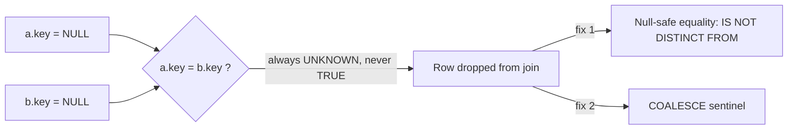

# :material-null: Null Key Trap

Standard SQL equality (`=`) never evaluates to `TRUE` when either side is `NULL` —
including `NULL = NULL`. In a join `ON` clause this means rows with a `NULL` join key
are **silently excluded** from the result, with no error or warning.

## :material-sitemap: Overview



______________________________________________________________________

### :material-animation-play: Interactive Visualization — NULL-Safe Matching

<div id="viz-joins-issues-null-key-trap" class="ts-viz"></div>

The two tabs compare standard equality with the ANSI-style null-safe fix verified in Spark 4.2. The output makes the hidden loss of NULL-key rows obvious.

<script src="../../../assets/js/querying-joins-issues-viz.js"></script>

## :material-pin: Common Symptoms

- An `INNER`/`LEFT` join returns fewer rows than expected, but there is no exception.
- Row counts don't reconcile between a source table and a joined report, and the
    missing rows all turn out to have `NULL` in the join key.
- Business impact is easy to miss because the query "runs fine" — this is a silent
    correctness bug, like [Data Explosion](data-explosion.md).

______________________________________________________________________

## :material-flask-outline: Practical Examples

### Setup

```sql
CREATE TABLE orders (
    order_id    INT,
    customer_id INT,   -- NULL for guest checkouts that were never linked to an account
    amount      DOUBLE
);

INSERT INTO orders VALUES
    (1, 101,  250.00),
    (2, 102,  175.50),
    (3, NULL,  40.00),   -- guest checkout, no customer_id
    (4, NULL,  15.00);   -- another guest checkout

CREATE TABLE customers (
    customer_id INT,
    name        STRING
);

INSERT INTO customers VALUES
    (101, 'Alice'),
    (102, 'Bob'),
    (NULL, 'Unregistered');  -- placeholder row some upstream systems add
```

### Example 1 — The Bug: NULL Keys Silently Excluded

```sql
SELECT o.order_id, o.customer_id, c.name
FROM orders o
JOIN customers c ON o.customer_id = c.customer_id
ORDER BY o.order_id;
-- Result: only 2 rows -- both guest orders (customer_id IS NULL) vanished, even
-- though a NULL-named placeholder row exists in `customers`.
-- order_id  customer_id  name
-- 1         101          Alice
-- 2         102          Bob
```

### Example 2 — Diagnose: Confirm NULL Keys Exist on Either Side

```sql
SELECT COUNT(*) AS null_key_orders
FROM orders
WHERE customer_id IS NULL;
-- Result: 2  <- these rows can never match with `=`, regardless of the right side
```

### Example 3 — Fix: Null-Safe Equality (`IS NOT DISTINCT FROM`)

```sql
SELECT o.order_id, o.customer_id, c.name
FROM orders o
JOIN customers c ON o.customer_id IS NOT DISTINCT FROM c.customer_id
ORDER BY o.order_id;
-- Result: 4 rows -- NULL = NULL now matches, so both guest orders join to the
-- 'Unregistered' placeholder customer.
-- order_id  customer_id  name
-- 1         101          Alice
-- 2         102          Bob
-- 3         NULL         Unregistered
-- 4         NULL         Unregistered
```

Spark 4.2 also accepts Spark's shorthand `o.customer_id <=> c.customer_id`, but
`IS NOT DISTINCT FROM` is the ANSI-style spelling and reads well in documentation.

### Example 4 — Fix: COALESCE Sentinel (When Null-Safe Equality Isn't Available)

```sql
SELECT o.order_id, o.customer_id, c.name
FROM orders o
JOIN customers c
    ON COALESCE(o.customer_id, -1) = COALESCE(c.customer_id, -1)
ORDER BY o.order_id;
-- Same 4-row result as Example 3. Prefer native null-safe equality when supported --
-- COALESCE risks a real collision if -1 is ever a valid customer_id.
```

### Example 5 — When You *Want* NULL Keys Excluded

```sql
-- If guest orders genuinely shouldn't be attributed to any customer, standard `=`
-- is correct -- the "trap" is only a bug when the NULL rows were expected to match.
SELECT o.order_id, o.amount
FROM orders o
LEFT JOIN customers c ON o.customer_id = c.customer_id
WHERE c.customer_id IS NULL
ORDER BY o.order_id;
-- Result: the 2 guest orders, explicitly identified as unattributed.
-- order_id  amount
-- 3         40.00
-- 4         15.00
```

### Example 6 — The Same Trap in a Plain `WHERE` Filter (No Join Required)

The "NULL is never equal, even to itself" rule isn't unique to joins — it silently
drops rows from a `WHERE` filter too, and `<>` (not-equals) is the most common place
it bites:

```sql
CREATE TABLE orders_status (order_id INT, status STRING);
INSERT INTO orders_status VALUES (1, 'SHIPPED'), (2, 'CANCELLED'), (3, NULL), (4, 'PENDING');

-- BUG: intent is "everything that isn't CANCELLED", but NULL <> 'CANCELLED' is
-- UNKNOWN, not TRUE -- order 3 silently disappears along with the cancelled order.
SELECT * FROM orders_status WHERE status <> 'CANCELLED';
-- Result: only 2 rows (SHIPPED, PENDING) -- order 3 (NULL status) is missing too.

-- FIX 1: explicitly re-include NULLs if they belong in the result.
SELECT * FROM orders_status WHERE status <> 'CANCELLED' OR status IS NULL;

-- FIX 2: null-safe comparison expresses "distinct from" directly, without the
-- separate IS NULL clause.
SELECT * FROM orders_status WHERE status IS DISTINCT FROM 'CANCELLED';
-- Both fixes return 3 rows: SHIPPED, PENDING, and the NULL-status row.
```

Any `<>`, `!=`, `NOT IN`, or `NOT (col = val)` predicate has the same blind spot:
three-valued logic means `UNKNOWN` rows are filtered out just like `FALSE` rows, even
though "not equal to X" often should include "unknown/missing" in the result. Decide
deliberately whether `NULL` belongs in a "not equal" filter's output, the same way
Example 5 asks whether `NULL` should match in a join.

______________________________________________________________________

## :material-brain: When to Use

| Scenario                                                      | Recommended Pattern                                                                                  |
| ------------------------------------------------------------- | ---------------------------------------------------------------------------------------------------- |
| NULL keys on both sides should be treated as equal            | `a.key IS NOT DISTINCT FROM b.key`                                                                   |
| Engine/version lacks null-safe equality                       | `COALESCE(a.key, sentinel) = COALESCE(b.key, sentinel)` with a sentinel that can never be a real key |
| NULL keys should never match anything (default SQL semantics) | Standard `=` — no change needed                                                                      |
| Need to explicitly find/report unattributed rows              | `LEFT JOIN ... WHERE right.key IS NULL`                                                              |
| A `WHERE col <> value` filter should also keep NULL rows      | Add `OR col IS NULL`, or rewrite as `col IS DISTINCT FROM value` (Example 6)                         |
