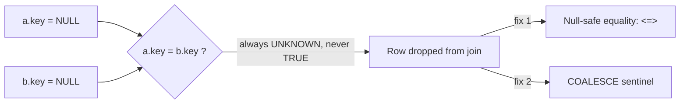

# :material-null: Null Key Trap

Standard SQL equality (`=`) never evaluates to `TRUE` when either side is `NULL` —
including `NULL = NULL`. In a join `ON` clause this means rows with a `NULL` join key
are **silently excluded** from the result, with no error or warning.


### :material-sitemap: Overview



---

## :material-pin: Common Symptoms

- An `INNER`/`LEFT` join returns fewer rows than expected, but there is no exception.
- Row counts don't reconcile between a source table and a joined report, and the
  missing rows all turn out to have `NULL` in the join key.
- Business impact is easy to miss because the query "runs fine" — this is a silent
  correctness bug, like [Data Explosion](data_explosion.md).

---

## :material-flask-outline: Practical Examples

### Setup

```sql
CREATE TABLE orders (
    order_id    INT,
    customer_id INT,   -- NULL for guest checkouts that were never linked to an account
    amount      DOUBLE
) USING DELTA;

INSERT INTO orders VALUES
    (1, 101,  250.00),
    (2, 102,  175.50),
    (3, NULL,  40.00),   -- guest checkout, no customer_id
    (4, NULL,  15.00);   -- another guest checkout

CREATE TABLE customers (
    customer_id INT,
    name        STRING
) USING DELTA;

INSERT INTO customers VALUES
    (101, 'Alice'),
    (102, 'Bob'),
    (NULL, 'Unregistered');  -- placeholder row some upstream systems add
```

### Example 1 — The Bug: NULL Keys Silently Excluded

```sql
SELECT o.order_id, o.customer_id, c.name
FROM orders o
JOIN customers c ON o.customer_id = c.customer_id
ORDER BY o.order_id;
-- Result: only 2 rows -- both guest orders (customer_id IS NULL) vanished, even
-- though a NULL-named placeholder row exists in `customers`.
-- order_id  customer_id  name
-- 1         101          Alice
-- 2         102          Bob
```

### Example 2 — Diagnose: Confirm NULL Keys Exist on Either Side

```sql
SELECT COUNT(*) AS null_key_orders
FROM orders
WHERE customer_id IS NULL;
-- Result: 2  <- these rows can never match with `=`, regardless of the right side
```

### Example 3 — Fix: Null-Safe Equality Operator (`<=>`)

```sql
SELECT o.order_id, o.customer_id, c.name
FROM orders o
JOIN customers c ON o.customer_id <=> c.customer_id
ORDER BY o.order_id;
-- Result: 4 rows -- NULL = NULL now matches, so both guest orders join to the
-- 'Unregistered' placeholder customer.
-- order_id  customer_id  name
-- 1         101          Alice
-- 2         102          Bob
-- 3         NULL         Unregistered
-- 4         NULL         Unregistered
```

### Example 4 — Fix: COALESCE Sentinel (When `<=>` Isn't Available)

```sql
SELECT o.order_id, o.customer_id, c.name
FROM orders o
JOIN customers c
    ON COALESCE(o.customer_id, -1) = COALESCE(c.customer_id, -1)
ORDER BY o.order_id;
-- Same 4-row result as Example 3. Prefer <=> when supported -- COALESCE risks a
-- real collision if -1 is ever a valid customer_id.
```

### Example 5 — When You *Want* NULL Keys Excluded

```sql
-- If guest orders genuinely shouldn't be attributed to any customer, standard `=`
-- is correct -- the "trap" is only a bug when the NULL rows were expected to match.
SELECT o.order_id, o.amount
FROM orders o
LEFT JOIN customers c ON o.customer_id = c.customer_id
WHERE c.customer_id IS NULL
ORDER BY o.order_id;
-- Result: the 2 guest orders, explicitly identified as unattributed.
-- order_id  amount
-- 3         40.00
-- 4         15.00
```

---

## :material-brain: When to Use

| Scenario | Recommended Pattern |
|----------|---------------------|
| NULL keys on both sides should be treated as equal | `a.key <=> b.key` |
| Engine/version lacks `<=>` support | `COALESCE(a.key, sentinel) = COALESCE(b.key, sentinel)` with a sentinel that can never be a real key |
| NULL keys should never match anything (default SQL semantics) | Standard `=` — no change needed |
| Need to explicitly find/report unattributed rows | `LEFT JOIN ... WHERE right.key IS NULL` |
