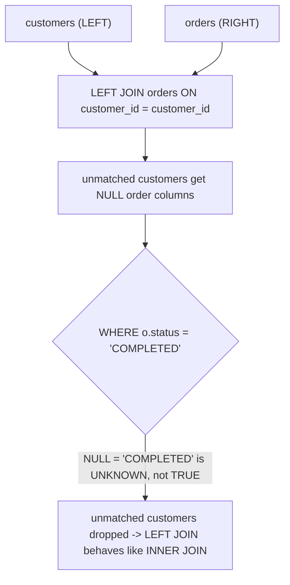

# :material-filter-remove: Outer Join Silently Becomes Inner Join

A `LEFT JOIN` is supposed to keep every row from the left table, even when there's no
match on the right. But if a filter on a **right-table column** is placed in the
`WHERE` clause instead of the `ON` clause, SQL's evaluation order quietly discards every
unmatched left row — turning the `LEFT JOIN` into an `INNER JOIN` with no error, warning,
or plan difference that jumps out at a glance.

!!! info "Prerequisite concept"
    This page is the concrete bug; for the underlying mental model of *why* `ON` and
    `WHERE` behave differently on outer joins (and identically on inner joins), see
    [Join Predicate vs. Filter](predicate_vs_filter.md) first.

---

### :material-sitemap: Overview



---

## :material-pin: Common Symptoms

- A report that's supposed to show "all customers, with their completed orders if any"
  is missing customers who have zero completed orders — they vanish entirely instead of
  appearing with `NULL` order columns.
- Changing `LEFT JOIN` to `INNER JOIN` produces the **exact same result** — a strong
  signal that the outer join isn't actually doing anything, because the `WHERE` clause
  already filtered out every row it would have preserved.
- The query "looks correct" on read-through — the join type says `LEFT JOIN`, so authors
  and reviewers often don't notice the `WHERE` clause is quietly overriding it.

---

## :material-flask-outline: Practical Examples

### Setup

```sql
CREATE TABLE customers (
    customer_id INT,
    name        STRING
);

INSERT INTO customers VALUES
    (1, 'Alice'),
    (2, 'Bob'),
    (3, 'Carol');

CREATE TABLE orders (
    order_id    INT,
    customer_id INT,
    status      STRING,
    amount      DOUBLE
);

INSERT INTO orders VALUES
    (100, 1, 'COMPLETED', 50.0),
    (101, 1, 'CANCELLED', 20.0),
    (102, 2, 'CANCELLED', 30.0);
-- Bob has only a cancelled order; Carol has no orders at all.
```

**Intent:** list every customer, along with their `COMPLETED` orders if they have any.

### Example 1 — The Bug: Filter in `WHERE` After a `LEFT JOIN`

```sql
SELECT c.customer_id, c.name, o.order_id, o.status, o.amount
FROM customers c
LEFT JOIN orders o ON c.customer_id = o.customer_id
WHERE o.status = 'COMPLETED'
ORDER BY c.customer_id;
```

| customer_id | name | order_id | status | amount |
|:---:|---|:---:|---|:---:|
| 1 | Alice | 100 | COMPLETED | 50.0 |

Bob and Carol are both missing entirely. The `LEFT JOIN` itself correctly keeps both of
them — Bob paired with his `CANCELLED` order, Carol paired with an all-`NULL` order row
since she has none — but then `WHERE o.status = 'COMPLETED'` runs *after* the join and
evaluates `'CANCELLED' = 'COMPLETED'` (false) for Bob and `NULL = 'COMPLETED'` (`UNKNOWN`)
for Carol. `WHERE` treats both as "not true" and removes the row, exactly as if the join
had been `INNER JOIN` all along.

### Example 2 — Confirm It: Compare Against a Plain `INNER JOIN`

```sql
SELECT c.customer_id, c.name, o.order_id, o.status, o.amount
FROM customers c
JOIN orders o ON c.customer_id = o.customer_id
WHERE o.status = 'COMPLETED'
ORDER BY c.customer_id;
-- Result: identical to Example 1 -- proof the LEFT JOIN was providing zero benefit
-- once the WHERE clause ran.
```

### Example 3 — Fix: Move the Filter Into the `ON` Clause

```sql
SELECT c.customer_id, c.name, o.order_id, o.status, o.amount
FROM customers c
LEFT JOIN orders o ON c.customer_id = o.customer_id AND o.status = 'COMPLETED'
ORDER BY c.customer_id;
```

| customer_id | name | order_id | status | amount |
|:---:|---|:---:|---|:---:|
| 1 | Alice | 100 | COMPLETED | 50.0 |
| 2 | Bob | NULL | NULL | NULL |
| 3 | Carol | NULL | NULL | NULL |

The status filter now only decides **which right-side rows are eligible to match**, not
whether the left row survives — Bob and Carol correctly reappear with `NULL` order
columns, exactly matching the original intent.

### Example 4 — Fix (Alternative): Filter in a Subquery First

```sql
SELECT c.customer_id, c.name, o.order_id, o.status, o.amount
FROM customers c
LEFT JOIN (
    SELECT * FROM orders WHERE status = 'COMPLETED'
) o ON c.customer_id = o.customer_id
ORDER BY c.customer_id;
-- Same 3-row result as Example 3. Pre-filtering the right side in a subquery/CTE
-- makes the intent explicit and is often easier to read in longer queries.
```

---

## :material-brain: When to Use

| Scenario | Recommended Pattern |
|----------|---------------------|
| Filtering which right-side rows can match, while keeping all left rows | Put the predicate in the `ON` clause (Example 3), or pre-filter the right side in a subquery/CTE (Example 4) |
| Filtering the **final result** after the join, on a column guaranteed non-`NULL` (e.g. a left-table column) | `WHERE` is fine — the trap only applies to filters on right-side columns after an outer join |
| Actually want an `INNER JOIN` semantics (only matching rows) | Just use `JOIN`/`INNER JOIN` — don't rely on a `WHERE` clause to silently convert a `LEFT JOIN` |
| Need to explicitly find unmatched left rows | `LEFT JOIN ... WHERE right.key IS NULL` — this is the *one* `WHERE`-after-outer-join pattern that's intentional and correct, per [Null Key Trap](null_key_trap.md) |

!!! warning "This is easy to miss in code review"
    The join type in the `FROM`/`JOIN` clause still says `LEFT JOIN`, so a quick skim
    doesn't reveal the bug — you have to trace what the `WHERE` clause does to `NULL`
    values from the right side. When reviewing an outer join, always ask: *"does any
    `WHERE` predicate reference a column that can be `NULL` because of this join?"*
