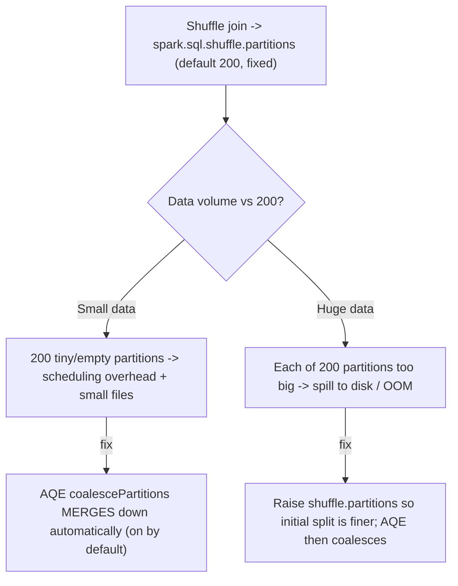

# :material-view-grid-plus: Partition-Count Problems

When Spark shuffles data for a join, it redistributes rows into a fixed number of
**shuffle partitions** — controlled by `spark.sql.shuffle.partitions`, which defaults to
**200 regardless of how much data you have**. That one static number is wrong for most
jobs: 200 partitions is far too many for a few megabytes (hundreds of near-empty tasks
and tiny output files) and far too few for hundreds of gigabytes (each partition too big
to fit in memory, causing spills and OOM). This is different from
[Skewed Join Keys](skewed_keys.md), where the *count* is fine but a few partitions are
disproportionately *large*.

---

### :material-sitemap: Overview



---

## :material-pin: Common Symptoms

- A tiny join writes **hundreds of small files** (or produces ~200 output partitions),
  with most tasks processing almost no rows — pure scheduling overhead.
- A large join **spills to disk** or fails with executor `OutOfMemoryError`, and raising
  `spark.sql.shuffle.partitions` (more, smaller partitions) makes it succeed.
- The Spark UI shows a shuffle stage with exactly **200 tasks** no matter the input size
  — a sign the default was never tuned and AQE is disabled.
- Two jobs on very different data volumes both run with 200 shuffle partitions, one
  wasting scheduler time and the other memory-starved.

---

## :material-flask-outline: Practical Examples

### Setup

```sql
CREATE TABLE a (id INT, k INT) USING PARQUET;
INSERT INTO a SELECT id, id % 50 FROM range(1, 2001);

CREATE TABLE b (k INT, v INT) USING PARQUET;
INSERT INTO b SELECT id % 50, id FROM range(1, 2001);
```

### Example 1 — The Default: 200 Shuffle Partitions Regardless of Size

```sql
SET spark.sql.shuffle.partitions;      -- 200
SET spark.sql.adaptive.enabled;        -- true

-- Force a shuffle (sort-merge) join so the shuffle-partition count is visible.
SET spark.sql.autoBroadcastJoinThreshold = -1;
```

The shuffle-partition count is a fixed `200`, chosen with no knowledge of your data
volume. For the ~2,000-row tables above, a shuffle join would split the data into 200
partitions — the vast majority holding a handful of rows or none at all.

### Example 2 — Too Many: AQE Coalesces Small Partitions Automatically

```python
# With AQE ON (the default), the join output is coalesced down to fit the advisory size.
spark.conf.set("spark.sql.autoBroadcastJoinThreshold", "-1")  # force shuffle join
df = spark.sql("SELECT a.id, b.v FROM a JOIN b ON a.k = b.k")
print(df.rdd.getNumPartitions())     # -> 1  (200 tiny partitions merged into 1)
```

`spark.sql.adaptive.coalescePartitions.enabled` (on by default) inspects the *actual*
shuffle output at runtime and merges the 200 tiny partitions down toward
`spark.sql.adaptive.advisoryPartitionSizeInBytes` (default 64 MB) — here, a single
partition. This is why the small-data half of the problem is mostly self-healing **as
long as AQE is enabled**.

### Example 3 — With AQE Off: The 200 Partitions Are Pinned

```python
spark.conf.set("spark.sql.adaptive.enabled", "false")
df = spark.sql("SELECT a.id, b.v FROM a JOIN b ON a.k = b.k")
print(df.rdd.getNumPartitions())     # -> 200  (no coalescing; 200 tiny partitions/files)
```

With AQE disabled, the join emits exactly 200 partitions — 200 tasks and, on write, up to
200 tiny files — even though the data would fit comfortably in one. On older runtimes or
where AQE is turned off, you must set `spark.sql.shuffle.partitions` manually to a value
appropriate for the data.

### Example 4 — Too Few: Large Data Needs *More* Partitions

```sql
-- AQE coalescing only MERGES partitions; for non-skewed data it never SPLITS them.
-- So if 200 partitions are each too large (e.g. a 200 GB shuffle => ~1 GB per partition),
-- AQE won't help -- you must start with a finer split.
SET spark.sql.adaptive.enabled = true;
SET spark.sql.shuffle.partitions = 2000;     -- ~100 MB per partition instead of ~1 GB
-- AQE will still coalesce back down if some end up too small, but now no single
-- partition is oversized -> no spill / OOM.
```

For very large shuffles, raise `spark.sql.shuffle.partitions` so the *initial* split is
fine-grained enough that no partition overflows memory; AQE then coalesces any that turn
out too small. Tuning `spark.sql.adaptive.advisoryPartitionSizeInBytes` adjusts the target
size AQE aims for on both merge and skew-split.

---

## :material-brain: When to Use

| Scenario | Recommended Pattern |
|----------|---------------------|
| Small/medium data, modern Spark | Leave AQE on (default) — `coalescePartitions` merges the 200 tiny partitions automatically (Example 2) |
| AQE unavailable or disabled | Set `spark.sql.shuffle.partitions` manually to roughly `total_shuffle_bytes / 128 MB` |
| Very large shuffle spilling / OOM | Raise `spark.sql.shuffle.partitions` (and/or lower `advisoryPartitionSizeInBytes`) so each partition is ~100–200 MB (Example 4) |
| Too many small output files on write | Rely on AQE coalesce, or add an explicit `/*+ COALESCE(n) */` / `/*+ REPARTITION(n) */` hint before writing |
| A *few* partitions are huge but the count is fine | That's skew, not partition count — see [Skewed Join Keys](skewed_keys.md) (AQE skew-join or salting) |

!!! tip "Partition count vs. partition skew are different problems"
    A wrong **count** (this page) affects *every* partition uniformly — all too small or
    all too big — and is fixed by AQE coalescing or tuning
    `spark.sql.shuffle.partitions`. **Skew** ([Skewed Join Keys](skewed_keys.md)) is a
    handful of oversized partitions among many normal ones, fixed by AQE skew-join
    splitting or salting. Diagnose which one you have from the Spark UI task-duration
    distribution before reaching for a fix — the remedies don't overlap.
