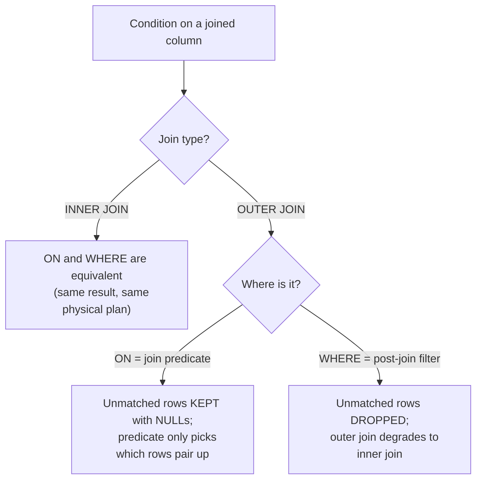

# :material-scale-balance: Join Predicate vs. Filter (`ON` vs. `WHERE`)

Every condition in a join query lives in one of two places, and the distinction is one of
the most consequential in SQL:

- A **join predicate** in the `ON` clause decides **which rows pair up** while the join
  is being formed.
- A **filter** in the `WHERE` clause runs **after the join is complete** and removes rows
  from the combined result.

For an **inner join** these two positions are logically equivalent — Spark's optimizer
even produces the *identical* physical plan. For an **outer join** they are emphatically
**not** equivalent: the same predicate produces different results depending on where you
put it. Understanding this rule up front prevents the single most common outer-join bug,
documented in detail in [Outer Join Filter Pushdown](outer_join_filter_pitfall.md).

---

### :material-sitemap: Overview



---

## :material-pin: Common Symptoms

- Two queries that "look the same" return different row counts — the only difference is
  a condition sitting in `ON` versus `WHERE`, and the join is an outer join.
- An outer join returns fewer rows than the (supposedly preserved) side has — a filter on
  the other side's column crept into `WHERE`.
- Moving a condition between `ON` and `WHERE` on an **inner** join changes nothing — this
  is correct and expected, and is often what leads people to wrongly assume it's always
  interchangeable.

---

## :material-flask-outline: Practical Examples

### Setup

```sql
CREATE TABLE customers (customer_id INT, name STRING);
INSERT INTO customers VALUES (1, 'Alice'), (2, 'Bob'), (3, 'Carol');

CREATE TABLE orders (order_id INT, customer_id INT, status STRING);
INSERT INTO orders VALUES
    (100, 1, 'COMPLETED'),
    (101, 1, 'CANCELLED'),
    (102, 2, 'CANCELLED');
-- Bob has only a cancelled order; Carol has none.
```

### Example 1 — Inner Join: `ON` and `WHERE` Are Equivalent

```sql
-- Predicate as a join predicate (ON):
SELECT c.customer_id, c.name, o.order_id, o.status
FROM customers c
JOIN orders o ON c.customer_id = o.customer_id AND o.status = 'COMPLETED';

-- Predicate as a post-join filter (WHERE):
SELECT c.customer_id, c.name, o.order_id, o.status
FROM customers c
JOIN orders o ON c.customer_id = o.customer_id
WHERE o.status = 'COMPLETED';
```

Both return the **same single row**:

| customer_id | name | order_id | status |
|:---:|---|:---:|---|
| 1 | Alice | 100 | COMPLETED |

For an inner join a row only survives if it matched *and* satisfied the predicate — and
"matched AND satisfied" is the same condition regardless of which clause it's written in.

### Example 2 — Inner Join: Identical Physical Plans

```sql
EXPLAIN SELECT c.customer_id
FROM customers c JOIN orders o
  ON c.customer_id = o.customer_id AND o.status = 'COMPLETED';

EXPLAIN SELECT c.customer_id
FROM customers c JOIN orders o
  ON c.customer_id = o.customer_id
WHERE o.status = 'COMPLETED';
```

Both produce the **same** physical plan — a `BroadcastHashJoin ... Inner` with the
`status = 'COMPLETED'` filter pushed down into the `orders` scan in *both* cases:

```text
+- BroadcastHashJoin [customer_id#..], [customer_id#..], Inner, ...
   :- ... FileScan parquet ... customers ...
   +- Filter ((status#.. = COMPLETED) AND isnotnull(customer_id#..))
      +- FileScan parquet ... orders ...
```

The optimizer freely moves inner-join predicates between `ON` and `WHERE` (predicate
pushdown), which is *why* they're interchangeable there — the choice is purely stylistic.

### Example 3 — Outer Join: `ON` Keeps Unmatched Rows

```sql
SELECT c.customer_id, c.name, o.order_id, o.status
FROM customers c
LEFT JOIN orders o ON c.customer_id = o.customer_id AND o.status = 'COMPLETED'
ORDER BY c.customer_id;
```

| customer_id | name | order_id | status |
|:---:|---|:---:|---|
| 1 | Alice | 100 | COMPLETED |
| 2 | Bob | NULL | NULL |
| 3 | Carol | NULL | NULL |

As a **join predicate**, `o.status = 'COMPLETED'` only decides which `orders` rows are
*eligible to pair* with each customer. Customers who don't pair with any completed order
are still preserved by the `LEFT JOIN`, with `NULL`s in the order columns.

### Example 4 — Outer Join: `WHERE` Drops Them (Degrades to Inner)

```sql
SELECT c.customer_id, c.name, o.order_id, o.status
FROM customers c
LEFT JOIN orders o ON c.customer_id = o.customer_id
WHERE o.status = 'COMPLETED'
ORDER BY c.customer_id;
```

| customer_id | name | order_id | status |
|:---:|---|:---:|---|
| 1 | Alice | 100 | COMPLETED |

As a **post-join filter**, `o.status = 'COMPLETED'` runs *after* the outer join has
already NULL-filled Bob and Carol. `NULL = 'COMPLETED'` evaluates to `UNKNOWN`, so
`WHERE` discards those rows — the `LEFT JOIN` silently behaves like an `INNER JOIN`. Same
predicate, same clause text, opposite outcome from Example 3, purely because of `ON` vs
`WHERE`.

---

## :material-brain: When to Use

| You want to… | Put the condition in… | Why |
|--------------|-----------------------|-----|
| Restrict an **inner** join's result on any joined column | `ON` or `WHERE` — either | They're equivalent; pick whichever reads clearer (many teams keep the equi-key in `ON`, business filters in `WHERE`) |
| Decide **which right-side rows may match** while keeping all left rows (outer join) | `ON` (join predicate) | The predicate scopes the match; unmatched left rows survive with `NULL`s — Example 3 |
| Filter the **final result** of an outer join on a **left-side / always-present** column | `WHERE` | The column is never `NULL` due to the join, so post-join filtering is safe |
| Find left rows that had **no match** (anti-join) | `WHERE right.key IS NULL` | The one intentional `WHERE`-after-outer-join pattern — see [Null Key Trap](null_key_trap.md) |
| Filter an outer join on a **right-side** column and still keep unmatched left rows | `ON` (never `WHERE`) | A `WHERE` on a right-side column silently converts the outer join to inner — [Outer Join Filter Pushdown](outer_join_filter_pitfall.md) |

!!! tip "A quick mental test"
    Ask: *"If this condition is false, do I want the row **gone**, or do I want it
    **kept but unmatched** (NULL-filled)?"* — "gone" means `WHERE`; "kept but unmatched"
    means `ON`. For an inner join there's no "kept but unmatched" case, which is exactly
    why the two clauses collapse into one there.
