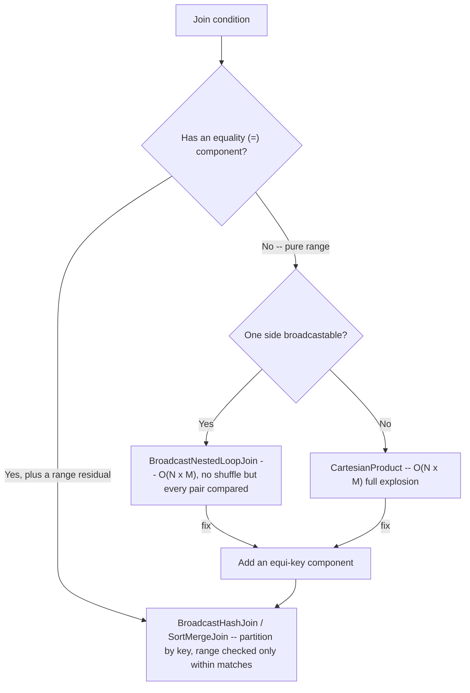

# :material-arrow-left-right: Range / Non-Equality Join Pitfalls

A join whose condition uses `<`, `<=`, `>`, `>=`, `BETWEEN`, or `<>` instead of (or in
addition to) `=` is a **non-equi join**. These are indispensable for time-window,
interval, and nearest-match logic (see the
[Range Join](../types/non_equi_join/range_join/point-in-interval.md) reference for how to
write them well), but they have a sharp performance cliff: a condition with **no equality
component** cannot use a hash join. Spark falls back to a **nested-loop** strategy that
compares every left row against every right row — `O(N x M)` — which quietly becomes a
`CartesianProduct` when neither side is small enough to broadcast.

______________________________________________________________________

## :material-sitemap: Overview



______________________________________________________________________

### :material-animation-play: Interactive Visualization — Pure Range vs. Keyed Range

<div id="viz-joins-issues-range-join-pitfalls" class="ts-viz"></div>

This demo compresses the verified plan change from `BroadcastNestedLoopJoin`/`CartesianProduct` to `SortMergeJoin` once an equality key is restored alongside the range predicate.

<script src="../../../assets/js/querying-joins-issues-viz.js"></script>

## :material-pin: Common Symptoms

- `EXPLAIN` shows `BroadcastNestedLoopJoin` or `CartesianProduct` where you expected a
    `SortMergeJoin`/`BroadcastHashJoin` — the tell-tale sign of a pure non-equi join.
- A range join is orders of magnitude slower than an equi-join on the same tables, and
    gets dramatically worse as either side grows (quadratic, not linear).
- A one-sided range predicate (`ts >= w.lo` with no upper bound) matches far more rows
    than intended — every later row qualifies for every earlier window.
- The job runs fine on small samples but hangs or OOMs on full data, because `N x M`
    grew faster than either table alone.

______________________________________________________________________

## :material-flask-outline: Practical Examples

### Setup

```sql
CREATE TABLE readings (sensor_id INT, ts INT, val DOUBLE);
INSERT INTO readings VALUES
    (1, 100, 10.0), (1, 200, 11.0), (1, 300, 12.0), (2, 150, 20.0);

CREATE TABLE windows (sensor_id INT, win_id INT, lo INT, hi INT);
INSERT INTO windows VALUES
    (1, 1, 100, 250), (1, 2, 200, 400), (2, 3, 100, 200);
```

### Example 1 — The Cost: A Pure Range Join Is a Nested Loop

```sql
EXPLAIN SELECT r.ts, w.win_id
FROM readings r
JOIN windows w ON r.ts BETWEEN w.lo AND w.hi;
```

```text
+- BroadcastNestedLoopJoin BuildLeft, Inner, ((ts#.. >= lo#..) AND (ts#.. <= hi#..))
```

There's no `=` in the condition, so Spark can't hash-partition the rows — it broadcasts
one side and compares **every** reading against **every** window. With N readings and M
windows that's `N x M` comparisons regardless of how selective the range actually is.

### Example 2 — Worse: No Broadcastable Side Becomes a Cartesian Product

```sql
SET spark.sql.autoBroadcastJoinThreshold = -1;   -- simulate two large tables

EXPLAIN SELECT r.ts, w.win_id
FROM readings r
JOIN windows w ON r.ts BETWEEN w.lo AND w.hi;
```

```text
+- CartesianProduct ((ts#.. >= lo#..) AND (ts#.. <= hi#..))
```

When neither side fits in a broadcast, the nested loop degrades to a full
`CartesianProduct` — the entire cross product is materialized and *then* filtered by the
range. This is the same physical operator as an [Accidental Cross Join](cartesian-join.md),
except here it's the *range condition itself*, not a missing `ON`, that forces it.

### Example 3 — The Fix: Add an Equality Component

```sql
EXPLAIN SELECT r.ts, w.win_id
FROM readings r
JOIN windows w ON r.sensor_id = w.sensor_id AND r.ts BETWEEN w.lo AND w.hi;
```

```text
+- BroadcastHashJoin [sensor_id#..], [sensor_id#..], Inner,
     ((ts#.. >= lo#..) AND (ts#.. <= hi#..)), ...
```

Adding `r.sensor_id = w.sensor_id` gives Spark an equi-key to hash/partition on; the
range becomes a **residual condition** evaluated only *within* rows that already share a
`sensor_id`. Instead of `N x M`, each reading is only compared against the windows for
its own sensor — the join is now near-linear in practice. The result is also correctly
scoped per sensor:

| sensor_id | ts  | win_id |
| :-------: | :-: | :----: |
|     1     | 100 |   1    |
|     1     | 200 |   1    |
|     1     | 200 |   2    |
|     1     | 300 |   2    |
|     2     | 150 |   3    |

### Example 4 — Correctness: Don't Leave a Range One-Sided

```sql
-- BUG: only a lower bound -- every reading matches every window that started before it,
-- with no upper cutoff.
SELECT r.sensor_id, r.ts, w.win_id
FROM readings r
JOIN windows w ON r.sensor_id = w.sensor_id AND r.ts >= w.lo;
-- Returns extra rows: e.g. sensor 1's ts=300 matches BOTH win 1 (100..) and win 2 (200..)
-- because neither upper bound (250 / 400) is being checked.

-- FIX: bound both ends so each reading falls inside a real interval.
SELECT r.sensor_id, r.ts, w.win_id
FROM readings r
JOIN windows w ON r.sensor_id = w.sensor_id AND r.ts BETWEEN w.lo AND w.hi;
```

A one-sided range isn't just slower — it's usually *wrong*: it silently over-matches.
Always confirm whether the intent is a bounded interval (`BETWEEN lo AND hi`) or a genuine
open-ended "as of" lookup (which typically needs a `QUALIFY ROW_NUMBER()` to pick the one
most-recent match — see [Incomplete Join Conditions](incomplete-join-conditions.md)).

### Example 5 — Fix: Bucket Both Sides on the Equi-Key to Skip the Shuffle

Adding an equi-key (Example 3) still costs a shuffle every run, because
`SortMergeJoin` must `Exchange hashpartitioning` both sides before it can sort-merge
them. If the same tables are joined on the same key repeatedly, pre-bucketing both
sides once at write time removes that shuffle from every subsequent query:

```sql
CREATE TABLE readings_b (sensor_id INT, ts INT, val DOUBLE)
USING PARQUET
CLUSTERED BY (sensor_id) INTO 4 BUCKETS;

CREATE TABLE windows_b (sensor_id INT, win_id INT, lo INT, hi INT)
USING PARQUET
CLUSTERED BY (sensor_id) INTO 4 BUCKETS;

EXPLAIN SELECT r.sensor_id, r.ts, w.win_id
FROM readings_b r
JOIN windows_b w ON r.sensor_id = w.sensor_id AND r.ts BETWEEN w.lo AND w.hi;
```

```text
== Physical Plan ==
+- SortMergeJoin [sensor_id#..], [sensor_id#..], Inner, ((ts#.. >= lo#..) AND (ts#.. <= hi#..))
   :- Sort [sensor_id#.. ASC NULLS FIRST], false, 0
   :  +- FileScan parquet ... readings_b ... Bucketed: true, SelectedBucketsCount: 4 out of 4
   +- Sort [sensor_id#.. ASC NULLS FIRST], false, 0
      +- FileScan parquet ... windows_b ... Bucketed: true, SelectedBucketsCount: 4 out of 4
```

Notice there's no `Exchange hashpartitioning` before either `Sort` — because both
tables were written with the **same bucketing column and bucket count**, Spark already
knows rows with a given `sensor_id` live in the same bucket file on both sides, so it
reads matching buckets directly instead of shuffling. The range predicate still runs as
a residual within each matched bucket, but the (usually much more expensive) shuffle is
gone entirely. This only pays off for tables that are re-joined on the same key
repeatedly — bucketing a one-off query's input is pure overhead.

______________________________________________________________________

## :material-brain: When to Use

| Scenario                                                   | Recommended Pattern                                                                                                                                   |
| ---------------------------------------------------------- | ----------------------------------------------------------------------------------------------------------------------------------------------------- |
| Range/interval match where rows also share a natural key   | Always include the equi-key in `ON` alongside the range — turns a nested loop into a hash/sort-merge join (Example 3)                                 |
| No natural equi-key, but ranges align to regular buckets   | Derive a coarse bucket column (e.g. `ts / 3600`) on both sides and equi-join on it, keeping the exact range as a residual                             |
| Genuine open-ended "latest as of" lookup                   | Use a bounded range or `effective_date <= t` plus `QUALIFY ROW_NUMBER()` — never an unbounded one-sided range that over-matches (Example 4)           |
| Pure range join is unavoidable and both sides are large    | Expect `BroadcastNestedLoopJoin`/`CartesianProduct`; shrink one side (pre-filter/aggregate) so it broadcasts, or reduce M x N before joining          |
| Small dimension of intervals vs. large fact stream         | Let Spark broadcast the small side; verify with `EXPLAIN` it's `BroadcastNestedLoopJoin` (acceptable) and not a `CartesianProduct` (both sides large) |
| Same two large tables re-joined on the equi-key repeatedly | Bucket both tables on the equi-key with the same bucket count at write time (Example 5) to remove the per-query `Exchange` shuffle entirely           |
| Selective predicate on either side is known ahead of time  | Push it down as a `WHERE` filter *before* the join, not after — it shrinks `N` or `M` before the `O(N x M)` comparison, not just the final output     |

!!! warning "Non-equi joins scale quadratically — validate on real data volumes"

    A range join that's instant on a 1,000-row sample can be catastrophic at
    10 million rows, because the work grows with `N x M`, not `N + M`. Before shipping a
    range join, run `EXPLAIN` to confirm the strategy, and add an equality component
    (Example 3) whenever the data model has one — it's the single most effective fix.
    See [Broadcast Join Pitfalls](broadcast-pitfalls.md) for the related risk of the
    broadcast side itself being too large.
