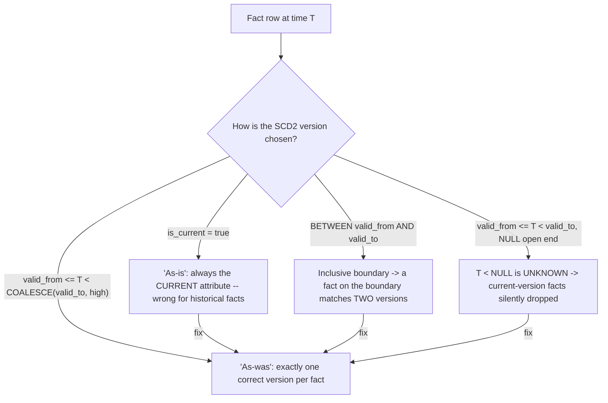

# :material-history: SCD Type 2 Join Problems

A **Slowly Changing Dimension Type 2** table keeps *every* historical version of a row,
each stamped with a validity window (`valid_from` / `valid_to`) and usually an
`is_current` flag. Joining a fact table to an SCD2 dimension is deceptively easy to get
wrong: the same `customer_id` now appears on multiple rows, so the join needs a
**point-in-time** predicate to pick the version that was in effect *when the fact
happened*. Four distinct mistakes recur — using `is_current`, inclusive boundary overlap,
`NULL`/high-date sentinel handling, and (the general case) omitting the temporal predicate
entirely, covered in [Incomplete Join Conditions](incomplete_join_conditions.md).

---

### :material-sitemap: Overview



---

## :material-pin: Common Symptoms

- A historical report shows every customer's **current** attribute (tier, region,
  segment) instead of the value that was true at the time of the transaction.
- Row counts are slightly inflated, and specific facts dated exactly on a version-change
  date appear **twice** — once per adjacent version.
- Facts belonging to the **current** version silently disappear from the result when the
  open-ended record stores `valid_to = NULL`.
- `SUM()`/`COUNT()` totals don't tie out to the fact table because some facts matched
  zero versions (gaps) or two versions (overlap).

---

## :material-flask-outline: Practical Examples

### Setup

```sql
-- Customer 1 was upgraded from Bronze to Gold on 2024-06-01. The open record uses a
-- high-date sentinel (9999-12-31) for valid_to.
CREATE TABLE dim_customer (
    customer_id INT,
    tier        STRING,
    valid_from  DATE,
    valid_to    DATE,
    is_current  BOOLEAN
);

INSERT INTO dim_customer VALUES
    (1, 'Bronze', DATE'2024-01-01', DATE'2024-06-01', false),
    (1, 'Gold',   DATE'2024-06-01', DATE'9999-12-31', true),
    (2, 'Silver', DATE'2024-01-01', DATE'9999-12-31', true);

CREATE TABLE orders (order_id INT, customer_id INT, order_date DATE, amount DOUBLE);
INSERT INTO orders VALUES
    (100, 1, DATE'2024-03-15', 50.0),   -- customer 1 was Bronze then
    (101, 1, DATE'2024-06-01', 80.0),   -- exactly on the change date
    (102, 2, DATE'2024-02-01', 20.0);
```

### Example 1 — The Bug: Joining on `is_current` Gives "As-Is", Not "As-Was"

```sql
SELECT o.order_id, o.order_date, d.tier
FROM orders o
JOIN dim_customer d ON o.customer_id = d.customer_id AND d.is_current
ORDER BY o.order_id;
```

| order_id | order_date | tier |
|:---:|:---:|---|
| 100 | 2024-03-15 | Gold |
| 101 | 2024-06-01 | Gold |
| 102 | 2024-02-01 | Silver |

Order 100 was placed in **March**, when customer 1 was **Bronze** — but `is_current`
always returns the *latest* version, so it's mislabeled **Gold**. `is_current` answers
"what is this customer's tier *now*", not "what was it *when they ordered*". It's only
correct when you genuinely want current attributes for every fact (an "as-is" report).

### Example 2 — The Bug: Inclusive `BETWEEN` Double-Matches on the Boundary

```sql
SELECT o.order_id, o.order_date, d.tier, d.valid_from, d.valid_to
FROM orders o
JOIN dim_customer d
  ON o.customer_id = d.customer_id
 AND o.order_date BETWEEN d.valid_from AND d.valid_to
ORDER BY o.order_id, d.valid_from;
```

| order_id | order_date | tier | valid_from | valid_to |
|:---:|:---:|---|:---:|:---:|
| 100 | 2024-03-15 | Bronze | 2024-01-01 | 2024-06-01 |
| 101 | 2024-06-01 | Bronze | 2024-01-01 | 2024-06-01 |
| 101 | 2024-06-01 | Gold | 2024-06-01 | 9999-12-31 |
| 102 | 2024-02-01 | Silver | 2024-01-01 | 9999-12-31 |

`BETWEEN` is **inclusive on both ends**, and SCD2 versions share the changeover date
(`valid_to` of the old row = `valid_from` of the new row). Order 101, dated exactly
`2024-06-01`, therefore matches **both** the Bronze and Gold versions — the fact is
duplicated, inflating any downstream `SUM(amount)`.

### Example 3 — The Fix: Half-Open Interval `[valid_from, valid_to)`

```sql
SELECT o.order_id, o.order_date, d.tier
FROM orders o
JOIN dim_customer d
  ON o.customer_id = d.customer_id
 AND o.order_date >= d.valid_from
 AND o.order_date <  d.valid_to
ORDER BY o.order_id;
```

| order_id | order_date | tier |
|:---:|:---:|---|
| 100 | 2024-03-15 | Bronze |
| 101 | 2024-06-01 | Gold |
| 102 | 2024-02-01 | Silver |

Using `>= valid_from AND < valid_to` (inclusive start, **exclusive** end) makes the
version windows non-overlapping: the boundary date `2024-06-01` belongs to exactly one
version (Gold). Every fact now maps to precisely one historical version with the correct
"as-was" attribute. This is the standard point-in-time SCD2 join.

### Example 4 — The Bug & Fix: `NULL` Open-Ended `valid_to`

```sql
-- If the CURRENT record stores valid_to = NULL instead of a high date, the exclusive
-- upper bound breaks: `order_date < NULL` evaluates to UNKNOWN, so every fact belonging
-- to the current version is silently dropped.
SELECT o.order_id, d.tier
FROM orders o
JOIN dim_customer d
  ON o.customer_id = d.customer_id
 AND o.order_date >= d.valid_from
 AND o.order_date <  d.valid_to;      -- current-version facts vanish

-- FIX: COALESCE the open end to a high sentinel so the comparison stays well-defined.
SELECT o.order_id, d.tier
FROM orders o
JOIN dim_customer d
  ON o.customer_id = d.customer_id
 AND o.order_date >= d.valid_from
 AND o.order_date <  COALESCE(d.valid_to, DATE'9999-12-31')
ORDER BY o.order_id;
```

A `NULL` upper bound is the [Null Key Trap](null_key_trap.md) applied to a range
predicate — `< NULL` is never `TRUE`. Either store a high-date sentinel at load time, or
`COALESCE(valid_to, DATE'9999-12-31')` in the join so the current record's window stays
open-ended and comparable.

---

## :material-brain: When to Use

| Scenario | Recommended Pattern |
|----------|---------------------|
| Historical/"as-was" reporting (attribute at the time of the fact) | `fact_date >= valid_from AND fact_date < valid_to` — half-open interval (Example 3) |
| Current-state ("as-is") reporting | Join on `is_current = true` (or `valid_to` sentinel = max) — but *only* when you truly want today's value for every fact |
| SCD2 versions share the changeover date | Always use a **half-open** interval, never inclusive `BETWEEN`, to avoid boundary double-matches (Example 2) |
| Open record stored as `valid_to IS NULL` | `COALESCE(valid_to, DATE'9999-12-31')` in the predicate, or store the sentinel at load time (Example 4) |
| Fact could fall in a gap between versions | Validate the SCD2 table has contiguous windows (`prev.valid_to = next.valid_from`); a `LEFT JOIN` will expose facts that match no version |

!!! danger "Half-open intervals are the SCD2 default for a reason"
    Inclusive `BETWEEN` on SCD2 windows is a silent double-counting bug that only
    manifests for facts dated exactly on a version-change boundary — easy to miss in
    testing, expensive in a financial report. Standardize on
    `valid_from <= fact_date < valid_to` everywhere, and treat any `NULL` upper bound as
    a sentinel via `COALESCE`. See [Range / Non-Equi Join](range_join_pitfalls.md) for
    the performance side of these interval joins (add the `customer_id` equi-key so it
    doesn't become a nested-loop join).
