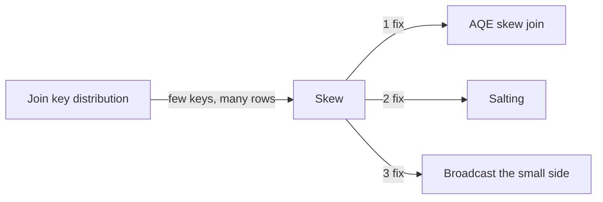

# :material-scale-unbalanced: Skewed Join Keys

A join is **skewed** when a small number of join-key values account for a
disproportionate share of the rows on one side. The task(s) processing those keys run
far longer than every other task, so the whole stage waits on a handful of "hot" keys.


### :material-sitemap: Overview



---

## :material-pin: Common Symptoms

- The Spark UI shows one task per stage running for minutes/hours while hundreds of
  siblings finish in seconds.
- `EXPLAIN` shows a `SortMergeJoin`/`ShuffleHashJoin` with a huge shuffle read on one
  partition.
- Adding executors doesn't help — the bottleneck is a single overloaded partition, not
  parallelism.

---

## :material-flask-outline: Practical Examples

### Setup

```sql
CREATE TABLE orders (
    order_id    INT,
    customer_id INT,
    amount      DOUBLE
) USING DELTA;

-- customer_id = 101 is a "super customer" (e.g. a marketplace/reseller account)
-- with far more orders than everyone else -- a classic skew pattern.
INSERT INTO orders VALUES
    (1, 101, 250.00),
    (2, 101, 175.50),
    (3, 101, 310.00),
    (4, 101,  89.99),
    (5, 101, 120.00),
    (6, 102,  45.00),
    (7, 103,  60.00),
    (8, 104,  75.00);

CREATE TABLE customers (
    customer_id INT,
    name        STRING
) USING DELTA;

INSERT INTO customers VALUES
    (101, 'Acme Marketplace'),
    (102, 'Bob'),
    (103, 'Charlie'),
    (104, 'Diana');
```

### Example 1 — Diagnose Skew: Find the Hot Keys

```sql
SELECT customer_id, COUNT(*) AS order_count
FROM orders
GROUP BY customer_id
ORDER BY order_count DESC;
-- Result:
-- customer_id  order_count
-- 101          5             <- 5 of 8 rows (62%) share one key
-- 102          1
-- 103          1
-- 104          1
```

### Example 2 — Fix: Let AQE Handle Skew Automatically

```sql
SET spark.sql.adaptive.enabled = true;
SET spark.sql.adaptive.skewJoin.enabled = true;

SELECT o.order_id, c.name, o.amount
FROM orders o
JOIN customers c ON o.customer_id = c.customer_id;
-- AQE splits the oversized customer_id=101 partition into smaller sub-partitions
-- at runtime, so no single task processes all 5 of Acme's rows alone.
```

### Example 3 — Fix: Manual Salting (When AQE Isn't Available)

```sql
-- Spread the hot key across N synthetic buckets on the large side...
WITH salted_orders AS (
    SELECT *, CONCAT(customer_id, '_', CAST(RAND() * 4 AS INT)) AS salted_key
    FROM orders
),
-- ...and explode the small side to match every possible bucket.
salted_customers AS (
    SELECT c.*, CONCAT(c.customer_id, '_', bucket) AS salted_key
    FROM customers c
    CROSS JOIN (SELECT EXPLODE(SEQUENCE(0, 3)) AS bucket)
)
SELECT o.order_id, c.name, o.amount
FROM salted_orders o
JOIN salted_customers c ON o.salted_key = c.salted_key;
-- Result: same 8 rows as an unsalted join, but customer_id=101's 5 rows are now
-- spread across 4 shuffle partitions instead of landing on one.
```

### Example 4 — Fix: Broadcast the Small Side (Sidesteps Skew Entirely)

```sql
SELECT /*+ BROADCAST(customers) */ o.order_id, c.name, o.amount
FROM orders o
JOIN customers c ON o.customer_id = c.customer_id;
-- No shuffle on the join key at all -- `customers` is sent whole to every executor,
-- so a skewed customer_id on the `orders` side no longer causes a single-partition
-- bottleneck.
```

---

## :material-brain: When to Use

| Scenario | Recommended Pattern |
|----------|---------------------|
| Spark 3.x, skew on either side | Enable AQE skew join (default in most deployments) |
| AQE unavailable / need explicit control | Manual salting |
| One side fits in executor memory (< ~10MB–a few hundred MB) | `BROADCAST` hint — avoids the shuffle entirely |
| Skew caused by NULL keys | See [Null Key Trap](null_key_trap.md) — often the "hot key" is `NULL` |

!!! note "Skew is not the same as a wrong partition count"
    Skew is a *few* oversized partitions among many normal ones. If instead *every*
    partition is uniformly too small or too big (independent of any hot key), that's a
    partition-**count** problem — see [Partition-Count Problems](partition_count.md).
