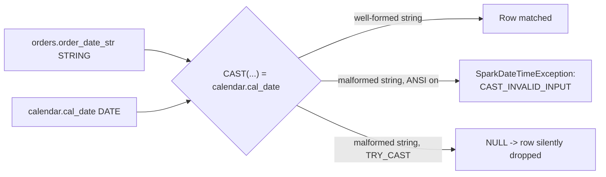

# :material-swap-horizontal: Type Mismatch / Implicit Cast

When join keys don't share the same data type, Spark implicitly casts one side to match
the other before comparing. This can either **crash the job** (Spark 4's default
`spark.sql.ansi.enabled = true` throws on invalid casts) or, if the cast is wrapped in
`TRY_CAST`, **silently turn unparsable values into `NULL`** — which then fall into the
[Null Key Trap](null-key-trap.md).

______________________________________________________________________

## :material-sitemap: Overview



______________________________________________________________________

### :material-animation-play: Interactive Visualization — Cast Failure vs. Tolerant Parsing

<div id="viz-joins-issues-type-mismatch" class="ts-viz"></div>

These panels mirror the verified Spark 4.2 outcomes: hard failure under `CAST`, silent NULLs under `TRY_CAST`, and recoverable parsing when the real input formats are handled explicitly.

<script src="../../../assets/js/querying-joins-issues-viz.js"></script>

## :material-pin: Common Symptoms

- A join that worked in development suddenly throws `CAST_INVALID_INPUT` /
    `NumberFormatException` in production the moment a badly formatted value appears.
- Rows silently vanish from the result with no error at all (when the cast is wrapped in
    `TRY_CAST` or ANSI mode is off) — same silent-drop symptom as the
    [Null Key Trap](null-key-trap.md), but caused by a failed *cast*, not a literal `NULL`.
- The physical plan shows a `Cast` expression injected into the join condition
    (`Filter (cast(order_date_str#12 as date) = cal_date#20)`), which also blocks certain
    join optimizations (e.g. bucket pruning) that require matching types on both sides.

______________________________________________________________________

## :material-flask-outline: Practical Examples

### Setup

```sql
CREATE TABLE orders_str (
    order_id       INT,
    order_date_str STRING,   -- ingested as text; format isn't validated at write time
    amount         DOUBLE
);

INSERT INTO orders_str VALUES
    (1, '2024-01-15', 100.0),
    (2, '2024-01-20', 200.0),
    (3, '01/25/2024', 300.0);   -- wrong format (MM/dd/yyyy instead of yyyy-MM-dd)

CREATE TABLE calendar_dim (
    cal_date   DATE,
    is_holiday BOOLEAN
);

INSERT INTO calendar_dim VALUES
    (DATE '2024-01-15', false),
    (DATE '2024-01-20', false),
    (DATE '2024-01-25', false);
```

### Example 1 — The Bug: Direct `CAST` in the Join Crashes the Job

```sql
SELECT o.order_id, o.order_date_str, c.cal_date
FROM orders_str o
JOIN calendar_dim c
    ON CAST(o.order_date_str AS DATE) = c.cal_date
ORDER BY o.order_id;
-- Result (Spark 4.2, ANSI enabled): job FAILS with
-- [CAST_INVALID_INPUT] The value '01/25/2024' of the type "STRING" cannot be cast to
-- "DATE" because it is malformed. Correct the value as per the syntax, or change its
-- target type. Use `try_cast` to tolerate malformed input and return NULL instead.
-- SQLSTATE: 22018
-- The entire query aborts -- rows 1 and 2 never even get returned.
```

### Example 2 — The Quieter Bug: `TRY_CAST` Hides the Failure

```sql
SELECT
    o.order_id,
    o.order_date_str,
    TRY_CAST(o.order_date_str AS DATE) AS parsed_date,
    c.cal_date,
    c.is_holiday
FROM orders_str o
LEFT JOIN calendar_dim c
    ON TRY_CAST(o.order_date_str AS DATE) = c.cal_date
ORDER BY o.order_id;
-- Result: query succeeds, but order_id 3 comes back with parsed_date = NULL and
-- every calendar_dim column NULL -- no error, no warning, just a quietly unmatched row.
-- order_id  order_date_str  parsed_date  cal_date    is_holiday
-- 1         2024-01-15      2024-01-15   2024-01-15  false
-- 2         2024-01-20      2024-01-20   2024-01-20  false
-- 3         01/25/2024      NULL         NULL        NULL
```

### Example 3 — Fix: Parse Explicitly with the Known Format(s)

```sql
SELECT
    o.order_id,
    o.order_date_str,
    COALESCE(
        TRY_TO_DATE(o.order_date_str, 'yyyy-MM-dd'),
        TRY_TO_DATE(o.order_date_str, 'MM/dd/yyyy')
    ) AS parsed_date,
    c.cal_date,
    c.is_holiday
FROM orders_str o
LEFT JOIN calendar_dim c
    ON COALESCE(
        TRY_TO_DATE(o.order_date_str, 'yyyy-MM-dd'),
        TRY_TO_DATE(o.order_date_str, 'MM/dd/yyyy')
    ) = c.cal_date
ORDER BY o.order_id;
-- Result: all 3 rows match -- explicitly trying both known formats recovers
-- '01/25/2024' instead of silently discarding it.
```

### Example 4 — Better Fix: Validate and Reject at Ingestion, Not at Join Time

```sql
-- Quarantine malformed values before they ever reach a join.
SELECT order_id, order_date_str
FROM orders_str
WHERE TRY_TO_DATE(order_date_str, 'yyyy-MM-dd') IS NULL;
-- Result: order_id 3 -- flag/reject this row (or fix its format) upstream instead of
-- discovering the problem inside a downstream join.
```

______________________________________________________________________

## :material-brain: When to Use

| Scenario                                                                                 | Recommended Pattern                                                                                                        |
| ---------------------------------------------------------------------------------------- | -------------------------------------------------------------------------------------------------------------------------- |
| Join keys are naturally different types (e.g. `STRING` vs `DATE`) but always well-formed | Explicit `CAST`/`TO_DATE` with the correct format — cheaper than `TRY_*` and fails loudly on bad data (arguably a feature) |
| Source data quality is unreliable and mixed formats are expected                         | `TRY_TO_DATE`/`TRY_CAST` **plus** an explicit `IS NULL` check downstream — never let a `TRY_*` failure disappear silently  |
| Same logical type, multiple formats seen in practice                                     | `COALESCE(TRY_TO_DATE(col, fmt1), TRY_TO_DATE(col, fmt2), ...)` trying each known format in order                          |
| Recurring bad-format problem                                                             | Validate and quarantine at ingestion (Example 4) instead of re-parsing on every downstream join                            |

!!! tip "Type mismatches hurt performance too, not just correctness"

    A `Cast` injected into a join key also prevents Spark from exploiting matching
    partitioning/bucketing between the two sides, and can silently disable
    broadcast-join size estimation shortcuts. Prefer aligning column types at the
    schema level (same type in both tables) over relying on implicit casts at query time.
