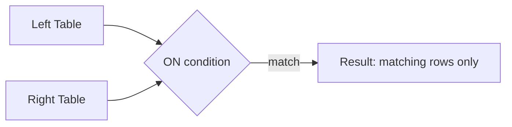
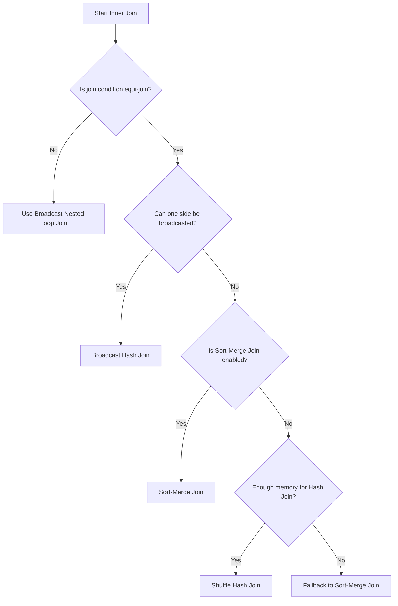

# :material-set-center: Inner Join

An **inner join** returns only the rows where the join condition matches in *both* tables. It's the default and most widely used join type in SQL and Spark.

## :material-sitemap: Overview



______________________________________________________________________

## :material-rocket-launch: Why Use Inner Joins?

| Use Case                   | Benefit                                      | Example                       |
| -------------------------- | -------------------------------------------- | ----------------------------- |
| Combine related data       | Merge datasets with shared keys              | Orders + Customers            |
| Data integrity enforcement | Ensures referenced keys exist in both tables | Foreign key checks            |
| Filter matching rows       | Efficiently narrows data to relevant matches | Only customers with purchases |

______________________________________________________________________

## :material-flask-outline: Practical Example

### Setup

```sql
CREATE TABLE orders (
    order_id    INT,
    customer_id INT,
    amount      DOUBLE
) USING DELTA;

INSERT INTO orders VALUES
    (1, 101, 250.00),
    (2, 102, 175.50),
    (3, 105,  40.00);   -- customer 105 does not exist in `customers`

CREATE TABLE customers (
    customer_id INT,
    name        STRING
) USING DELTA;

INSERT INTO customers VALUES
    (101, 'Alice'),
    (102, 'Bob'),
    (103, 'Charlie');   -- Charlie has no orders
```

### Query

```sql
SELECT o.order_id, o.customer_id, c.name, o.amount
FROM orders o
JOIN customers c ON o.customer_id = c.customer_id
ORDER BY o.order_id;
-- Result: only rows with a match on BOTH sides survive.
-- order_id  customer_id  name   amount
-- 1         101          Alice  250.00
-- 2         102          Bob    175.50
-- (order 3 dropped: customer 105 unknown; Charlie dropped: no orders)
```

______________________________________________________________________

## :material-animation-play: Interactive Visualization

<div id="viz-join-inner" class="ts-viz"></div>

______________________________________________________________________

## :material-magnify-scan: Diagnose Silently Dropped Rows

An inner join **silently discards** any row without a match on the other side — there is
no error and no `NULL`, the row simply vanishes. When a result has fewer rows than you
expected, use a `LEFT ANTI JOIN` to list exactly which left-side rows were dropped:

```sql
SELECT c.customer_id, c.name
FROM customers c
LEFT ANTI JOIN orders o ON c.customer_id = o.customer_id;
-- customer_id  name
-- 103          Charlie   -- has no orders, so the inner join dropped it
```

Swap the table order to find dropped *right*-side rows (orders whose customer is unknown).
See [Left Anti Join](left-anti.md) for the full pattern.

**Fix — if unmatched rows must be retained**, switch to an outer join so the preserved
side survives with `NULL`s for the missing columns:

```sql
SELECT c.customer_id, c.name, o.order_id, o.amount
FROM customers c
LEFT JOIN orders o ON c.customer_id = o.customer_id;
-- Charlie now appears with NULL order_id / amount instead of disappearing.
```

Only keep the inner join if dropping unmatched rows is genuinely the intended behavior.

______________________________________________________________________

Depending on data size and configuration, Spark automatically selects the most efficient join strategy:

| Join Strategy             | When Spark Chooses It                                            |
| ------------------------- | ---------------------------------------------------------------- |
| **Broadcast Hash Join**   | One side fits `autoBroadcastJoinThreshold`                       |
| **Sort-Merge Join**       | Both sides are large, join keys are sortable                     |
| **Shuffle Hash Join**     | `preferSortMergeJoin` is disabled and enough memory is available |
| **Broadcast Nested Loop** | Non-equi joins (e.g., `<`, `<>`, `!=`, etc.)                     |

______________________________________________________________________

## :material-refresh: Join Strategy Flow



______________________________________________________________________

## :material-lightbulb-outline: Tips for Efficient Inner Joins

| Tip                                    | Why It Helps                                       |
| -------------------------------------- | -------------------------------------------------- |
| **Broadcast small tables**             | Avoids expensive shuffles                          |
| **Repartition on join keys**           | Ensures data co-location for faster joins          |
| **Use `JOIN ... USING` if keys match** | Cleaner syntax, avoids duplicate columns           |
| **Avoid skewed join keys**             | Prevents out-of-memory and performance bottlenecks |

______________________________________________________________________

## :material-alert:️ Common Pitfalls & Solutions

| Issue                  | Solution                                  |
| ---------------------- | ----------------------------------------- |
| Data skew on join keys | Use salting or Spark's skew join hints    |
| Nulls in join keys     | Inner join skips those rows automatically |
| Over-partitioned data  | Tune partitions to avoid tiny tasks       |

______________________________________________________________________

> **Pro Tip:**\
> Always analyze your data distribution and table sizes before joining. Use `EXPLAIN` to see Spark's chosen strategy!
