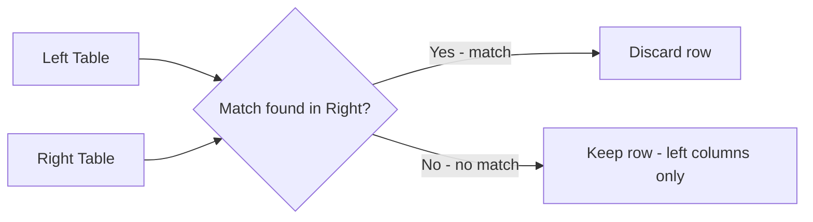
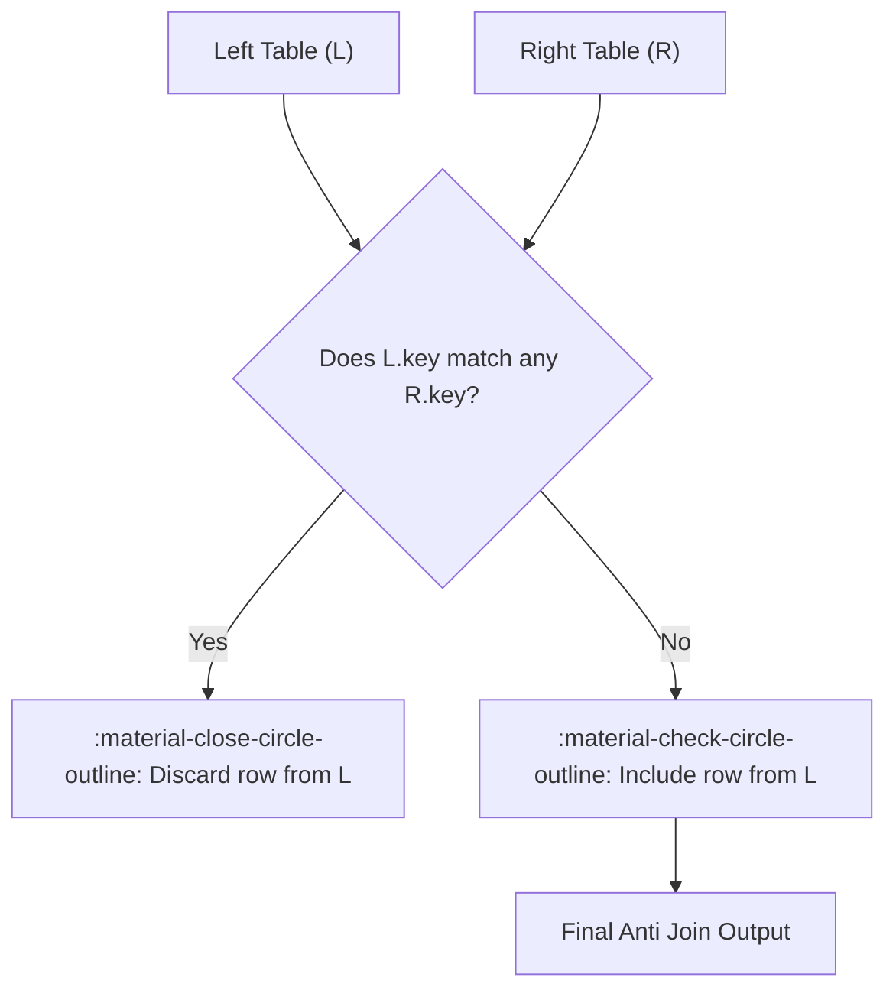
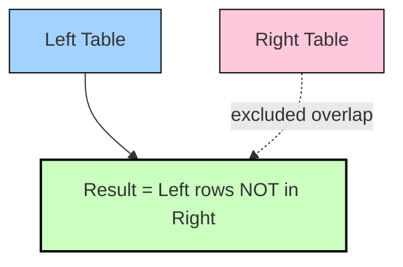

# :material-set-left: Left Anti Join

A **left anti join** returns **only the rows from the left table that have no matching row in the right table**, based on the join condition. No columns from the right table are ever projected — it is a pure *existence-negation* filter.

> _“Give me everything from A that has **no** counterpart in B.”_

It is the Spark-native, set-based replacement for `NOT IN` / `NOT EXISTS` subqueries and is the workhorse behind orphan detection, referential-integrity checks, and incremental (delta) load patterns.

---

## :material-sitemap: Overview



---

## :material-pencil-outline: Syntax

```sql
SELECT <left_columns>
FROM <left_table> AS l
LEFT ANTI JOIN <right_table> AS r
    ON l.<key> = r.<key>;
```

- Only columns from the **left** table may be referenced in the `SELECT` list.
- The `ON` clause is a normal join predicate — equi, composite, or non-equi conditions are all valid.
- `LEFT ANTI JOIN` and `ANTI JOIN` are equivalent in Spark SQL; `LEFT ANTI JOIN` is preferred for readability.

---

## :material-repeat: How Does It Work in Spark?

1. **Evaluate** the join predicate between every left row and the right table.
2. **Probe for existence** — Spark only needs to know *whether a match exists*, not which right rows matched.
3. **Discard** left rows that have at least one match.
4. **Keep** left rows with **zero** matches, projecting only left-side columns.
5. **No row multiplication** — unlike an inner join, duplicate matching keys on the right side never produce duplicate output rows, because anti join is a filter, not a Cartesian expansion.

---

## :material-map:️ Visual Flow



### Venn-Style Result Set



---

## :material-cog-outline:️ Spark Physical Execution Strategies

Spark plans a left anti join exactly like an inner or semi join — it picks a build/probe strategy based on size and join-key type, then only emits the "no match" side.

| Condition                                   | Spark Strategy                     | Notes                                            |
|----------------------------------------------|-------------------------------------|---------------------------------------------------|
| Right side small (< `autoBroadcastJoinThreshold`) | **BroadcastHashJoin** (anti)   | Fastest — no shuffle of the (usually larger) left side |
| Equi-join, both sides large                   | **SortMergeJoin** (anti)           | Both sides sorted and merged; no broadcast needed  |
| Equi-join, `preferSortMergeJoin=false`         | **ShuffledHashJoin** (anti)         | Right side hashed in memory after shuffle          |
| Non-equi predicate (`<`, `BETWEEN`, etc.)      | **BroadcastNestedLoopJoin**         | O(M×N) — use `SHUFFLE_REPLICATE_NL` hint sparingly |

```sql
EXPLAIN
SELECT e.id, e.name
FROM employee AS e
LEFT ANTI JOIN department AS d
    ON e.department = d.department_name;
```

!!! note "Reading the plan"
    Look for `BroadcastHashJoin LeftAnti`, `SortMergeJoin LeftAnti`, or `ShuffledHashJoin LeftAnti`
    in the physical plan `EXPLAIN` output to confirm which strategy Spark chose.

---

## :material-database: Example Dataset

**`employee`**

| id | name            | age | department |
|----|-----------------|-----|------------|
| 1  | John Doe        | 30  | IT         |
| 2  | Jane Smith      | 25  | HR         |
| 3  | Michael Johnson | 35  | Finance    |
| 4  | Mahfooz Doe     | 30  | HR         |

**`department`**

| department_id | department_name |
|----------------|------------------|
| 1              | IT               |
| 2              | HR               |
| 3              | Finance          |
| 4              | Admin            |

`Admin` (department_id 4) has **no employees**. Every `employee.department` value has a matching `department_name`.

### :material-link: 1. Employees whose department has no match

```sql
SELECT
    e.id,
    e.name,
    e.age,
    e.department
FROM employee AS e
LEFT ANTI JOIN department AS d
    ON e.department = d.department_name;
```

??? success "Expected output"

    | id | name | age | department |
    |----|------|-----|------------|
    | *(0 rows — every department has a match)* |

### :material-link-off: 2. Departments with no matching employee

```sql
SELECT
    d.department_id,
    d.department_name
FROM department AS d
LEFT ANTI JOIN employee AS e
    ON e.department = d.department_name;
```

??? success "Expected output"

    | department_id | department_name |
    |----------------|------------------|
    | 4              | Admin            |

---

## :material-flask-outline: Full Runnable Example

```sql
--8<-- "sql/join/types/anti/left_anti_join.sql"
```

---

## :material-equal: Equivalent Formulations

The three forms below are logically equivalent; Spark's optimizer typically rewrites `NOT EXISTS` into the same `LeftAnti` physical join, but `NOT IN` has a critical `NULL` caveat (see below).

=== "LEFT ANTI JOIN"

    ```sql
    SELECT d.department_id, d.department_name
    FROM department AS d
    LEFT ANTI JOIN employee AS e
        ON e.department = d.department_name;
    ```

=== "NOT EXISTS"

    ```sql
    SELECT d.department_id, d.department_name
    FROM department AS d
    WHERE NOT EXISTS (
        SELECT 1
        FROM employee AS e
        WHERE e.department = d.department_name
    );
    ```

=== "NOT IN"

    ```sql
    SELECT d.department_id, d.department_name
    FROM department AS d
    WHERE d.department_name NOT IN (
        SELECT e.department FROM employee AS e
    );
    ```

!!! warning "NULL trap with NOT IN"
    If **any** row returned by the `NOT IN` subquery has a `NULL` value for `e.department`, the
    entire `NOT IN` predicate evaluates to `UNKNOWN` for **every** row and the query silently
    returns **zero rows** — a classic, hard-to-debug SQL pitfall.
    `LEFT ANTI JOIN` and `NOT EXISTS` do **not** have this problem because they compare row-by-row
    rather than against a flattened list. Prefer `LEFT ANTI JOIN` in production pipelines.

---

## :material-language-python: PySpark DataFrame API

```python
from pyspark.sql import DataFrame


def employees_without_department(employee: DataFrame, department: DataFrame) -> DataFrame:
    return employee.join(
        department,
        employee.department == department.department_name,
        how="left_anti",  # aliases: "leftanti", "anti"
    )
```

---

## :material-microscope: Comparing Join Types

| Join Type  | Left Only | Right Only | Matching | Output Columns        |
|------------|:---------:|:----------:|:--------:|------------------------|
| Inner      | :material-close-circle-outline: | :material-close-circle-outline: | :material-check-circle-outline: | Left + Right |
| Left Outer | :material-check-circle-outline: | :material-close-circle-outline: | :material-check-circle-outline: | Left + Right (NULLs) |
| Left Semi  | :material-check-circle-outline: | :material-close-circle-outline: | :material-check-circle-outline: | Left only |
| **Left Anti** | :material-check-circle-outline: | :material-close-circle-outline: | :material-close-circle-outline: | **Left only, no match** |

---

## :material-earth: Real-World Use Cases

| Use Case                              | Why an Anti Join?                                             |
|-----------------------------------------|----------------------------------------------------------------|
| **Referential integrity checks**        | Find `employee.department` values with no matching `department` row |
| **CDC / incremental load**              | Insert-only rows: `source LEFT ANTI JOIN target ON key` finds new records |
| **Orphan / dangling record detection**  | Foreign keys pointing to deleted parent rows |
| **Data quality audits**                 | Rows failing a lookup / reference table validation |
| **De-duplication prep**                 | Isolate records not yet processed in a staging table |
| **A/B or cohort exclusion**             | Users in segment A who are **not** in segment B |

---

## :material-rocket-launch: Optimization Tips

- **Broadcast the smaller side** when it fits in memory — this is almost always the *right*-hand
  table in an anti join:

    ```sql
    SELECT /*+ BROADCAST(d) */
        e.id, e.name
    FROM employee AS e
    LEFT ANTI JOIN department AS d
        ON e.department = d.department_name;
    ```

- **Prefer `LEFT ANTI JOIN` / `NOT EXISTS` over `NOT IN`** — safer with `NULL`s and usually planned
  identically or better by Catalyst.
- **Filter early** — push `WHERE` predicates on the left table before the anti join so fewer rows
  are probed.
- **Watch for skew** — if the join key is heavily skewed (e.g., one department value dominates),
  apply the same [salting techniques](../optimization/skewjoin/salting/index.md) used for
  other join types; anti join skew must be on the **left** (probe) side.
- **NOT NULL join keys** — ensure both sides' join columns are non-null where possible; anti joins
  handle `NULL` keys safely (a `NULL` never matches, so it is always kept), but unexpected `NULL`s
  are a frequent source of "too many rows retained" surprises.

---

## :material-alert:️ Common Pitfalls

| Pitfall                                        | Explanation / Fix                                                        |
|--------------------------------------------------|-----------------------------------------------------------------------|
| Using `NOT IN` with a nullable subquery column | Silently returns 0 rows if any subquery row is `NULL` — use `LEFT ANTI JOIN` instead |
| Composite key partially `NULL`                  | `NULL <=> NULL` semantics differ from `=`; use `<=>` in the `ON` clause if `NULL`-safe matching is required |
| Assuming right-side columns are available       | Anti join **never** projects right-side columns — join back separately if you need them |
| Confusing Anti with Semi                        | Semi = "keep if match exists"; Anti = "keep if match does **not** exist" |

---

## :material-lightbulb-outline: Related Pages

- [Left Semi Join](left_semi.md) — the mirror image: keep only matching rows
- [Left Outer Join](outer/left.md) — keep all left rows, filled with `NULL` where unmatched
- [Join Hints](../hints/operator.md) — `BROADCAST`, `MERGE`, `SHUFFLE_HASH` reference
- [Skew Join Optimization](../optimization/skewjoin/index.md) — handling hot keys in large anti joins

---

!!! success "Summary"
    A **left anti join** is the safest, most scalable way to find rows in one dataset that have
    no counterpart in another. Use it in place of `NOT IN` to avoid `NULL` pitfalls, broadcast the
    smaller side for speed, and reach for salting only when the left (probe) side is skewed.
