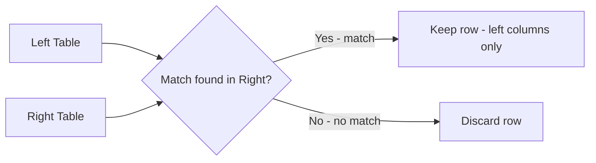
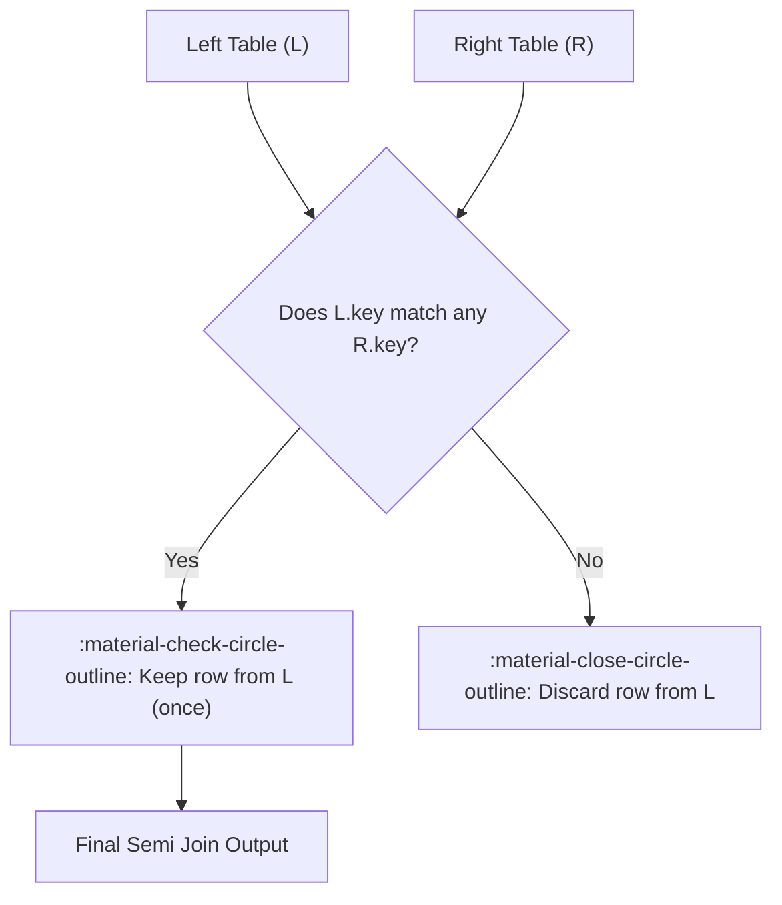
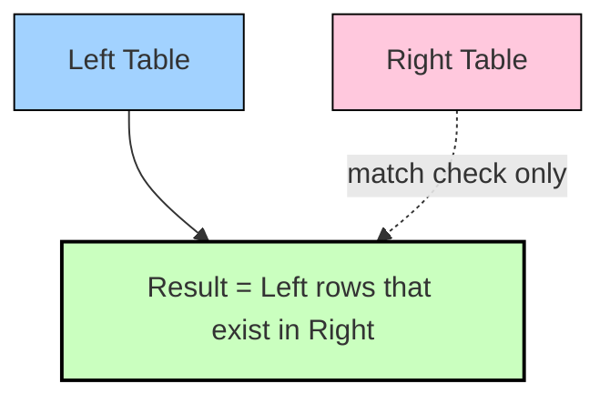

# :material-set-left: Left Semi Join

A **left semi join** returns rows from the left table that have **at least one matching row** in the right table — but it **never** returns columns from the right table. It is a pure *existence filter*, not a data-combining join.

> _“Give me all rows from A that exist in B, based on the join condition — I don't need B's columns.”_

It is the Spark-native, set-based replacement for `IN` / `EXISTS` subqueries, and is the workhorse behind existence checks, VIP/segment filtering, and "has at least one related record" queries — all without the row-duplication risk of an inner join.

---

## :material-sitemap: Overview



---

## :material-pencil-outline: Syntax

```sql
SELECT <left_columns>
FROM <left_table> AS l
LEFT SEMI JOIN <right_table> AS r
    ON l.<key> = r.<key>;
```

- Only columns from the **left** table may be referenced in the `SELECT` list.
- The `ON` clause is a normal join predicate — equi, composite, or non-equi conditions are all valid.
- `LEFT SEMI JOIN` and `SEMI JOIN` are equivalent in Spark SQL; `LEFT SEMI JOIN` is preferred for readability.

---

## :material-repeat: How Does It Work in Spark?

1. **Evaluate** the join predicate between every left row and the right table.
2. **Probe for existence** — Spark only needs to know *whether at least one match exists*, not
   which or how many right rows matched.
3. **Keep** the left row exactly **once**, even if it matches many right rows.
4. **Discard** left rows with **zero** matches.
5. **No row multiplication and no right-side columns** — unlike an inner join, duplicate matching
   keys on the right side never produce duplicate output rows, and right-side data is never
   projected.

---

## :material-map:️ Visual Flow



### Venn-Style Result Set



---

## :material-cog-outline:️ Spark Physical Execution Strategies

Spark plans a left semi join exactly like an inner or anti join — it picks a build/probe strategy
based on size and join-key type, then only emits the "match found" side (deduplicated).

| Condition                                        | Spark Strategy                | Notes                                                  |
|---------------------------------------------------|-------------------------------|-----------------------------------------------------------|
| Right side small (< `autoBroadcastJoinThreshold`)  | **BroadcastHashJoin** (semi)   | Fastest — no shuffle of the (usually larger) left side     |
| Equi-join, both sides large                        | **SortMergeJoin** (semi)       | Both sides sorted and merged; no broadcast needed          |
| Equi-join, `preferSortMergeJoin=false`              | **ShuffledHashJoin** (semi)    | Right side hashed in memory after shuffle                  |
| Non-equi predicate (`<`, `BETWEEN`, etc.)           | **BroadcastNestedLoopJoin**    | O(M×N) — use `SHUFFLE_REPLICATE_NL` hint sparingly          |

```sql
EXPLAIN
SELECT c.customer_id, c.name
FROM customers AS c
LEFT SEMI JOIN orders AS o
    ON c.customer_id = o.customer_id;
```

!!! note "Reading the plan"
    Look for `BroadcastHashJoin LeftSemi`, `SortMergeJoin LeftSemi`, or `ShuffledHashJoin LeftSemi`
    in the physical plan `EXPLAIN` output to confirm which strategy Spark chose.

---

## :material-database: Example Dataset

**`customers`**

| customer_id | name    | country |
|-------------|---------|---------|
| 101         | Alice   | US      |
| 102         | Bob     | CA      |
| 103         | Charlie | US      |
| 104         | Diana   | UK      |

**`orders`**

| order_id | customer_id | amount | status    |
|----------|-------------|--------|-----------|
| 1        | 101         | 250.00 | completed |
| 2        | 102         | 80.00  | completed |
| 3        | 101         | 430.00 | pending   |
| 4        | 103         | 120.00 | completed |
| 5        | 199         | 960.00 | cancelled |

**`vip_customers`** — VIP tier: `customer_id` 101 and 103 only.

Order 5 references `customer_id` 199, which does **not** exist in `customers` — an orphan row
used to demonstrate that unmatched right-side rows are simply ignored. Diana (104) has no orders
at all.

### :material-link: 1. Customers who have placed at least one order

```sql
SELECT
    c.customer_id,
    c.name,
    c.country
FROM customers AS c
LEFT SEMI JOIN orders AS o
    ON c.customer_id = o.customer_id;
```

??? success "Expected output"

    | customer_id | name    | country |
    |-------------|---------|---------|
    | 101         | Alice   | US      |
    | 102         | Bob     | CA      |
    | 103         | Charlie | US      |

    Diana (104) is excluded — no matching order. Notice Alice (101) appears **once**, even
    though she has two orders (1 and 3) — a semi join never duplicates left rows.

### :material-star-check: 2. VIP customers who also have a completed order

Chaining multiple `LEFT SEMI JOIN`s narrows the result with each existence check —
equivalent to `AND EXISTS (...) AND EXISTS (...)`.

```sql
SELECT
    c.customer_id,
    c.name,
    c.country
FROM customers AS c
LEFT SEMI JOIN orders AS o
    ON
        c.customer_id = o.customer_id
        AND o.status = 'completed'
LEFT SEMI JOIN vip_customers AS v
    ON c.customer_id = v.customer_id;
```

??? success "Expected output"

    | customer_id | name    | country |
    |-------------|---------|---------|
    | 101         | Alice   | US      |
    | 103         | Charlie | US      |

    Bob has a completed order but is not a VIP; both survivors satisfy **every** chained
    existence check.

---

## :material-flask-outline: Full Runnable Example

```sql
--8<-- "sql/join/types/semi/semi_join.sql"
```

---

## :material-equal: Equivalent Formulations

The two forms below are logically equivalent — Spark's optimizer typically rewrites a correlated
`EXISTS` subquery into the same `LeftSemi` physical join.

=== "LEFT SEMI JOIN"

    ```sql
    SELECT c.customer_id, c.name, c.country
    FROM customers AS c
    LEFT SEMI JOIN orders AS o
        ON c.customer_id = o.customer_id;
    ```

=== "EXISTS"

    ```sql
    SELECT c.customer_id, c.name, c.country
    FROM customers AS c
    WHERE EXISTS (
        SELECT 1
        FROM orders AS o
        WHERE o.customer_id = c.customer_id
    );
    ```

=== "IN (subquery)"

    ```sql
    SELECT c.customer_id, c.name, c.country
    FROM customers AS c
    WHERE c.customer_id IN (
        SELECT o.customer_id FROM orders AS o
    );
    ```

!!! warning "IN vs LEFT SEMI JOIN"
    `IN (subquery)` works correctly here because the subquery column (`customer_id`) is not
    nullable in this dataset. If the subquery's column **can** contain `NULL`, `NOT IN` breaks
    (see the [Left Anti Join](left_anti.md) page), and even plain `IN` can be less efficient than
    `LEFT SEMI JOIN` because some engines materialize the full `IN` list before filtering. Prefer
    `LEFT SEMI JOIN` in production pipelines for both safety and performance.

---

## :material-language-python: PySpark DataFrame API

```python
from pyspark.sql import DataFrame


def customers_with_orders(customers: DataFrame, orders: DataFrame) -> DataFrame:
    return customers.join(
        orders,
        customers.customer_id == orders.customer_id,
        how="left_semi",  # aliases: "leftsemi", "semi"
    )
```

---

## :material-microscope: Comparing Join Types

| Join Type     | Left Only | Right Only | Matching | Output Columns          |
|---------------|:---------:|:----------:|:--------:|--------------------------|
| Inner         | :material-close-circle-outline: | :material-close-circle-outline: | :material-check-circle-outline: | Left + Right |
| Left Outer    | :material-check-circle-outline: | :material-close-circle-outline: | :material-check-circle-outline: | Left + Right (NULLs) |
| **Left Semi** | :material-check-circle-outline: | :material-close-circle-outline: | :material-check-circle-outline: | **Left only** |
| Left Anti     | :material-check-circle-outline: | :material-close-circle-outline: | :material-close-circle-outline: | Left only, no match |

---

## :material-earth: Real-World Use Cases

| Use Case                                  | Why a Semi Join?                                                       |
|----------------------------------------------|-------------------------------------------------------------------|
| **Existence filtering**                   | "Customers who have ordered" without pulling every order row       |
| **Segment / cohort membership**           | Keep users present in a VIP, allow-list, or eligibility table       |
| **De-duplicating a broadcast lookup**     | Avoids fan-out that an inner join would cause on a 1:many relation  |
| **Chained business rules**                | Successive `LEFT SEMI JOIN`s express `AND EXISTS(...) AND EXISTS(...)` |
| **Referential validation (positive case)**| Confirm foreign keys resolve, without needing the parent's columns  |
| **Feature-flag / entitlement checks**     | Rows whose key appears in an entitlement or config table            |

---

## :material-rocket-launch: Optimization Tips

- **Broadcast the smaller side** when it fits in memory — this is almost always the *right*-hand
  table in a semi join:

    ```sql
    SELECT /*+ BROADCAST(o) */
        c.customer_id, c.name
    FROM customers AS c
    LEFT SEMI JOIN orders AS o
        ON c.customer_id = o.customer_id;
    ```

- **Prefer `LEFT SEMI JOIN` / `EXISTS` over `IN` or `INNER JOIN + DISTINCT`** — semi join is
  purpose-built for existence checks and avoids both `NULL` surprises and duplicate-row cleanup.
- **Chain semi joins instead of `AND`-ing multiple `EXISTS`** — reads cleanly and lets Catalyst
  reorder/push down each existence check independently.
- **Filter early** — push `WHERE` predicates on the left table before the semi join so fewer rows
  are probed.
- **Watch for skew** — if the join key is heavily skewed, apply the same
  [salting techniques](../optimization/skewjoin/salting/index.md) used for other join types;
  semi join skew must be on the **left** (probe) side.

---

## :material-alert:️ Common Pitfalls

| Pitfall                                          | Explanation / Fix                                                          |
|-----------------------------------------------------|--------------------------------------------------------------------|
| Expecting right-side columns in the output        | Semi join **never** projects right-side columns — join back separately (e.g., inner join) if you need them |
| Replacing with `INNER JOIN` + `SELECT DISTINCT`   | Works but is wasteful — inner join first fans out rows, then dedups; semi join never fans out |
| Composite key partially `NULL`                    | `NULL <=> NULL` semantics differ from `=`; use `<=>` in the `ON` clause if `NULL`-safe matching is required |
| Confusing Semi with Anti                          | Semi = "keep if match **exists**"; Anti = "keep if match does **not** exist" |

---

## :material-lightbulb-outline: Related Pages

- [Left Anti Join](left_anti.md) — the mirror image: keep only non-matching rows
- [Left Outer Join](outer/left.md) — keep all left rows, filled with `NULL` where unmatched
- [Join Hints](../hints/operator.md) — `BROADCAST`, `MERGE`, `SHUFFLE_HASH` reference
- [Skew Join Optimization](../optimization/skewjoin/index.md) — handling hot keys in large semi joins

---

!!! success "Summary"
    A **left semi join** is the safest, most scalable way to check whether a related row exists
    without pulling in the other table's columns or risking row duplication. Use it in place of
    `IN`/`EXISTS` subqueries and `INNER JOIN + DISTINCT`, broadcast the smaller side for speed, and
    chain multiple semi joins to express compound existence rules.
