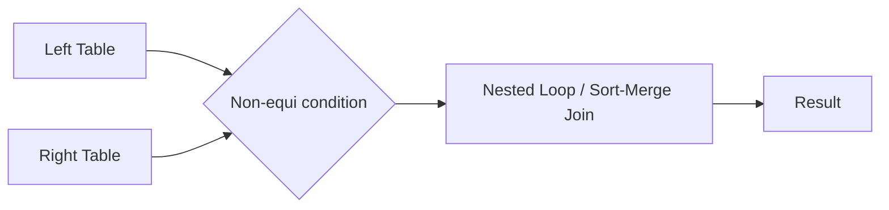
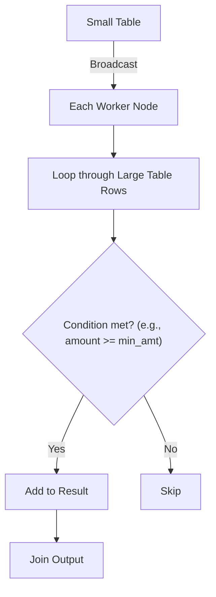

# :material-not-equal: Introduction

A **non-equi join** is a join where the condition is *not* based solely on equality (`=`). Instead, it uses operators such as:

- `<`, `>`, `<=`, `>=`
- `!=`, `BETWEEN`, or even complex expressions

> :material-alert:️ **Note:** Non-equi joins are not hashable. Spark cannot use efficient broadcast/hash joins for them, so it must fall back to more expensive join strategies (like sort-merge or nested loop joins).

## :material-sitemap: Overview



______________________________________________________________________

______________________________________________________________________

## :material-flask-outline: Practical Example

```sql
CREATE TABLE txns (txn_id INT, customer_id INT, amount DOUBLE, txn_date DATE) USING DELTA;
INSERT INTO txns VALUES
    (1, 101, 45.00,   DATE '2024-01-15'),
    (2, 102, 150.00,  DATE '2024-02-10'),
    (5, 105, 1200.00, DATE '2024-05-01');

CREATE TABLE pricing_tiers (tier STRING, min_amount DOUBLE, max_amount DOUBLE, discount_pct DOUBLE) USING DELTA;
INSERT INTO pricing_tiers VALUES
    ('Bronze',   0.00,    99.99,   0.0),
    ('Silver',   100.00,  499.99,  5.0),
    ('Platinum', 1000.00, 9999.99, 15.0);

SELECT t.txn_id, t.amount, p.tier, p.discount_pct
FROM txns t
JOIN pricing_tiers p ON t.amount BETWEEN p.min_amount AND p.max_amount
ORDER BY t.txn_id;
-- Result: each transaction assigned to the pricing tier its amount falls inside.
-- txn_id  amount   tier      discount_pct
-- 1       45.00    Bronze    0.0
-- 2       150.00   Silver    5.0
-- 5       1200.00  Platinum  15.0
```

## :material-animation-play: Interactive Visualization

<div id="viz-join-non-equi" class="ts-viz"></div>

______________________________________________________________________

## What is a Non-Equi Inner Join?

Unlike a traditional inner join (which matches rows where column values are equal), a **non-equi inner join** matches rows based on non-equality conditions, such as:

- Greater than (`>`)
- Less than (`<`)
- Ranges (`BETWEEN`)
- Other complex logical expressions

These joins are often more complex and computationally expensive, especially with large datasets.

______________________________________________________________________

## :material-bookshelf: Use Cases

Non-equi joins are particularly useful for:

1. **Range-based joins:**\
    Joining data based on value ranges (e.g., date or numerical ranges).
2. **Time-series data joins:**\
    Joining on overlapping or adjacent time intervals.
3. **Interval matching:**\
    Finding records that fall within specific intervals or thresholds.

______________________________________________________________________

## :material-refresh: How Non-Equi Joins Work in Spark



**Explanation:**

- The small table is broadcast to all worker nodes.
- Each worker loops through the large table's rows.
- For each row, the non-equi join condition is evaluated.
- If the condition is met, the row is added to the result.

______________________________________________________________________

## :material-lightning-bolt:️ Key Points

- Non-equi joins are powerful for advanced analytics but can be slow on large datasets.
- Always consider data size and join conditions when designing Spark jobs.
- Where possible, filter or reduce data before performing non-equi joins.

______________________________________________________________________

> :material-lightbulb-outline: **Tip:** If possible, rewrite your logic to use equi joins for better performance, or pre-filter data to minimize the join workload.
