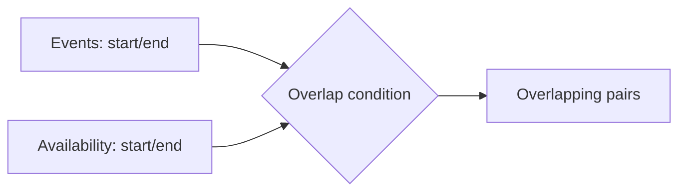

# :material-not-equal: Interval Overlap

This guide demonstrates how to perform a **range join** (also known as an **interval overlap join**) in Spark SQL. This is useful when you want to find overlapping time intervals between two tables.


### :material-sitemap: Overview



## Scenario

Suppose you have:

- **`events_df`**: Contains events with start and end times.
- **`availability_df`**: Contains periods of availability.

**Goal:** Join these tables to find all event–availability pairs where the event overlaps with an availability period.

---

## 1. Create Example Tables

```sql
CREATE TABLE events_tbl (
    event_id INT,
    event_name STRING,
    start_time TIMESTAMP,
    end_time TIMESTAMP
);

INSERT INTO events_tbl (event_id, event_name, start_time, end_time) VALUES
    (1, 'Event A', CAST('2024-07-01 08:00:00' AS TIMESTAMP), CAST('2024-07-01 10:00:00' AS TIMESTAMP)),
    (2, 'Event B', CAST('2024-07-01 09:00:00' AS TIMESTAMP), CAST('2024-07-01 11:00:00' AS TIMESTAMP)),
    (3, 'Event C', CAST('2024-07-01 12:00:00' AS TIMESTAMP), CAST('2024-07-01 14:00:00' AS TIMESTAMP)),
    (4, 'Event D', CAST('2024-07-01 13:00:00' AS TIMESTAMP), CAST('2024-07-01 15:00:00' AS TIMESTAMP));
```

```sql
CREATE TABLE availability_tbl (
    avail_id INT,
    start_time TIMESTAMP,
    end_time TIMESTAMP
);

INSERT INTO availability_tbl (avail_id, start_time, end_time) VALUES
    (1, CAST('2024-07-01 07:00:00' AS TIMESTAMP), CAST('2024-07-01 09:30:00' AS TIMESTAMP)),
    (2, CAST('2024-07-01 09:00:00' AS TIMESTAMP), CAST('2024-07-01 11:30:00' AS TIMESTAMP)),
    (3, CAST('2024-07-01 10:00:00' AS TIMESTAMP), CAST('2024-07-01 12:00:00' AS TIMESTAMP)),
    (4, CAST('2024-07-01 14:00:00' AS TIMESTAMP), CAST('2024-07-01 16:00:00' AS TIMESTAMP));
```

---

## 2. Interval Overlap Range Join

To find overlapping intervals, use the following join condition:

> **Two intervals `[start1, end1)` and `[start2, end2)` overlap if:**  
> `start1 < end2 AND end1 > start2`

### Example Query

```sql
SELECT
    e.event_id,
    e.event_name,
    e.start_time AS event_start,
    e.end_time AS event_end,
    a.avail_id,
    a.start_time AS avail_start,
    a.end_time AS avail_end
FROM
    events_tbl e
JOIN
    availability_tbl a
ON
    e.start_time < a.end_time
    AND e.end_time > a.start_time
ORDER BY
    e.event_id, a.avail_id;
```

??? success "Expected output"

    | event_id | event_name | event_start | event_end | avail_id | avail_start | avail_end |
    |----------|------------|-------------|-----------|----------|-------------|-----------|
    | 1        | Event A    | 08:00       | 10:00     | 1        | 07:00       | 09:30     |
    | 1        | Event A    | 08:00       | 10:00     | 2        | 09:00       | 11:30     |
    | 2        | Event B    | 09:00       | 11:00     | 1        | 07:00       | 09:30     |
    | 2        | Event B    | 09:00       | 11:00     | 2        | 09:00       | 11:30     |
    | 2        | Event B    | 09:00       | 11:00     | 3        | 10:00       | 12:00     |
    | 4        | Event D    | 13:00       | 15:00     | 4        | 14:00       | 16:00     |

    Event A and Event B each overlap **multiple** availability windows, producing multiple
    output rows. Event C (12:00–14:00) matches **no** availability window — its closest
    candidate (avail 3, ending exactly at 12:00) fails the strict `<`/`>` overlap condition,
    since two intervals that only touch at an endpoint don't overlap.

### :material-animation-play: Interactive Visualization

<div id="viz-join-interval-overlap" class="ts-viz"></div>

---

## 3. Explanation

- **`e.start_time < a.end_time`**: The event starts before the availability ends.
- **`e.end_time > a.start_time`**: The event ends after the availability starts.

This ensures that the event and availability intervals overlap.

---

## 4. Visual Representation

```text
Event:      |------|
Availability:   |------|
Overlap:     |--|
```

---

## 5. Summary

- Use a **range join** to match overlapping intervals.
- The key condition is:  

  ```sql
  event.start_time < availability.end_time
  AND event.end_time > availability.start_time
  ```

- This pattern is common in scheduling, booking, and time series analysis.

---

## 6. All Possible Overlap Scenarios

Two intervals can only ever relate to each other in one of a handful of ways (a simplified,
practical subset of [Allen's interval algebra](https://en.wikipedia.org/wiki/Allen%27s_interval_algebra)).
The table below tests nine reference intervals `A`–`I` against a fixed interval `R = [3, 6]`
(hours) using the exact `start1 < end2 AND end1 > start2` condition from Section 2:

```sql
CREATE TABLE intervals_tbl (label STRING, start_h INT, end_h INT);

INSERT INTO intervals_tbl VALUES
    ('R', 3, 6),
    ('A_before', 0, 2),
    ('B_meets_start', 1, 3),
    ('C_overlap_left', 2, 4),
    ('D_equals', 3, 6),
    ('E_contained', 4, 5),
    ('F_contains', 2, 8),
    ('G_overlap_right', 5, 9),
    ('H_meets_end', 6, 9),
    ('I_after', 7, 9);

SELECT
    y.label, y.start_h, y.end_h,
    (x.start_h < y.end_h AND x.end_h > y.start_h) AS strict_overlap
FROM
    intervals_tbl x
JOIN
    intervals_tbl y
ON
    x.label = 'R' AND y.label != 'R'
ORDER BY
    y.start_h;
```

| label | start_h | end_h | overlaps `R=[3,6]`? | relation |
|---|:---:|:---:|:---:|---|
| A_before | 0 | 2 | false | disjoint — ends before `R` starts |
| B_meets_start | 1 | 3 | false | touches `R`'s start only (`3 = 3`) |
| C_overlap_left | 2 | 4 | true | partial overlap, hangs off the left |
| F_contains | 2 | 8 | true | fully contains `R` |
| D_equals | 3 | 6 | true | identical to `R` |
| E_contained | 4 | 5 | true | fully contained within `R` |
| G_overlap_right | 5 | 9 | true | partial overlap, hangs off the right |
| H_meets_end | 6 | 9 | false | touches `R`'s end only (`6 = 6`) |
| I_after | 7 | 9 | false | disjoint — starts after `R` ends |

### :material-animation-play: Interactive Visualization

<div id="viz-join-interval-overlap-scenarios" class="ts-viz"></div>

!!! warning "`meets` is the classic surprise"
    `B_meets_start` and `H_meets_end` touch `R` at a single instant but do **not** overlap under
    the strict `<`/`>` condition — the same "touch ≠ overlap" behavior seen with Event C in
    Section 2. If your business rule should treat back-to-back bookings as a conflict (e.g. no
    time to clean a room between meetings), switch to the inclusive form in Section 7, or add a
    buffer as in Section 9.

---

## 7. Using Inequality Expressions

The base condition `start1 < end2 AND end1 > start2` is **strict** — two intervals that only
touch at a shared endpoint do not count as overlapping. Switching to inclusive operators changes
that:

```sql
SELECT
    e.event_id, e.event_name, a.avail_id
FROM
    events_tbl e
JOIN
    availability_tbl a
ON
    e.start_time <= a.end_time
AND e.end_time >= a.start_time
ORDER BY
    e.event_id, a.avail_id;
```

| event_id | event_name | avail_id | matched under strict (`<`/`>`)? |
|:---:|---|:---:|:---:|
| 1 | Event A | 1 | yes |
| 1 | Event A | 2 | yes |
| 1 | Event A | **3** | **no** — Event A ends exactly when avail 3 starts (10:00) |
| 2 | Event B | 1 | yes |
| 2 | Event B | 2 | yes |
| 2 | Event B | 3 | yes |
| 3 | Event C | **3** | **no** — Event C starts exactly when avail 3 ends (12:00) |
| 3 | Event C | **4** | **no** — Event C ends exactly when avail 4 starts (14:00) |
| 4 | Event D | 4 | yes |

Switching from strict to inclusive operators grows the result from **6** rows to **9** — three
extra pairs that only touch at a boundary now count as "overlapping".

### :material-animation-play: Interactive Visualization

<div id="viz-join-interval-overlap-inequality" class="ts-viz"></div>

!!! tip "Pick the semantics that match your business rule"
    - **Strict `</>`** — appropriate when adjacent bookings are fine back-to-back (e.g. calendar
      slots where one meeting ending at 10:00 and the next starting at 10:00 is not a conflict).
    - **Inclusive `<=/>=`** — appropriate when a shared boundary instant genuinely counts as
      contention (e.g. two processes both requiring exclusive access to a resource "at" 10:00:00).

---

## 8. Using Fixed-Length Interval

Instead of storing both a `start_time` and `end_time`, a table can store only a **start** and a
fixed duration — the end is computed with an `INTERVAL` literal, exactly as in the
[point-in-interval fixed-length pattern](point_in_interval.md#7-using-fixed-length-interval).
Here, every meeting request has a fixed 60-minute duration:

```sql
CREATE TABLE meeting_requests (
    request_id INT,
    requester STRING,
    start_time TIMESTAMP
);

INSERT INTO meeting_requests VALUES
    (1, 'Amy', TIMESTAMP '2024-07-01 07:30:00'),
    (2, 'Ben', TIMESTAMP '2024-07-01 10:30:00'),
    (3, 'Cid', TIMESTAMP '2024-07-01 13:30:00'),
    (4, 'Dee', TIMESTAMP '2024-07-01 15:30:00');
```

```sql
SELECT
    m.request_id,
    m.requester,
    m.start_time,
    m.start_time + INTERVAL 60 MINUTES AS request_end,
    a.avail_id,
    a.start_time AS avail_start,
    a.end_time AS avail_end
FROM
    meeting_requests m
JOIN
    availability_tbl a
ON
    m.start_time < a.end_time
AND m.start_time + INTERVAL 60 MINUTES > a.start_time
ORDER BY
    m.request_id, a.avail_id;
```

| request_id | requester | start_time | request_end | avail_id | avail_start | avail_end |
|:---:|---|---|---|:---:|---|---|
| 1 | Amy | 07:30 | 08:30 | 1 | 07:00 | 09:30 |
| 2 | Ben | 10:30 | 11:30 | 2 | 09:00 | 11:30 |
| 2 | Ben | 10:30 | 11:30 | 3 | 10:00 | 12:00 |
| 3 | Cid | 13:30 | 14:30 | 4 | 14:00 | 16:00 |
| 4 | Dee | 15:30 | 16:30 | 4 | 14:00 | 16:00 |

### :material-animation-play: Interactive Visualization

<div id="viz-join-interval-overlap-fixed-length" class="ts-viz"></div>

---

## 9. Using Join Points Within a Fixed Distance

A common variant of overlap-checking is requiring a **buffer** (turnaround/cleaning/travel time)
between intervals — two intervals that don't literally overlap should still be treated as
conflicting if they are within *N* minutes of each other. Pad both sides of the condition with a
fixed `INTERVAL`:

```sql
SELECT
    e.event_id,
    e.event_name,
    a.avail_id
FROM
    events_tbl e
JOIN
    availability_tbl a
ON
    e.start_time < a.end_time + INTERVAL 15 MINUTES
AND e.end_time + INTERVAL 15 MINUTES > a.start_time
ORDER BY
    e.event_id, a.avail_id;
```

| event_id | event_name | avail_id |
|:---:|---|:---:|
| 1 | Event A | 1 |
| 1 | Event A | 2 |
| 1 | Event A | 3 |
| 2 | Event B | 1 |
| 2 | Event B | 2 |
| 2 | Event B | 3 |
| 3 | Event C | 3 |
| 3 | Event C | 4 |
| 4 | Event D | 4 |

All 9 pairs now match — the 15-minute buffer pulls in the boundary-touching pairs from Section 6
(Event A/avail 3, Event C/avail 3, Event C/avail 4) plus any pair within 15 minutes even without
touching, growing the strict result from 6 rows to 9.

### :material-animation-play: Interactive Visualization

<div id="viz-join-interval-overlap-fixed-distance" class="ts-viz"></div>

!!! tip "Buffer joins are asymmetric-safe"
    Padding **both** `end_time` comparisons (not just one side) makes the buffer apply
    consistently regardless of which interval starts first — the query above pads the
    availability's end and the event's end, covering both "event ends just before availability"
    and "availability ends just before event" cases.

---

## 10. Using Range Condition with Additional Join Conditions

A range table is often scoped by a resource (room, machine, employee). The overlap condition
alone is **not enough** — it must be ANDed with an equality condition on that resource, or
conflicts get reported between intervals that don't even share a resource:

```sql
CREATE TABLE room_events (
    event_id INT,
    event_name STRING,
    room STRING,
    start_time TIMESTAMP,
    end_time TIMESTAMP
);

INSERT INTO room_events VALUES
    (1, 'Standup', 'Room A', TIMESTAMP '2024-07-01 09:00:00', TIMESTAMP '2024-07-01 09:30:00'),
    (2, 'Planning', 'Room B', TIMESTAMP '2024-07-01 09:15:00', TIMESTAMP '2024-07-01 10:00:00'),
    (3, 'Retro', 'Room A', TIMESTAMP '2024-07-01 09:15:00', TIMESTAMP '2024-07-01 09:45:00');
```

### :material-check-circle-outline: Correct — room equality AND overlap

```sql
SELECT
    a.event_id AS ev1, a.event_name AS name1, a.room,
    b.event_id AS ev2, b.event_name AS name2
FROM
    room_events a
JOIN
    room_events b
ON
    a.room = b.room
AND a.event_id < b.event_id
AND a.start_time < b.end_time
AND a.end_time > b.start_time
ORDER BY
    a.event_id, b.event_id;
```

| ev1 | name1 | room | ev2 | name2 |
|:---:|---|---|:---:|---|
| 1 | Standup | Room A | 3 | Retro |

Exactly **one** real conflict: Standup and Retro both use Room A and overlap 09:15–09:30.

### :material-alert-outline: Pitfall — dropping the room equality condition

```sql
SELECT
    a.event_id AS ev1, a.event_name AS name1, a.room AS room1,
    b.event_id AS ev2, b.event_name AS name2, b.room AS room2
FROM
    room_events a
JOIN
    room_events b
ON
    a.event_id < b.event_id
AND a.start_time < b.end_time
AND a.end_time > b.start_time   -- ⚠ no room match!
ORDER BY
    a.event_id, b.event_id;
```

| ev1 | name1 | room1 | ev2 | name2 | room2 |
|:---:|---|---|:---:|---|---|
| 1 | Standup | Room A | 2 | Planning | Room B |
| 1 | Standup | Room A | 3 | Retro | Room A |
| 2 | Planning | Room B | 3 | Retro | Room A |

Without the `room =` condition, **2 false conflicts** appear between events in *different*
rooms — Standup/Planning and Planning/Retro overlap in time but never actually compete for the
same room. This is the interval-overlap equivalent of the
[fan-out pitfall](point_in_interval.md#9-using-range-condition-with-additional-join-conditions)
in the point-in-interval guide.

### :material-animation-play: Interactive Visualization

<div id="viz-join-interval-overlap-extra-condition" class="ts-viz"></div>

!!! tip "Always scope range joins by resource"
    Any time an overlap/range condition is checked across a table that represents multiple
    independent resources (rooms, machines, tenants, accounts), add an equality predicate on the
    resource identifier — see [Data Explosion](../../../issues/data_explosion.md) for the general
    fan-out pattern this pitfall belongs to.
