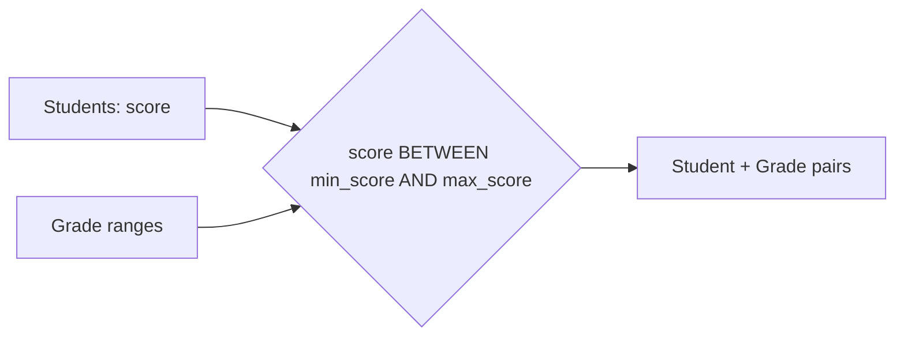

# :material-not-equal: Point-in-Interval

Learn how to map continuous values to intervals using a **range join** (also called a *point-in-interval* join) in Spark SQL. In this tutorial, we'll assign letter grades to students based on their scores.

## :material-sitemap: Overview



______________________________________________________________________

## 1️⃣ Create Tables

```sql
CREATE TABLE students_rj (
    id INT,
    name STRING,
    score INT
);

CREATE TABLE grade_range (
    grade STRING,
    min_score INT,
    max_score INT
);
```

______________________________________________________________________

## 2️⃣ Load Sample Data

### :material-account:‍:material-school: Insert Students

```sql
INSERT INTO students_rj (id, name, score) VALUES
    (1, 'Alice', 55),
    (2, 'Bob', 75),
    (3, 'Charlie', 85),
    (4, 'Diana', 65),
    (5, 'Eva', 70),
    (6, 'Frank', 90);
```

### :material-tag-outline:️ Insert Grade Ranges

```sql
INSERT INTO grade_range (grade, min_score, max_score) VALUES
    ('A', 85, 100),
    ('B', 70, 84),
    ('C', 50, 69),
    ('D', 35, 49),
    ('F', 0, 34);
```

______________________________________________________________________

## 3️⃣ Perform the Range Join

### :material-animation-play: Interactive Visualization

<div id="viz-join-point-in-interval" class="ts-viz"></div>

Assign each student a grade based on their score using a point-in-interval join:

```sql
SELECT
    s.id,
    s.name,
    s.score,
    g.grade
FROM
    students_rj s
JOIN
    grade_range g
ON
    s.score BETWEEN g.min_score AND g.max_score;
```

______________________________________________________________________

## 4️⃣ Example Output

| :material-identifier: | Name    | Score | Grade |
| --------------------- | ------- | ----- | ----- |
| 1                     | Alice   | 55    | C     |
| 2                     | Bob     | 75    | B     |
| 3                     | Charlie | 85    | A     |
| 4                     | Diana   | 65    | C     |
| 5                     | Eva     | 70    | B     |
| 6                     | Frank   | 90    | A     |

______________________________________________________________________

> :material-lightbulb-outline: **Tip:**\
> Range joins are powerful for mapping continuous values (like scores, timestamps, or prices) to categorical intervals.

______________________________________________________________________

## 5️⃣ All Possible Overlap Scenarios

A point-in-interval join between a single point and one or more ranges can only ever land in
one of **four** scenarios. The diagram below plots real and synthetic scores against the
`grade_range` bands (top) and a second, deliberately **overlapping** set of ranges (bottom) to
show every case side by side.

<div id="viz-join-point-in-interval-scenarios" class="ts-viz"></div>

| #   | Scenario                                                                                     | Example                                                                               |               Output rows               |
| --- | -------------------------------------------------------------------------------------------- | ------------------------------------------------------------------------------------- | :-------------------------------------: |
| 1   | Point strictly **inside** a band                                                             | Alice, score=55 → `C [50–69]`                                                         |                    1                    |
| 2   | Point exactly **on a boundary**                                                              | Eva, score=70 → `B [70–84]` (inclusive lower bound); Charlie, score=85 → `A [85–100]` |                    1                    |
| 3   | Point in a **gap** — below the lowest band, above the highest, or between non-adjacent bands | score=−5 or score=105 (outside `grade_range`'s 0–100 domain)                          | 0 — silently dropped by an `INNER` join |
| 4   | Point inside **overlapping** bands                                                           | Promo A `[40–80]` and Promo B `[60–100]` both cover price=70                          | N — one row per matching band (fan-out) |

!!! warning "Scenario 3 and 4 are the classic range-join gotchas"

    - **Gap (0 rows):** if every point is expected to map to *some* interval, use a `LEFT JOIN`
        instead of `INNER JOIN` so unmatched points still appear (with `NULL` grade/tier), and check
        for them explicitly — see [Null Key Trap](../../../issues/null-key-trap.md) for the
        equivalent problem on equi-joins.
    - **Overlap (N rows):** if the range table is supposed to be non-overlapping (e.g. exactly one
        grade per score) but isn't — often due to a data-quality bug in how the ranges were loaded —
        the join silently fans out instead of erroring. Validate range tables with a self-join
        (`a.min_score < b.max_score AND a.max_score > b.min_score AND a.grade != b.grade`) to catch
        overlaps before they reach production. See [Data Explosion](../../../issues/data-explosion.md)
        for the general pattern.

______________________________________________________________________

## 6️⃣ Using Inequality Expressions

`BETWEEN g.min_score AND g.max_score` is syntactic sugar for two inequality predicates ANDed
together. Writing them out explicitly is useful because it lets you choose **which boundary is
inclusive** — a decision that matters a lot in practice (e.g. billing periods, SCD "as of" ranges,
sensor time buckets).

### :material-code-braces: Inclusive both sides — identical to `BETWEEN`

```sql
SELECT s.id, s.name, s.score, g.grade
FROM students_rj s
JOIN grade_range g
    ON s.score >= g.min_score
   AND s.score <= g.max_score;
```

Produces the exact same 6 rows as the `BETWEEN` query above — `min_score`/`max_score` are both
closed boundaries.

### :material-code-braces: Exclusive both sides — boundary points fall into a gap

```sql
SELECT s.id, s.name, s.score, g.grade
FROM students_rj s
JOIN grade_range g
    ON s.score > g.min_score
   AND s.score < g.max_score;
```

Switching to strict `>`/`<` **excludes** scores that sit exactly on a `min_score`/`max_score`
boundary. Eva (70, the lower bound of `B`) and Charlie (85, the lower bound of `A`) no longer
match anything and silently disappear from an `INNER JOIN` result:

| id  | name    | score | inclusive `>= / <=` | exclusive `> / <` |
| --- | ------- | ----- | :-----------------: | :---------------: |
| 1   | Alice   | 55    |          C          |         C         |
| 2   | Bob     | 75    |          B          |         B         |
| 3   | Charlie | 85    |          A          | **— (no match)**  |
| 4   | Diana   | 65    |          C          |         C         |
| 5   | Eva     | 70    |          B          | **— (no match)**  |
| 6   | Frank   | 90    |          A          |         A         |

### :material-code-braces: Half-open `[min, max)` — the common choice for time buckets

```sql
SELECT s.id, s.name, s.score, g.grade
FROM students_rj s
JOIN grade_range g
    ON s.score >= g.min_score
   AND s.score < g.max_score;
```

Here only the *lower* bound is inclusive. Because `grade_range` bands are contiguous
(`B.max_score = 84`, `A.min_score = 85` — never equal), this variant still returns all 6 rows for
this dataset — but it is the pattern to reach for whenever adjacent ranges **share** an endpoint
(e.g. `valid_from <= event_ts AND event_ts < valid_to`), since it guarantees a point can never
match two adjacent bands at once.

### :material-animation-play: Interactive Visualization

<div id="viz-join-point-in-interval-inequality" class="ts-viz"></div>

!!! tip "Which form should I use?"

    - Prefer `BETWEEN` (inclusive/inclusive) when both endpoints belong to their own band and
        ranges never touch — it is the most readable form.
    - Prefer the **half-open** `>= / <` form whenever ranges are defined by a shared boundary
        (`this.end == next.start`), which is the standard convention for time-validity ranges (see
        [SCD Type 2](../../../../../schema-tables/types/datatype/datetime/concepts.md)) — it avoids the
        exact-boundary ambiguity that inclusive/inclusive ranges create if the ranges ever touch.
    - Avoid exclusive/exclusive unless you specifically intend boundary values to be unmatched
        gaps — it's the variant most likely to silently drop rows.

______________________________________________________________________

## 7️⃣ Using Fixed-Length Interval

So far `grade_range` stored an explicit `min_score`/`max_score` **per row** — a *variable-width*
range table. The other very common flavor is a **fixed-length interval**: only an anchor
(`bucket_start`) is stored, and every band has the *same* width, computed once with a Spark
`INTERVAL` literal. This is the standard pattern for **time-bucketing / downsampling** a
timestamp column (e.g. IoT sensor readings into 15‑minute windows).

```sql
CREATE TABLE sensor_readings (
    reading_id INT,
    sensor STRING,
    reading_ts TIMESTAMP,
    value DOUBLE
);

INSERT INTO sensor_readings VALUES
    (1, 'temp-1', TIMESTAMP '2024-01-01 09:03:00', 21.4),
    (2, 'temp-1', TIMESTAMP '2024-01-01 09:12:00', 21.6),
    (3, 'temp-1', TIMESTAMP '2024-01-01 09:29:00', 22.1),
    (4, 'temp-1', TIMESTAMP '2024-01-01 09:31:00', 22.3),
    (5, 'temp-1', TIMESTAMP '2024-01-01 09:47:00', 21.9),
    (6, 'temp-1', TIMESTAMP '2024-01-01 10:05:00', 20.8);

CREATE TABLE time_buckets (
    bucket_id INT,
    bucket_start TIMESTAMP
);

INSERT INTO time_buckets VALUES
    (1, TIMESTAMP '2024-01-01 09:00:00'),
    (2, TIMESTAMP '2024-01-01 09:15:00'),
    (3, TIMESTAMP '2024-01-01 09:30:00'),
    (4, TIMESTAMP '2024-01-01 09:45:00'),
    (5, TIMESTAMP '2024-01-01 10:00:00');
```

The interval width (`INTERVAL 15 MINUTES`) is defined **once**, directly in the `ON` clause,
instead of being stored per row — `bucket_end` is *derived*, not stored:

```sql
SELECT
    b.bucket_id,
    b.bucket_start,
    b.bucket_start + INTERVAL 15 MINUTES AS bucket_end,
    r.reading_id,
    r.reading_ts,
    r.value
FROM
    time_buckets b
JOIN
    sensor_readings r
ON
    r.reading_ts >= b.bucket_start
AND r.reading_ts <  b.bucket_start + INTERVAL 15 MINUTES
ORDER BY
    b.bucket_id, r.reading_ts;
```

| bucket_id | bucket_start | bucket_end | reading_id | reading_ts | value |
| :-------: | ------------ | ---------- | :--------: | ---------- | :---: |
|     1     | 09:00:00     | 09:15:00   |     1      | 09:03:00   | 21.4  |
|     1     | 09:00:00     | 09:15:00   |     2      | 09:12:00   | 21.6  |
|     2     | 09:15:00     | 09:30:00   |     3      | 09:29:00   | 22.1  |
|     3     | 09:30:00     | 09:45:00   |     4      | 09:31:00   | 22.3  |
|     4     | 09:45:00     | 10:00:00   |     5      | 09:47:00   | 21.9  |
|     5     | 10:00:00     | 10:15:00   |     6      | 10:05:00   | 20.8  |

### :material-sigma: Downsampling: aggregate per fixed-length bucket

The real-world payoff of fixed-length intervals is aggregation — e.g. a 15-minute rolling average.
Use a `LEFT JOIN` (not `INNER`) so buckets with **zero** readings still appear, per the
[gap scenario](#5-all-possible-overlap-scenarios) above:

```sql
SELECT
    b.bucket_id,
    b.bucket_start,
    b.bucket_start + INTERVAL 15 MINUTES AS bucket_end,
    COUNT(r.reading_id) AS num_readings,
    ROUND(AVG(r.value), 2) AS avg_value
FROM
    time_buckets b
LEFT JOIN
    sensor_readings r
ON
    r.reading_ts >= b.bucket_start
AND r.reading_ts <  b.bucket_start + INTERVAL 15 MINUTES
GROUP BY
    b.bucket_id, b.bucket_start
ORDER BY
    b.bucket_id;
```

| bucket_id | bucket_start | bucket_end | num_readings | avg_value |
| :-------: | ------------ | ---------- | :----------: | :-------: |
|     1     | 09:00:00     | 09:15:00   |      2       |   21.5    |
|     2     | 09:15:00     | 09:30:00   |      1       |   22.1    |
|     3     | 09:30:00     | 09:45:00   |      1       |   22.3    |
|     4     | 09:45:00     | 10:00:00   |      1       |   21.9    |
|     5     | 10:00:00     | 10:15:00   |      1       |   20.8    |

### :material-animation-play: Interactive Visualization

<div id="viz-join-point-in-interval-fixed-length" class="ts-viz"></div>

!!! tip "Fixed-length vs. variable-width ranges"

    - **Variable-width** (`grade_range`): each band stores its own `min`/`max` — use when band
        widths genuinely differ (grades, pricing tiers, custom SLA windows).
    - **Fixed-length** (`time_buckets` + `INTERVAL`): only an anchor is stored and every band has
        the same width — use for time-series bucketing/downsampling, session windows, or any
        "every N minutes/rows" grouping. Prefer generating buckets on the fly with
        `sequence(start, end, step)` + `explode()` over materializing a bucket table when the
        time range is large or open-ended.

______________________________________________________________________

## 8️⃣ Using Join Points Within a Fixed Distance

The previous two patterns anchored points to a **static** range table. A third flavor — common
in event-attribution, log correlation, and "nearest event" problems — has **no** range table at
all: two tables of *points* are joined whenever they fall within a fixed distance of **each
other**. Here we attribute purchases to marketing clicks that happened within **±10 minutes**.

```sql
CREATE TABLE clicks (
    click_id INT,
    campaign STRING,
    click_ts TIMESTAMP
);

INSERT INTO clicks VALUES
    (1, 'summer_sale', TIMESTAMP '2024-01-01 09:00:00'),
    (2, 'summer_sale', TIMESTAMP '2024-01-01 09:08:00'),
    (3, 'winter_promo', TIMESTAMP '2024-01-01 09:25:00'),
    (4, 'flash_deal', TIMESTAMP '2024-01-01 10:00:00');

CREATE TABLE purchases (
    purchase_id INT,
    customer STRING,
    purchase_ts TIMESTAMP
);

INSERT INTO purchases VALUES
    (1, 'cust_1', TIMESTAMP '2024-01-01 09:05:00'),
    (2, 'cust_2', TIMESTAMP '2024-01-01 09:26:00'),
    (3, 'cust_3', TIMESTAMP '2024-01-01 09:45:00'),
    (4, 'cust_4', TIMESTAMP '2024-01-01 10:05:00');
```

Each `purchase_ts` defines its **own** ±10-minute window — unlike fixed-length buckets, the
window moves with every row instead of being anchored to a shared grid:

```sql
SELECT
    p.purchase_id,
    p.customer,
    p.purchase_ts,
    c.click_id,
    c.campaign,
    c.click_ts,
    (unix_timestamp(p.purchase_ts) - unix_timestamp(c.click_ts)) / 60 AS minutes_diff
FROM
    purchases p
JOIN
    clicks c
ON
    c.click_ts BETWEEN p.purchase_ts - INTERVAL 10 MINUTES
                   AND p.purchase_ts + INTERVAL 10 MINUTES
ORDER BY
    p.purchase_id, c.click_id;
```

| purchase_id | customer | purchase_ts | click_id | campaign     | click_ts | minutes_diff |
| :---------: | -------- | ----------- | :------: | ------------ | -------- | :----------: |
|      1      | cust_1   | 09:05:00    |    1     | summer_sale  | 09:00:00 |     5.0      |
|      1      | cust_1   | 09:05:00    |    2     | summer_sale  | 09:08:00 |     -3.0     |
|      2      | cust_2   | 09:26:00    |    3     | winter_promo | 09:25:00 |     1.0      |
|      4      | cust_4   | 10:05:00    |    4     | flash_deal   | 10:00:00 |     5.0      |

Two clicks (1 and 2) both land inside `cust_1`'s ±10-minute window, so `cust_1` **fans out** to
2 rows — the same overlapping-window gotcha from [Scenario 4](#5-all-possible-overlap-scenarios),
but now caused by two *points* being close together rather than two static ranges overlapping.
`cust_3` (09:45) has **no** click within 10 minutes of it in either direction and is silently
dropped by the `INNER JOIN` — the gap scenario again.

### :material-format-list-numbered: Resolving the fan-out: nearest match only

If the business rule is "attribute to the single closest click", rank matches by distance with
a window function and keep only `rn = 1`:

```sql
WITH matched AS (
    SELECT
        p.purchase_id, p.customer, p.purchase_ts,
        c.click_id, c.campaign, c.click_ts,
        ABS(unix_timestamp(p.purchase_ts) - unix_timestamp(c.click_ts)) AS diff_secs
    FROM purchases p
    JOIN clicks c
        ON c.click_ts BETWEEN p.purchase_ts - INTERVAL 10 MINUTES
                          AND p.purchase_ts + INTERVAL 10 MINUTES
),
ranked AS (
    SELECT *, ROW_NUMBER() OVER (PARTITION BY purchase_id ORDER BY diff_secs) AS rn
    FROM matched
)
SELECT purchase_id, customer, purchase_ts, click_id, campaign, click_ts, diff_secs / 60 AS minutes_diff
FROM ranked
WHERE rn = 1
ORDER BY purchase_id;
```

| purchase_id | customer | purchase_ts | click_id | campaign     | click_ts | minutes_diff |
| :---------: | -------- | ----------- | :------: | ------------ | -------- | :----------: |
|      1      | cust_1   | 09:05:00    |    2     | summer_sale  | 09:08:00 |     3.0      |
|      2      | cust_2   | 09:26:00    |    3     | winter_promo | 09:25:00 |     1.0      |
|      4      | cust_4   | 10:05:00    |    4     | flash_deal   | 10:00:00 |     5.0      |

`cust_1` now resolves to click 2 (3 minutes away) instead of click 1 (5 minutes away), and
`cust_3` still has no row at all — ranking removes the fan-out but does **not** fix the gap; use
a `LEFT JOIN` beforehand if unmatched purchases must still be reported.

### :material-animation-play: Interactive Visualization

<div id="viz-join-point-in-interval-fixed-distance" class="ts-viz"></div>

!!! tip "`BETWEEN` beats `ABS()` for performance"

    Write the window as `col BETWEEN x - INTERVAL ... AND x + INTERVAL ...` rather than
    `ABS(unix_timestamp(a) - unix_timestamp(b)) <= n`. Spark's range-join optimizations
    (`RangeJoin`/sort-merge-with-bounds) recognize explicit `>=`/`<=`/`BETWEEN` predicates on the
    join keys; wrapping both sides in `ABS()` or `unix_timestamp()` hides the relationship from
    the optimizer and typically falls back to a full `BroadcastNestedLoopJoin` or Cartesian
    product on large tables.

______________________________________________________________________

## 9️⃣ Using Range Condition with Additional Join Conditions

Every range join so far used a **single** predicate. In practice a range table is often
partitioned by a category (course, region, tier, tenant) — and the range condition must be
**ANDed with an equality condition** on that category, or scores from unrelated categories will
match too. Here each `course` defines its **own** grading curve:

```sql
CREATE TABLE students_by_course (
    id INT,
    name STRING,
    course STRING,
    score INT
);

INSERT INTO students_by_course VALUES
    (1, 'Alice', 'Math', 55),
    (2, 'Bob', 'English', 75),
    (3, 'Charlie', 'Math', 85),
    (4, 'Diana', 'English', 65),
    (5, 'Eva', 'Math', 70),
    (6, 'Frank', 'English', 90);

CREATE TABLE grade_range_by_course (
    course STRING,
    grade STRING,
    min_score INT,
    max_score INT
);

INSERT INTO grade_range_by_course VALUES
    ('Math', 'A', 90, 100), ('Math', 'B', 75, 89), ('Math', 'C', 60, 74), ('Math', 'D', 45, 59), ('Math', 'F', 0, 44),
    ('English', 'A', 85, 100), ('English', 'B', 70, 84), ('English', 'C', 50, 69), ('English', 'D', 35, 49), ('English', 'F', 0, 34);
```

### :material-check-circle-outline: Correct — equality AND range together

```sql
SELECT
    s.id, s.name, s.course, s.score, g.grade
FROM
    students_by_course s
JOIN
    grade_range_by_course g
ON
    s.course = g.course
AND s.score BETWEEN g.min_score AND g.max_score
ORDER BY
    s.id;
```

| id  | name    | course  | score | grade |
| :-: | ------- | ------- | :---: | :---: |
|  1  | Alice   | Math    |  55   |   D   |
|  2  | Bob     | English |  75   |   B   |
|  3  | Charlie | Math    |  85   |   B   |
|  4  | Diana   | English |  65   |   C   |
|  5  | Eva     | Math    |  70   |   C   |
|  6  | Frank   | English |  90   |   A   |

Math and English use different curves — Charlie (Math, 85) is only a `B` because Math's `A`
starts at 90, whereas Frank (English, 90) is an `A` under English's curve.

### :material-alert-outline: Pitfall — dropping the equality condition

```sql
SELECT
    s.id, s.name, s.course, s.score, g.course AS band_course, g.grade
FROM
    students_by_course s
JOIN
    grade_range_by_course g
ON
    s.score BETWEEN g.min_score AND g.max_score   -- ⚠ no course match!
ORDER BY
    s.id, g.course;
```

**Every single student now doubles**, because Math's and English's score ranges overlap enough
that every score in this dataset happens to fall inside a band from **both** curves:

| id  | name    | course  | score | band_course | grade |
| :-: | ------- | ------- | :---: | ----------- | :---: |
|  1  | Alice   | Math    |  55   | English     |   C   |
|  1  | Alice   | Math    |  55   | Math        |   D   |
|  2  | Bob     | English |  75   | English     |   B   |
|  2  | Bob     | English |  75   | Math        |   B   |
|  3  | Charlie | Math    |  85   | English     |   A   |
|  3  | Charlie | Math    |  85   | Math        |   B   |
|  4  | Diana   | English |  65   | English     |   C   |
|  4  | Diana   | English |  65   | Math        |   C   |
|  5  | Eva     | Math    |  70   | English     |   B   |
|  5  | Eva     | Math    |  70   | Math        |   C   |
|  6  | Frank   | English |  90   | English     |   A   |
|  6  | Frank   | English |  90   | Math        |   A   |

6 rows become 12 — a silent [data explosion](../../../issues/data-explosion.md), and Alice
(Math) ends up with a spurious `English C` grade in addition to her real `Math D`.

### :material-animation-play: Interactive Visualization

<div id="viz-join-point-in-interval-extra-condition" class="ts-viz"></div>

!!! tip "Order the AND clauses for performance, not just correctness"

    - Put the **equality** predicate first — Spark's join planner can use it to partition/shuffle
        both sides on `course` before evaluating the (more expensive) range predicate, so each side
        of the range check only scans rows within the same category instead of the whole table.
    - Treat every range condition on a categorized range table as **incomplete** unless it is
        paired with an equality (or `IN`) predicate on that category — the missing-key mistake is
        the same root cause as the [Null Key Trap](../../../issues/null-key-trap.md), just
        surfacing as silent fan-out instead of silent drop.

______________________________________________________________________

## 🔟 Temporal / Effective-Time Dimension Join

Every example so far mapped a **static value** (a score) to a range. The same predicate
shape also solves a very different problem: matching an **event** to whichever version of
a **dimension** was valid *at the time the event happened* — an effective-dated price
list, exchange rate table, or SCD2 dimension. Here each `product_id` has multiple
non-overlapping price versions, and each order must pick the price that was in effect on
its `order_date`:

```sql
CREATE TABLE price_list (
    product_id INT,
    price      DOUBLE,
    valid_from DATE,
    valid_to   DATE
);

INSERT INTO price_list VALUES
    (100,  9.99, DATE'2024-01-01', DATE'2024-04-01'),
    (100, 12.49, DATE'2024-04-01', DATE'2024-09-01'),
    (100, 14.99, DATE'2024-09-01', DATE'9999-12-31'),
    (200,  5.00, DATE'2024-01-01', DATE'9999-12-31');

CREATE TABLE orders_temporal (
    order_id   INT,
    product_id INT,
    order_date DATE,
    qty        INT
);

INSERT INTO orders_temporal VALUES
    (1, 100, DATE'2024-03-15', 2),
    (2, 100, DATE'2024-04-01', 1),   -- exactly on the price-change boundary
    (3, 100, DATE'2024-10-10', 3),
    (4, 200, DATE'2024-05-01', 5);
```

### :material-alert-outline: Pitfall — inclusive `BETWEEN` double-matches the boundary date

```sql
SELECT o.order_id, o.product_id, o.order_date, p.price
FROM orders_temporal o
JOIN price_list p
    ON o.product_id = p.product_id
   AND o.order_date BETWEEN p.valid_from AND p.valid_to
ORDER BY o.order_id;
```

| order_id | product_id | order_date | price |
| :------: | :--------: | :--------: | :---: |
|    1     |    100     | 2024-03-15 | 9.99  |
|    2     |    100     | 2024-04-01 | 9.99  |
|    2     |    100     | 2024-04-01 | 12.49 |
|    3     |    100     | 2024-10-10 | 14.99 |
|    4     |    200     | 2024-05-01 | 5.00  |

Order 2 was placed exactly on the day the price changed (`2024-04-01`), which is the
`valid_to` of the old price *and* the `valid_from` of the new one. `BETWEEN` is
inclusive on both ends, so the order matches **both** rows — the same double-count
covered in depth in [SCD Type 2 Join Problems](../../../issues/scd-type2-join.md).

### :material-check-circle-outline: Fix — half-open `[valid_from, valid_to)`

```sql
SELECT o.order_id, o.product_id, o.order_date, p.price, p.price * o.qty AS line_total
FROM orders_temporal o
JOIN price_list p
    ON o.product_id = p.product_id
   AND o.order_date >= p.valid_from
   AND o.order_date <  p.valid_to
ORDER BY o.order_id;
```

| order_id | product_id | order_date | price | line_total |
| :------: | :--------: | :--------: | :---: | :--------: |
|    1     |    100     | 2024-03-15 | 9.99  |   19.98    |
|    2     |    100     | 2024-04-01 | 12.49 |   12.49    |
|    3     |    100     | 2024-10-10 | 14.99 |   44.97    |
|    4     |    200     | 2024-05-01 | 5.00  |   25.00    |

Making the lower bound inclusive and the upper bound exclusive gives exactly one match
per order — the changeover day (`2024-04-01`) belongs to the **new** price version, not
the old one, because `valid_to` is the moment the old version *stops* being valid.

!!! note "The equi-key drives the join strategy, not the range predicate"

    `EXPLAIN` on the fixed query shows a `BroadcastHashJoin` keyed on `product_id`, with
    the date range applied as a plain post-join filter — because `product_id` is an
    equality predicate, Spark can still hash/broadcast the join. Range predicates alone
    (no equi-key) are what force the expensive `BroadcastNestedLoopJoin`/
    `CartesianProduct` plans covered in
    [Range / Non-Equality Join Pitfalls](../../../issues/range-join-pitfalls.md) — always
    pair a temporal range condition with an equality key on the dimension's business key
    when one exists.

______________________________________________________________________

**Next Steps:**

- Try changing the grade ranges or adding more students.
- Extend the temporal join above to a full SCD2 dimension with an `is_current` flag and
    overlapping-window edge cases — see [SCD Type 2 Join Problems](../../../issues/scd-type2-join.md).
