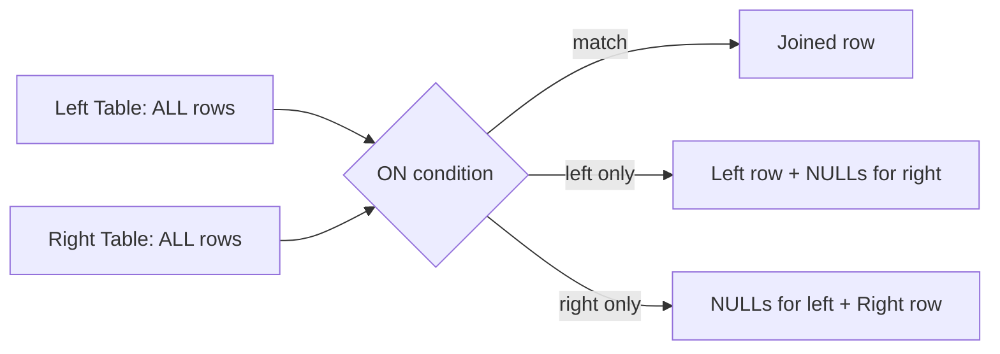
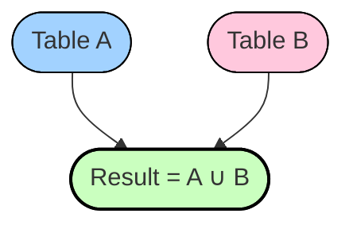

# :material-set-all: :material-web: Full Outer Join

A **Full Outer Join** returns **all rows** from both tables:

- All rows from the **left** table
- All rows from the **right** table
- Matches where possible, and `NULL`s where there is no match


### :material-sitemap: Overview



---

## :material-clipboard-list-outline: Example

### :material-animation-play: Interactive Visualization

<div id="viz-join-full" class="ts-viz"></div>

```sql
SELECT
  *
FROM
  employees
FULL OUTER JOIN
  departments
ON
  employees.dept_no = departments.id;
```

---

## :material-pencil-outline: Result Explained

- **All employees** are included, even if they don't belong to a department.
- **All departments** are included, even if they have no employees.
- Non-matching columns are filled with `NULL`.

---

## :material-image-frame:️ Visual Representation

| employees.dept_no | employees.name | departments.id | departments.name |
|:-----------------:|:--------------|:--------------:|:----------------|
| 1                 | Alice         | 1              | HR              |
| 2                 | Bob           | NULL           | NULL            |
| NULL              | NULL          | 3              | IT              |

---

## :material-lightbulb-outline: Real-World Use Cases

- **Customers vs Orders:** Find customers with and without orders, and orders without matching customers.
- **Employees vs Departments:** List all employees and departments, even if some are unassigned or empty.
- **System Logs:** Merge logs from two sources and see all entries, including those without a match.

---

## :material-lightning-bolt: Performance Notes

- A full outer join **shuffles both datasets** (like a sort-merge join).
- Can be **expensive** for very large datasets.
- If one dataset is small, you can **broadcast** it, but Spark **does not support broadcast** with full outer join (only inner, left, right joins).

---

## :material-target: Diagram



**Full Outer Join Result = All of A + All of B (matches + non-matches).**

---

## :material-scale-balance: Reconciliation Diagnostic

A full outer join is the go-to tool for **reconciling two datasets** — proving which keys
exist only on one side versus both. Bucket the result into `only_a` / `only_b` / `matched`
in a single pass:

```sql
SELECT
    SUM(CASE WHEN b.id IS NULL                        THEN 1 ELSE 0 END) AS only_a,
    SUM(CASE WHEN a.id IS NULL                        THEN 1 ELSE 0 END) AS only_b,
    SUM(CASE WHEN a.id IS NOT NULL AND b.id IS NOT NULL THEN 1 ELSE 0 END) AS matched
FROM a
FULL OUTER JOIN b ON a.id = b.id;
-- only_a  only_b  matched
-- 1       1       2          -- e.g. a={1,2,3}, b={2,3,4}
```

| Bucket    | Meaning                                   | Typical follow-up                     |
|-----------|-------------------------------------------|---------------------------------------|
| `only_a`  | Rows present in **A** but missing from B  | Orphaned/unmigrated source records    |
| `only_b`  | Rows present in **B** but missing from A  | Extra/stale target records to purge   |
| `matched` | Keys present on **both** sides            | Candidates for value-level comparison |

!!! tip "Prefer a targeted anti-join when you only need one side"
    If you just need the *unmatched* rows (not the full reconciliation counts), a
    [Left Anti Join](../left_anti.md) is cheaper than a full outer join — it skips
    materializing the matched rows entirely.

---
