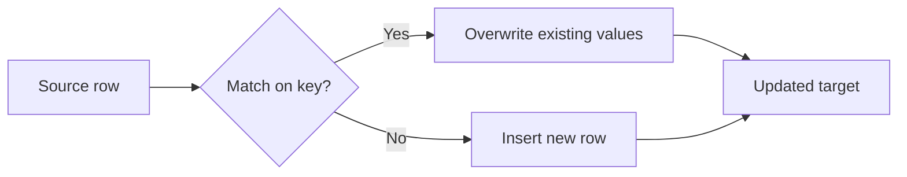

# :material-pencil: Demo

### :material-sitemap: Overview



```sql
-- Step 1: Find records that changed or are new
WITH changes AS (
  SELECT
    s.customer_id,
    s.name,
    s.city,
    d.name AS old_name,
    d.city AS old_city,
    d.is_current
  FROM stg_customer s
  LEFT JOIN dim_customer d
    ON s.customer_id = d.customer_id
    AND d.is_current = true
),
changed_or_new AS (
  SELECT
    customer_id,
    name,
    city
  FROM changes
  WHERE old_name IS NULL OR old_city != city
)
-- Step 2: Expire old records in dim_customer
UPDATE dim_customer
SET end_date = current_date() - INTERVAL 1 DAY,
    is_current = false
WHERE customer_id IN (SELECT customer_id FROM changed_or_new)
AND is_current = true;
--- Step 3: Insert new versions into dim_customer
INSERT INTO dim_customer
SELECT
  customer_id,
  name,
  city,
  current_date() AS start_date,
  DATE('9999-12-31') AS end_date,
  true AS is_current
FROM changed_or_new;
```

## Merge

```sql
MERGE INTO dim_customer AS d
USING stg_customer AS s
ON d.customer_id = s.customer_id AND d.is_current = true
WHEN MATCHED AND (d.name != s.name OR d.city != s.city) THEN
  UPDATE SET d.end_date = current_date() - INTERVAL 1 DAY, d.is_current = false
WHEN NOT MATCHED THEN
  INSERT (customer_id, name, city, start_date, end_date, is_current)
  VALUES (s.customer_id, s.name, s.city, current_date(), DATE('9999-12-31'), true);
```
