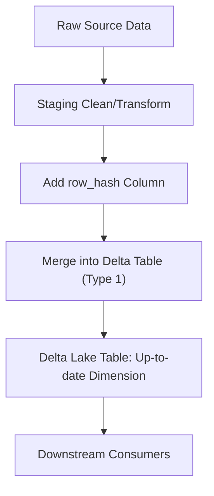

# Introduction

## Definition

Overwrites existing records when changes occur.

1. Replaces old data with new data.
2. No history is maintained.

## Use Case

When history is not important, and only the latest data matters.

## Best Practices

### 1. Use a Surrogate Key (Optional but Recommended)

Helps in database joins, even if business keys change.

### 2.  Use Delta Lake for Merge Support

1. Supports ACID transactions.
2. Optimized for upserts (insert/update).
3. Enables MERGE INTO which simplifies Type 1.

### 3. Normalize Business Keys

Use consistent casing and trim whitespace.

### 4. Detect Changes Efficiently

Use a hash column to compare row changes.

### 5. Minimize Write Volume

Update only rows that changed:

```sql
WHEN MATCHED AND src.row_hash <> tgt.row_hash THEN UPDATE SET ...
```

### 6. Ensure Idempotency

Your job should be safe to run multiple times with the same input.

### 7. Partitioning and ZORDER

1. Partition on a logical field like region or customer type.
2. ZORDER on frequently filtered columns for query efficiency.

### 8. Validation Layer

Run unit/data tests post-merge to verify row counts and duplicates.

## Pattern

### SCD Type 1 Design Pattern

#### Assumptions

1. `Business key`: customer_id
2. `Target table`: dim_customer
3. `Columns to track`: name, email, city

#### 🧱 Delta Table Schema

```sql
CREATE TABLE dim_customer (
  customer_id STRING,
  name STRING,
  email STRING,
  city STRING,
  row_hash STRING,
  updated_at TIMESTAMP
)
USING DELTA
PARTITIONED BY (city)
```

#### Load sample data

```sql
INSERT INTO dim_customer (customer_id, name, email, city, row_hash, updated_at)
SELECT
  customer_id,
  name,
  email,
  city,
  md5(concat_ws('||', name, email, city)) AS row_hash,
  current_timestamp() AS updated_at
FROM VALUES
  ("cust1", "Alice", "alice@example.com", "NY"),
  ("cust2", "Bob", "bob@example.com", "CA")
AS tmp(customer_id, name, email, city);
```

#### Create Staging Table

```sql
CREATE OR REPLACE TEMP VIEW staging_customer AS
SELECT * FROM VALUES
  ("cust1", "Alice", "alice@example.com", "NY"),           -- No change
  ("cust2", "Bobby", "bob@newdomain.com", "CA"),           -- Update
  ("cust3", "Charlie", "charlie@example.com", "WA")        -- New insert
AS staging(customer_id, name, email, city);
```

#### 🔄 Merge Statement

```sql
MERGE INTO dim_customer AS tgt
USING (
  SELECT *, md5(concat_ws('||', name, email, city)) AS row_hash
  FROM staging_customer
) AS src
ON src.customer_id = tgt.customer_id

WHEN MATCHED AND src.row_hash <> tgt.row_hash THEN
  UPDATE SET
    tgt.name = src.name,
    tgt.email = src.email,
    tgt.city = src.city,
    tgt.row_hash = src.row_hash,
    tgt.updated_at = current_timestamp()

WHEN NOT MATCHED THEN
  INSERT (
    customer_id, name, email, city, row_hash, updated_at
  )
  VALUES (
    src.customer_id, src.name, src.email, src.city, src.row_hash, current_timestamp()
  )
```

#### Verify the output

```sql
SELECT * FROM dim_customer ORDER BY customer_id;
```

### Workflow Design Pattern



## 🛡️ Common Pitfalls

Pitfall                 | Solution
------------------------|--------------------------------------
Updating unchanged rows | Use `row_hash` to avoid
Duplicate keys          | Validate staging data before merge
Dirty data in source    | Apply transformations and `null` checks
Lack of audit trail     | Add `updated_at` column for tracking

## 🧪 Test Cases to Include

1. ✔ Record exists, no change → no update.
2. ✔ Record exists, value changed → update.
3. ✔ New record → insert.
4. ❌ Duplicate customer_id in source → raise error or deduplicate.

## What to Test in SCD Type 1

Scenario                            | Expectation
------------------------------------|-----------------------------------
New record in source                | Should be inserted
Existing record with changed fields | Should be updated
Existing record with no changes     | Should be left untouched
Duplicate keys in source            | Should be rejected or deduplicated
Missing business key                | Should be logged or failed
Null or invalid values              | Should be validated or defaulted

### Validate with SQL Assertions

#### Check Final Row Count

```sql
SELECT COUNT(*) AS final_count FROM dim_customer;
```

### Check that cust2 was updated

```sql
SELECT * FROM dim_customer WHERE customer_id = 'cust2';
```

### Check that cust1 is unchanged

```sql
SELECT * FROM dim_customer WHERE customer_id = 'cust1';
```

-- Expect: Same as before (Alice, alice@example.com)
### ✅ Check that cust3 was inserted

```sql
SELECT * FROM dim_customer WHERE customer_id = 'cust3';
```
