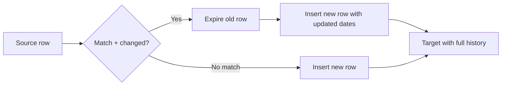

# :material-clock-plus: Demo

### :material-sitemap: Overview



## Simpe cte

### target table

```sql
DROP TABLE IF EXISTS dim_customer;

CREATE TABLE dim_customer (
  customer_id STRING,
  name STRING,
  email STRING,
  city STRING,
  row_hash STRING,
  start_date TIMESTAMP,
  end_date TIMESTAMP,
  is_current BOOLEAN
)
USING DELTA
PARTITIONED BY (city);
```

### Insert Initial Data

```sql
INSERT INTO dim_customer
SELECT
  customer_id,
  name,
  email,
  city,
  md5(concat_ws('||', name, email, city)) AS row_hash,
  current_timestamp() AS start_date,
  NULL AS end_date,
  TRUE AS is_current
FROM VALUES
  ("cust1", "Alice", "alice@example.com", "NY"),
  ("cust2", "Bob", "bob@example.com", "CA")
AS t(customer_id, name, email, city);
```

### source staging table

```sql
CREATE TABLE staging_customer (
  customer_id STRING,
  name STRING,
  email STRING,
  city STRING
);

INSERT INTO staging_customer 
SELECT * FROM VALUES
  ("cust1", "Alice", "alice@example.com", "NY"),          -- Unchanged
  ("cust2", "Bobby", "bob@newdomain.com", "TX"),          -- Changed
  ("cust3", "Charlie", "charlie@example.com", "WA")       -- New insert
AS t(customer_id, name, email, city);
```

### SCD Type 2 Merge Logic

```sql
-- 1. Invalidate current rows if there is a change
-- Step 1: Hash staging data and alias it
WITH staged_data AS (
  SELECT
    customer_id,
    name,
    email,
    city,
    md5(concat_ws('||', name, email, city)) AS row_hash
  FROM staging_customer
),

-- Step 2: Identify changed records (delta updates only)
changed_rows AS (
  SELECT
    tgt.customer_id AS tgt_id,
    tgt.row_hash AS old_hash,
    src.*
  FROM dim_customer AS tgt
  JOIN staged_data AS src
    ON tgt.customer_id = src.customer_id
  WHERE tgt.is_current = TRUE
    AND tgt.row_hash <> src.row_hash
),

-- Step 3: Identify new inserts (not present in current target)
new_customers AS (
  SELECT src.*
  FROM staged_data AS src
  LEFT ANTI JOIN (
    SELECT customer_id
    FROM dim_customer
    WHERE is_current = TRUE
  ) AS tgt
  ON src.customer_id = tgt.customer_id
)

-- Step 4: Apply SCD2 logic

-- 4a: Expire previous versions
UPDATE dim_customer
SET
  end_date = current_timestamp(),
  is_current = FALSE
WHERE customer_id IN (SELECT tgt_id FROM changed_rows)
  AND is_current = TRUE;

-- 4b: Insert updated records and new customers
INSERT INTO dim_customer
SELECT
  customer_id,
  name,
  email,
  city,
  row_hash,
  current_timestamp() AS start_date,
  NULL AS end_date,
  TRUE AS is_current
FROM (
  SELECT * FROM changed_rows
  UNION ALL
  SELECT * FROM new_customers
);
```

## Using merge

```sql
MERGE INTO dim_customer AS tgt
USING (
  SELECT
    customer_id,
    md5(concat_ws('||', name, email, city)) AS row_hash
  FROM staging_customer
) AS src
ON src.customer_id = tgt.customer_id
  AND tgt.is_current = TRUE
  AND tgt.row_hash <> src.row_hash

WHEN MATCHED THEN
  UPDATE SET
    end_date = current_timestamp(),
    is_current = FALSE;

-- Insert new record
MERGE INTO dim_customer AS tgt
USING (
  SELECT
    customer_id,
    name,
    email,
    city,
    md5(concat_ws('||', name, email, city)) AS row_hash
  FROM staging_customer
) AS src
ON tgt.customer_id = src.customer_id
  AND tgt.is_current = TRUE
  AND tgt.row_hash = src.row_hash

-- Do nothing when matched (no changes)
WHEN NOT MATCHED THEN
  INSERT (
    customer_id, name, email, city, row_hash,
    start_date, end_date, is_current
  )
  VALUES (
    src.customer_id, src.name, src.email, src.city, src.row_hash,
    current_timestamp(), NULL, TRUE
  );
```

### Why Two-Step MERGE?

Delta Lake currently does not support:

1. `UPDATE and INSERT in same match clause` with WHEN MATCHED + WHEN NOT MATCHED
2. `Multi-row versioning logic with UPDATE` → INSERT for same row in a single pass

Thus, two MERGE statements are the safe and clean pattern for full SCD2 in SQL.

## Simple insert and update

### target table

```sql
CREATE TABLE IF NOT EXISTS dim_customer (
  customer_id INT,
  name STRING,
  city STRING,
  start_date DATE,
  end_date DATE,
  is_current BOOLEAN
);
```

### source staging table

```sql
CREATE TABLE IF NOT EXISTS stg_customer (
  customer_id INT,
  name STRING,
  city STRING
);
```

### 1. Expire old records in dim_customer if the data has changed

```SQL
UPDATE dim_customer
SET end_date = current_date() - INTERVAL 1 DAY,
    is_current = false
WHERE is_current = true
  AND customer_id IN (
    SELECT s.customer_id
    FROM stg_customer s
    JOIN dim_customer d
      ON s.customer_id = d.customer_id
    WHERE d.is_current = true
      AND (s.name != d.name OR s.city != d.city)
  );

```

### 2. Insert new records from staging where:

1. The record is new, or
2. It has changed from the current version

```sql
INSERT INTO dim_customer
SELECT
  s.customer_id,
  s.name,
  s.city,
  current_date() AS start_date,
  DATE('9999-12-31') AS end_date,
  true AS is_current
FROM stg_customer s
LEFT JOIN dim_customer d
  ON s.customer_id = d.customer_id AND d.is_current = true
WHERE d.customer_id IS NULL
   OR s.name != d.name
   OR s.city != d.city;
```
