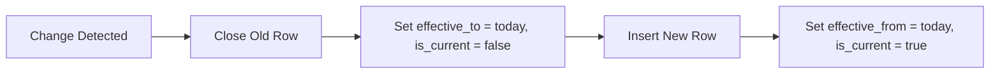

# :material-clock-plus: SCD Type 2

Type 2 preserves history by inserting a new row for each change and marking
previous rows as no longer current.

### :material-sitemap: Overview



---

## 📌 Key Columns

| Column | Purpose |
|--------|---------|
| `effective_from` | Start date of version |
| `effective_to` | End date (NULL for current) |
| `is_current` | Current row flag |

---

## 🧪 Example Pattern

```sql
UPDATE dim_customer
SET is_current = false, effective_to = current_date()
WHERE customer_id = 10 AND is_current = true;

INSERT INTO dim_customer
SELECT customer_id, name, current_date(), NULL, true
FROM staging_customer;
```

---

## 🧠 When to Use

| Scenario | Recommendation |
|----------|----------------|
| Full history tracking | Use Type 2 |
| Slowly changing attributes | Type 2 pattern |
