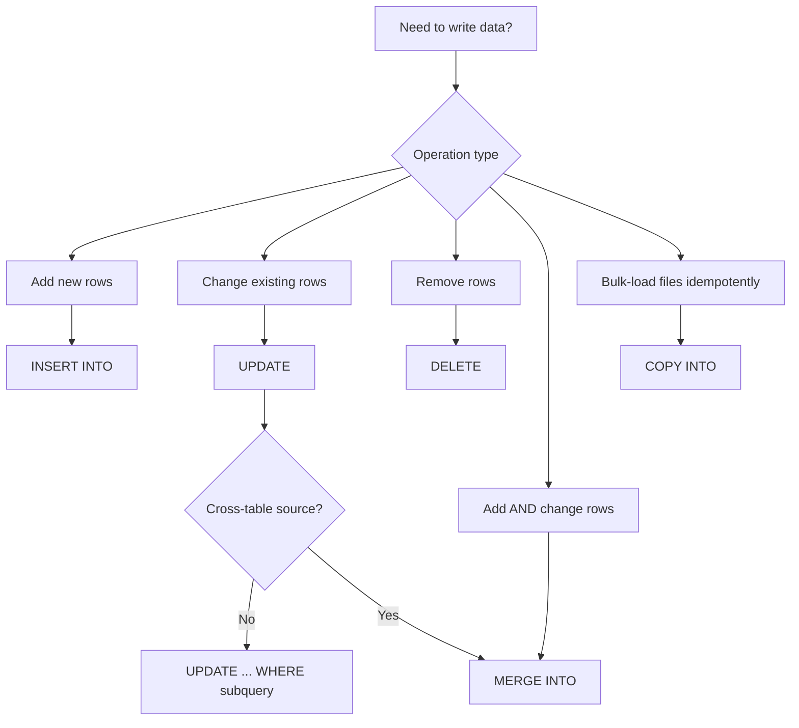

# :material-table-edit: DML — Data Manipulation Language

DML statements modify the **contents** of tables without changing their schema.
In Spark SQL, write support depends on the table format —
Delta Lake enables the full set of operations, while Hive/Parquet tables support only `INSERT`.

---

## :material-table-of-contents: In This Section

| Statement | Description |
|-----------|-------------|
| [INSERT](table/insert.md) | Append rows, overwrite partitions, or seed literal values |
| [UPDATE](table/update.md) | Modify existing rows in-place (Delta only) |
| [DELETE](table/delete.md) | Remove rows matching a condition (Delta only) |
| [MERGE INTO](table/merge.md) | Atomic upsert — INSERT + UPDATE + DELETE in one statement |
| [COPY INTO](table/copy_into.md) | Idempotent bulk-load from cloud storage files |

---

## :material-sitemap: DML Decision Flow



---

## :material-compare: Format Support Matrix

| Operation | Delta | Parquet | Hive/ORC | CSV/JSON |
|-----------|:-----:|:-------:|:--------:|:--------:|
| `INSERT INTO` | :material-check: | :material-check: | :material-check: | :material-check: |
| `INSERT OVERWRITE` | :material-check: | :material-check: | :material-check: | :material-close: |
| `TRUNCATE TABLE` | :material-check: | :material-close: | :material-check: | :material-close: |
| `UPDATE` | :material-check: | :material-close: | :material-close: | :material-close: |
| `DELETE` | :material-check: | :material-close: | :material-close: | :material-close: |
| `MERGE INTO` | :material-check: | :material-close: | :material-close: | :material-close: |
| `COPY INTO` | :material-check: | :material-close: | :material-close: | :material-close: |

!!! tip "Use Delta for all writable tables"
    If `UPDATE`, `DELETE`, or `MERGE` are needed, the table **must** be Delta format.
    Convert with `CONVERT TO DELTA parquet.\`path\`` to migrate existing tables.

---

## :material-key: Key Concepts

| Concept | Details |
|---------|---------|
| **ACID transactions** | Delta wraps every DML in a transaction — failures leave the table unchanged |
| **Schema enforcement** | Spark validates column types on write; mismatches raise `AnalysisException` |
| **Partition pruning on write** | `INSERT OVERWRITE PARTITION(...)` rewrites only targeted partitions |
| **Optimistic concurrency** | Concurrent writes to different partitions succeed; same-partition conflicts retry or fail |
| **File rewrite model** | `UPDATE`/`DELETE` rewrite affected data files — old files remain until `VACUUM` |
| **Idempotency** | `COPY INTO` tracks loaded files — safe to re-run |

---

## :material-flask-outline: Quick Examples

```sql
-- Append rows
INSERT INTO orders SELECT * FROM staging WHERE load_date = current_date();

-- Replace a partition
INSERT OVERWRITE orders PARTITION (order_date = '2024-06-01')
SELECT order_id, customer_id, amount FROM staging WHERE order_date = '2024-06-01';

-- Update in-place (Delta)
UPDATE customers SET tier = 'Gold' WHERE total_spend >= 10000;

-- Delete stale rows (Delta)
DELETE FROM events WHERE event_date < date_sub(current_date(), 365);

-- Upsert (Delta)
MERGE INTO customers AS t USING staging AS s ON t.id = s.id
WHEN MATCHED THEN UPDATE SET *
WHEN NOT MATCHED THEN INSERT *;

-- Idempotent file load (Delta)
COPY INTO raw_events FROM 's3://landing/events/' FILEFORMAT = JSON;
```

---

## :material-link: Related Sections

- [Data Sources](../../data-sources/index.md) — `CREATE TABLE USING format`
- [SCD Patterns](../../patterns/scd/index.md) — Multi-step MERGE for Type 2 / 6
- [Views](../view/index.md) — Materialised views vs temp views
