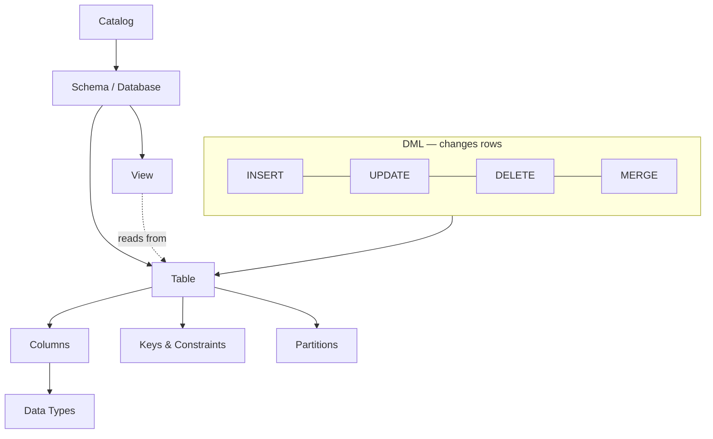
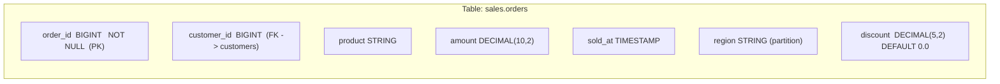
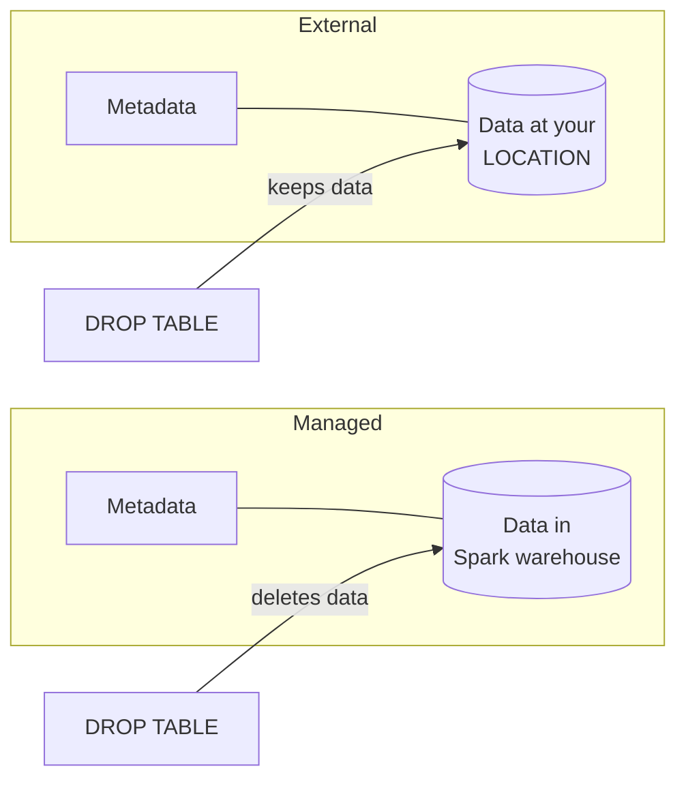

# :material-table-multiple: Schema & Table

The foundation of Spark SQL — defining structure, enforcing types, and organising
data into catalogs, schemas, tables, columns, keys, and views.

Everything you *query* first has to be *modelled*. This section is the modelling
half of Spark SQL: how data is shaped, typed, constrained, and exposed before a
single `SELECT` runs.

---

## :material-sitemap: The Mental Model

Spark organises objects in a three-level namespace. A **table** is the atom of
storage; **columns**, **types**, **keys**, and **views** describe and reshape it,
while **DML** changes the rows inside it.



An object's fully-qualified name always has **three parts**:

```sql
SELECT * FROM main.sales.orders;
--            └┬─┘ └─┬─┘ └─┬──┘
--          catalog schema table
```

!!! note "Defaults fill in the gaps"
    Write `orders` and Spark expands it to `<current_catalog>.<current_schema>.orders`
    using `USE CATALOG` / `USE SCHEMA`. Always qualify names in production jobs so a
    changed session context can never silently point a query at the wrong table.

---

## :material-compass-outline: Topics

| Topic | What You'll Find |
|-------|-------------------|
| :material-table: [Tables](table/index.md) | Managed & external tables, metadata, partitioning |
| :material-table-column: [Columns](column/index.md) | Selection, aliases, casting, derived, nested, defaults |
| :material-format-text: [Data Types](types/index.md) | Primitives, datetime, complex types, VARIANT |
| :material-key: [Keys & Constraints](key/index.md) | Primary, foreign, composite, surrogate, natural keys |
| :material-eye: [Views](view/index.md) | Temporary, global, permanent views and use cases |
| :material-table-edit: [DML](dml/index.md) | INSERT, UPDATE, DELETE, MERGE, COPY INTO |

---

## :material-table-large: Anatomy of a Table

A table is a named, typed grid of rows. Each **column** has a name, a **data type**,
optional **constraints**, and an optional **default**. Some columns act as **keys**.



| Piece | Example | Why it matters |
|-------|---------|----------------|
| Column name | `order_id` | Stable contract for downstream queries |
| Data type | `DECIMAL(10, 2)` | Correctness (money ≠ `DOUBLE`) and storage size |
| Constraint | `NOT NULL`, `PRIMARY KEY` | Data-quality guarantees |
| Default | `DEFAULT 0.0` | Back-fills new columns without rewriting rows |
| Partition | `PARTITIONED BY (region)` | Prunes files at query time |

---

## :material-pin: Quick Reference

=== ":material-plus-box: Create"

    ```sql
    -- Managed table (Spark owns the data + metadata)
    CREATE TABLE sales.orders (
        order_id     BIGINT       NOT NULL,
        customer_id  BIGINT,
        product      STRING,
        amount       DECIMAL(10, 2),
        sold_at      TIMESTAMP,
        region       STRING
    )
    USING DELTA
    PARTITIONED BY (region)
    COMMENT 'Fact table of completed orders';

    -- External table (you own the data; Spark stores only metadata)
    CREATE TABLE sales.raw_events (
        event_id  STRING,
        payload   VARIANT,
        ingested  TIMESTAMP
    )
    USING DELTA
    LOCATION 's3://lake/bronze/events/';

    -- Create from a query (schema is inferred)
    CREATE TABLE sales.top_regions AS
    SELECT region, SUM(amount) AS total
    FROM sales.orders
    GROUP BY region;
    ```

=== ":material-pencil-box: Alter"

    ```sql
    -- Add a column with a default (no full rewrite on Delta)
    ALTER TABLE sales.orders ADD COLUMN discount DECIMAL(5, 2) DEFAULT 0.0;

    -- Rename and change comments
    ALTER TABLE sales.orders RENAME COLUMN product TO product_name;
    ALTER TABLE sales.orders ALTER COLUMN amount COMMENT 'Gross order value';

    -- Add a data-quality constraint (Delta)
    ALTER TABLE sales.orders
        ADD CONSTRAINT positive_amount CHECK (amount >= 0);
    ```

=== ":material-magnify: Inspect"

    ```sql
    -- Structure, partitioning, and location
    DESCRIBE EXTENDED sales.orders;

    -- Just the columns and types
    DESCRIBE sales.orders;

    -- List objects in a schema
    SHOW TABLES IN sales;
    SHOW VIEWS IN sales;

    -- The exact DDL Spark stored
    SHOW CREATE TABLE sales.orders;
    ```

=== ":material-eye-plus: View"

    ```sql
    CREATE OR REPLACE VIEW sales.monthly_sales AS
    SELECT
        region,
        DATE_TRUNC('month', sold_at) AS month,
        SUM(amount)                  AS total
    FROM sales.orders
    GROUP BY ALL;
    ```

=== ":material-table-sync: DML"

    ```sql
    -- Insert
    INSERT INTO sales.orders
    VALUES (1, 42, 'Widget', 120.00, TIMESTAMP '2024-01-15 09:00:00', 'East');

    -- Update / Delete (Delta only)
    UPDATE sales.orders SET amount = amount * 1.05 WHERE region = 'East';
    DELETE FROM sales.orders WHERE sold_at < DATE '2020-01-01';

    -- Upsert with MERGE
    MERGE INTO sales.orders AS t
    USING staging.orders AS s
    ON t.order_id = s.order_id
    WHEN MATCHED THEN UPDATE SET *
    WHEN NOT MATCHED THEN INSERT *;
    ```

---

## :material-format-list-bulleted-type: Data Type Cheat Sheet

| Category | Types | Use for |
|----------|-------|---------|
| Integer | `TINYINT`, `SMALLINT`, `INT`, `BIGINT` | Counts, IDs, surrogate keys |
| Decimal | `DECIMAL(p, s)` | Money, exact fractions (never `FLOAT`) |
| Floating | `FLOAT`, `DOUBLE` | Scientific / approximate measures |
| String | `STRING`, `CHAR(n)`, `VARCHAR(n)` | Text, codes, labels |
| Boolean | `BOOLEAN` | Flags |
| Datetime | `DATE`, `TIMESTAMP`, `TIMESTAMP_NTZ` | Points in time |
| Interval | `INTERVAL` | Durations, date arithmetic |
| Complex | `ARRAY<T>`, `MAP<K,V>`, `STRUCT<...>` | Nested / repeated fields |
| Semi-structured | `VARIANT` | Schema-flexible JSON-like data |

!!! tip "Pick the narrowest correct type"
    `BIGINT` for a boolean flag wastes 7 bytes per row; `DOUBLE` for currency
    introduces rounding drift. Right-sizing types improves both storage and scan
    speed. See [Data Types](types/index.md) and [VARIANT](types/variant/index.md).

---

## :material-compare: Managed vs External Tables



| Aspect | Managed | External |
|--------|---------|----------|
| Data ownership | Spark / warehouse | You (explicit `LOCATION`) |
| `DROP TABLE` | Deletes metadata **and** data | Deletes metadata only |
| Best for | Derived / curated tables | Shared lakes, raw landing zones |
| Storage path | Auto (warehouse dir) | You specify |

Deep dive: [Tables](table/index.md).

---

## :material-map-marker-path: Learning Path

Work through the section in this order — each topic builds on the previous one:

1. :material-table: **[Tables](table/index.md)** — create, describe, partition.
2. :material-table-column: **[Columns](column/index.md)** — select, alias, cast,
   [derive](column/derived.md), and reach into [nested](column/nested.md) fields.
3. :material-format-text: **[Data Types](types/index.md)** — primitives, datetime,
   complex, and [VARIANT](types/variant/index.md).
4. :material-key: **[Keys & Constraints](key/index.md)** — [primary](key/primary_key.md),
   [foreign](key/foreign_key.md), and [Delta constraints](key/delta_constraints.md).
5. :material-eye: **[Views](view/index.md)** — [types](view/types.md) and reuse patterns.
6. :material-table-edit: **[DML](dml/index.md)** — [INSERT](dml/table/insert.md),
   [UPDATE](dml/table/update.md), [DELETE](dml/table/delete.md),
   [MERGE](dml/table/merge.md), [COPY INTO](dml/table/copy_into.md).

---

## :material-lightbulb-outline: Best Practices

!!! success "Do"
    - Prefer **Delta** format for full DML support (UPDATE, DELETE, MERGE, time travel).
    - Use **partitioning** on low-to-moderate cardinality filter columns (date, region) —
      not on high-cardinality keys like `order_id`.
    - Define **NOT NULL** and **CHECK** constraints on critical columns for data quality.
    - Use the **VARIANT** type for semi-structured data instead of raw JSON strings.
    - Always **fully-qualify** table names (`catalog.schema.table`) in jobs.
    - Leverage **lateral column alias** (Spark 4.0) to simplify complex expressions —
      see [Lateral Alias](column/lateral_alias.md).

!!! failure "Avoid"
    - `FLOAT` / `DOUBLE` for money — use `DECIMAL(p, s)`.
    - Over-partitioning on high-cardinality columns (creates millions of tiny files).
    - Relying on session defaults for the current catalog/schema in production code.
    - Storing dates as `STRING` — you lose type-safe comparisons and date math.

!!! warning "Constraints are enforced differently"
    Spark records `PRIMARY KEY` / `FOREIGN KEY` as **informational** metadata (used by
    the optimizer) but does **not** enforce uniqueness. Delta `CHECK` and `NOT NULL`
    constraints **are** enforced on write. See [Keys & Constraints](key/index.md).
