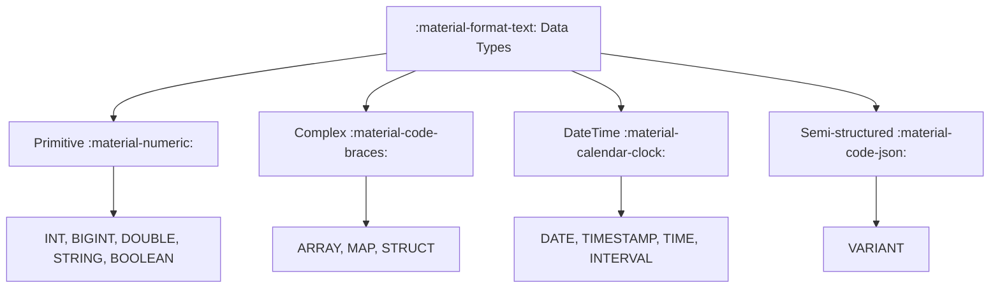

# :material-format-text: Data Types Overview

Spark SQL supports primitive, datetime, and complex data types. Understanding
types helps avoid casting errors and improves query performance.

### :material-sitemap: Overview



---

## :material-pin: Type Categories

| Category | Examples |
|----------|----------|
| Primitive | `INT`, `STRING`, `BOOLEAN` |
| Decimal | `DECIMAL(10,2)` |
| Datetime | `DATE`, `TIMESTAMP`, `TIME` |
| Complex | `ARRAY`, `MAP`, `STRUCT` |
| Semi-structured | [`VARIANT`](variant/index.md) :material-new-box: |
| Collated strings | `STRING COLLATE UTF8_LCASE` :material-new-box: |

---

## :material-flask-outline: Example

```sql
CREATE TABLE demo (
  id INT,
  created_at TIMESTAMP,
  tags ARRAY<STRING>
);
```

---

## :material-brain: When to Use

| Scenario | Recommendation |
|----------|----------------|
| Exact precision | Use `DECIMAL` |
| Time analytics | Use `TIMESTAMP` |
| Nested data | Use complex types |

---

### Related Guides

- [Datatype Reference](datatype/index.md)
- [Datetime Types](datatype/datetime/index.md)
- [Complex Types](datatype/complextype/arrays/array_data_type.md)
