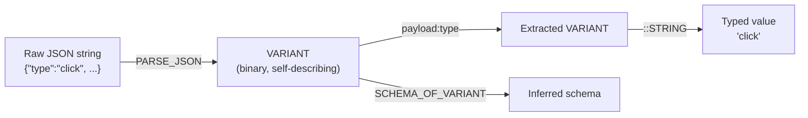
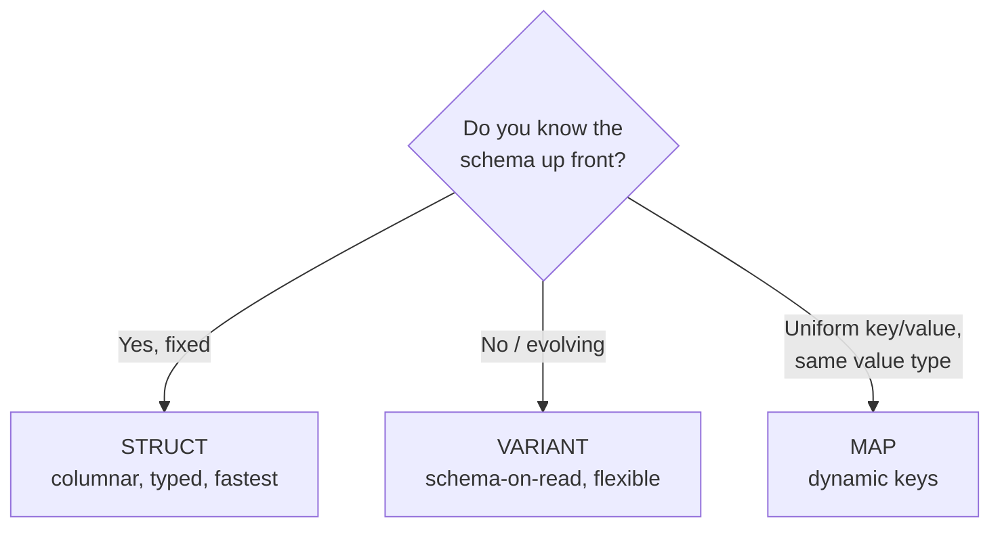

# :material-code-json: VARIANT Data Type

!!! info "Spark 4.0"
    The VARIANT data type is new in Apache Spark 4.0.

The **VARIANT** type stores semi-structured data (JSON-like) without requiring a
fixed schema. Values are held in an optimized binary format and queried with the
`:` field-extraction and `::` cast operators — giving you **schema-on-read**:
ingest raw JSON now, decide its shape at query time.

---

## :material-lightbulb-outline: Why VARIANT?

Traditional options force a trade-off. A rigid `STRUCT` breaks the moment an
upstream producer adds a field; a raw JSON `STRING` is flexible but slow (re-parsed
on every access) and un-queryable. VARIANT keeps the flexibility of JSON **and** the
speed of a binary, indexed encoding.



!!! success "Use VARIANT when"
    - The schema is **unknown, evolving, or heterogeneous** (one column, many shapes).
    - You ingest **third-party JSON / webhook / event** payloads.
    - You want to **land raw now, model later** without an `ALTER TABLE` migration.

!!! failure "Prefer STRUCT when"
    - The schema is **known and stable** — columnar `STRUCT` is faster and enforces types.

---

## :material-pin: Creating VARIANT Values

```sql
-- From a JSON string
SELECT PARSE_JSON('{"name": "Alice", "age": 30}') AS v;

-- Nested objects and arrays are preserved
SELECT PARSE_JSON('{"items": [1, 2, 3], "nested": {"key": "val"}}') AS v;

-- Fault-tolerant parsing (returns NULL instead of erroring on bad JSON)
SELECT TRY_PARSE_JSON('{not valid}') AS v;   -- NULL

-- Build a VARIANT object from a STRUCT
SELECT TO_VARIANT_OBJECT(NAMED_STRUCT('id', 1, 'tier', 'gold')) AS v;
```

---

## :material-key: Field Extraction

### Dot Notation (`:` operator)

```sql
SELECT v:name              FROM events;  -- top-level field (returns VARIANT)
SELECT v:metadata.version  FROM events;  -- nested path
SELECT v:items[0]          FROM events;  -- array indexing
SELECT v:items[0].id       FROM events;  -- index then field
```

### Type Casting (`::`)

Extraction returns VARIANT; append `::<type>` to get a concrete SQL value.

```sql
SELECT v:price::DECIMAL(10, 2) FROM products;
SELECT v:name::STRING          FROM products;
SELECT v:active::BOOLEAN       FROM products;
```

### Bracket Notation

Use brackets for keys containing dots or special characters — dot access would
otherwise treat them as a nested path.

```sql
SELECT v:['field-name']::STRING   FROM events;
SELECT v:['promo.code']::STRING   FROM events;   -- literal key 'promo.code'
```

---

## :material-function: VARIANT Functions

| Function | Description |
|----------|-------------|
| `parse_json(str)` | Parse a JSON string into VARIANT (errors on bad input) |
| `try_parse_json(str)` | Parse, returning NULL on invalid JSON |
| `variant_get(v, path, type)` | Extract a path with an explicit result type |
| `try_variant_get(v, path, type)` | Extract, returning NULL on a cast failure |
| `to_variant_object(struct)` | Build a VARIANT object from a STRUCT/MAP |
| `typeof(v)` | Runtime type name (`'string'`, `'array'`, `'object'`, …) |
| `is_variant_null(v)` | Distinguish a JSON `null` from SQL `NULL` |
| `schema_of_variant(v)` | Infer the schema of a single VARIANT value |
| `schema_of_variant_agg(v)` | Infer a unified schema across a whole column |

!!! tip "`:` vs `variant_get`"
    `payload:user.id::BIGINT` and `variant_get(payload, '$.user.id', 'BIGINT')` are
    equivalent. The `:` operator reads better inline; the function form is handy when
    the path is a **parameter** or built dynamically.

---

## :material-flask-outline: Full Runnable Example

The file below is executed verbatim by the test-suite — every query is guaranteed
to run on Spark 4. It builds a heterogeneous event stream and walks through
extraction, bracket keys, typing, NULL semantics, exploding arrays, constructing
VARIANT, a persisted column, and an analytics rollup.

```sql
--8<-- "sql/types/variant/variant.sql"
```

---

## :material-chart-box-outline: Real-World Demo — Event Analytics

A single VARIANT column can back a full analytics query even when every row has a
different shape. Here, revenue and event counts per user tier are computed directly
from the payload — no upfront flattening, no schema migration.

```sql
SELECT
    payload:user.tier::STRING AS tier,
    COUNT(*)                                                    AS event_count,
    COUNT(*) FILTER (WHERE payload:type::STRING = 'purchase')   AS purchases,
    ROUND(SUM(payload:amount::DECIMAL(10, 2)), 2)               AS total_revenue
FROM events
WHERE payload:user.tier IS NOT NULL
GROUP BY payload:user.tier::STRING
ORDER BY total_revenue DESC NULLS LAST;
```

| tier | event_count | purchases | total_revenue |
|------|-------------|-----------|---------------|
| silver | 2 | 1 | 89.90 |
| gold | 2 | 1 | 12.50 |

!!! note "Missing fields are `NULL`, not errors"
    `click` events carry no `amount`; the `::DECIMAL` cast yields SQL `NULL` and
    `SUM` simply ignores it. One query spans many payload shapes safely.

---

## :material-code-tags: More Examples

### Runtime Type Checking

```sql
SELECT
    typeof(v:name)   AS name_type,    -- 'string'
    typeof(v:scores) AS scores_type,  -- 'array'
    typeof(v:user)   AS user_type     -- 'object'
FROM events;
```

### NULL Handling

```sql
-- Absent field extracts to SQL NULL
SELECT (v:missing_field IS NULL) FROM events;              -- true

-- Distinguish a literal JSON null
SELECT is_variant_null(v:maybe_null) FROM events;

-- Supply a default downstream
SELECT COALESCE(v:optional::STRING, 'N/A') FROM events;
```

### Exploding VARIANT Arrays

```sql
-- Cast the VARIANT array to a typed ARRAY, then explode
SELECT explode((v:scores)::ARRAY<INT>) AS score
FROM events;
```

### Table with a VARIANT Column

```sql
CREATE TABLE raw_events (
    event_id   BIGINT,
    event_time TIMESTAMP,
    payload    VARIANT
) USING PARQUET;

INSERT INTO raw_events VALUES
    (1, current_timestamp(), PARSE_JSON('{"type": "click", "x": 100, "y": 200}')),
    (2, current_timestamp(), PARSE_JSON('{"type": "scroll", "offset": 450}'));

-- Query without ever declaring the payload schema
SELECT event_id, payload:type::STRING AS event_type
FROM raw_events;
```

---

## :material-compare-horizontal: VARIANT vs Struct vs Map



| Feature | VARIANT | Struct | Map |
|---------|---------|--------|-----|
| Schema required | No | Yes (fixed) | Partial (key/value types) |
| Nested access | `:` dot notation | `.` dot notation | `[]` bracket |
| Mixed value types | Yes | No | No |
| Schema evolution | Automatic | `ALTER TABLE` | Automatic |
| Performance | Good (binary format) | Best (columnar) | Good |
| Best for | Unknown / evolving schemas | Known fixed schemas | Key-value data |

See also: [STRUCT](../datatype/complextype/structs/struct_data_type.md) ·
[Data Types overview](../index.md).
