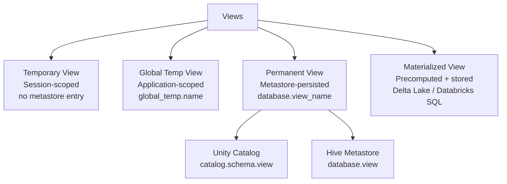
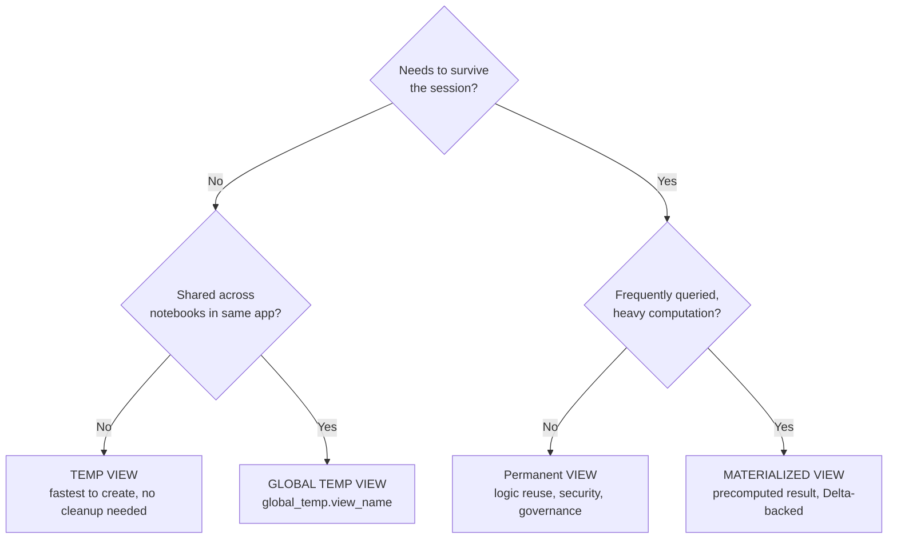

# :material-eye: Views

A **view** is a named SQL query stored in the catalog. Querying a view re-executes
its underlying SQL against the current data — no copy of the data is made
(unless it is a Materialized View).

---

## :material-sitemap: View Type Taxonomy

---

## :material-compare: View Types at a Glance

| Type | Scope | Stored in catalog | Data stored | Access syntax |
|------|-------|:-----------------:|:-----------:|---------------|
| Temp view | Session | No | No | `view_name` |
| Global temp view | Spark app | No (global_temp) | No | `global_temp.view_name` |
| Permanent view | Forever | Yes | No | `db.view_name` |
| Materialized view | Forever | Yes | Yes (Delta) | `catalog.schema.view_name` |

---

## :material-lightbulb: Decision Guide

---

## :material-alert-circle: View vs Table vs CTE

| Feature | View | CTE (`WITH`) | Temp Table (`CTAS`) |
|---------|------|:---:|:---:|
| Stores data | No | No | Yes |
| Persists across queries | Yes (perm) | No | Session / job |
| Queryable by name | Yes | No | Yes |
| Supports predicate pushdown | Yes | Yes | Yes (Parquet) |
| Can index / OPTIMIZE | No | No | Yes (Delta) |
| Best for | Logic reuse, security | Single-query decomposition | Materialized intermediate |

---

## :material-book-open-variant: In This Section

| Page | Contents |
|------|----------|
| [View Overview](view.md) | Lifecycle, DDL commands, behavior notes |
| [Types](types.md) | Temp, global temp, permanent, materialized — full syntax and behavior |
| [Syntax](syntax.md) | Complete DDL reference for all view types |
| [Examples](example.md) | Real-world patterns — layered views, security views, rollup views |
| [FAQ](faq.md) | Common errors and troubleshooting |
