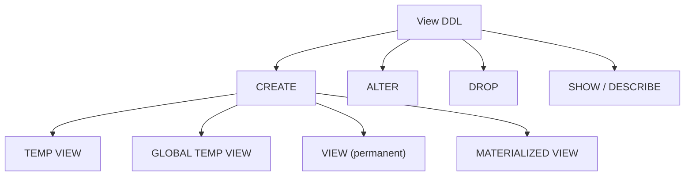

# :material-code-tags: View Syntax

Complete DDL reference for all view types in Spark SQL / Databricks.

---

## :material-sitemap: Syntax Map



---

## :material-plus: CREATE VIEW

### Temporary view

```sql
CREATE [OR REPLACE] TEMP VIEW view_name
  [(col_name [COMMENT 'col_comment'], ...)]  -- optional column aliases
  [COMMENT 'view_comment']
AS query;
```

```sql
-- Minimal
CREATE OR REPLACE TEMP VIEW top_customers AS
SELECT customer_id, SUM(amount) AS lifetime_value
FROM orders
GROUP BY customer_id
HAVING SUM(amount) > 10000;

-- With column aliases and comment
CREATE OR REPLACE TEMP VIEW order_summary
  (order_id COMMENT 'Unique order identifier',
   region   COMMENT 'Normalised region code',
   total    COMMENT 'Order total in USD')
COMMENT 'Cleaned and normalised order summary for current session'
AS
SELECT order_id, LOWER(TRIM(region)), CAST(amount AS DECIMAL(18,2))
FROM raw_orders;
```

### Global temporary view

```sql
CREATE [OR REPLACE] GLOBAL TEMP VIEW view_name
  [COMMENT 'view_comment']
AS query;
```

```sql
CREATE OR REPLACE GLOBAL TEMP VIEW shared_dim_product AS
SELECT product_id, name, category
FROM main.sales.products
WHERE is_published = true;

-- Always use global_temp. prefix to query
SELECT * FROM global_temp.shared_dim_product;
```

### Permanent view

```sql
CREATE [OR REPLACE] VIEW [IF NOT EXISTS]
  [catalog_name.][database_name.]view_name
  [(col_name [COMMENT 'col_comment'], ...)]
  [COMMENT 'view_comment']
AS query;
```

```sql
-- Hive Metastore
CREATE OR REPLACE VIEW analytics.daily_revenue AS
SELECT
    order_date,
    region,
    SUM(amount) AS revenue
FROM analytics.orders
GROUP BY order_date, region;

-- Unity Catalog (three-level namespace)
CREATE OR REPLACE VIEW main.reporting.daily_revenue
COMMENT 'Daily revenue aggregated by region. Refreshes on each query.'
AS
SELECT
    order_date,
    region,
    SUM(amount) AS revenue
FROM main.sales.orders
GROUP BY order_date, region;
```

### Materialized view (Databricks SQL / Unity Catalog)

```sql
CREATE [OR REPLACE] MATERIALIZED VIEW
  [IF NOT EXISTS] catalog.schema.view_name
  [COMMENT 'comment']
  [SCHEDULE [REFRESH] CRON 'cron_expression' [AT TIME ZONE tz]]
AS query;
```

```sql
-- Without scheduled refresh (manual refresh only)
CREATE OR REPLACE MATERIALIZED VIEW main.reporting.mv_weekly_kpi AS
SELECT
    DATE_TRUNC('week', order_date) AS week,
    region,
    COUNT(DISTINCT customer_id)    AS unique_buyers,
    SUM(amount)                    AS total_revenue
FROM main.sales.orders
GROUP BY 1, 2;

-- With automatic daily refresh at 02:00 UTC
CREATE OR REPLACE MATERIALIZED VIEW main.reporting.mv_daily_kpi
COMMENT 'Refreshed daily at 02:00 UTC'
SCHEDULE REFRESH CRON '0 2 * * *' AT TIME ZONE 'UTC'
AS
SELECT order_date, region, SUM(amount) AS revenue
FROM main.sales.orders
GROUP BY order_date, region;
```

---

## :material-pencil: ALTER VIEW

```sql
-- Change the defining query
ALTER VIEW [catalog.][database.]view_name AS new_query;

-- Rename
ALTER VIEW [catalog.][database.]view_name
  RENAME TO [catalog.][database.]new_name;

-- Add or change comment
ALTER VIEW [catalog.][database.]view_name
  SET TBLPROPERTIES ('comment' = 'New description');
```

```sql
ALTER VIEW main.reporting.daily_revenue AS
SELECT
    order_date,
    region,
    channel,                      -- added column
    SUM(amount) AS revenue
FROM main.sales.orders
GROUP BY order_date, region, channel;
```

---

## :material-delete: DROP VIEW

```sql
DROP VIEW [IF EXISTS] [catalog.][database.]view_name;
DROP MATERIALIZED VIEW [IF EXISTS] catalog.schema.view_name;
```

```sql
DROP VIEW IF EXISTS analytics.daily_revenue;
DROP VIEW IF EXISTS global_temp.shared_dim_product;
DROP MATERIALIZED VIEW IF EXISTS main.reporting.mv_weekly_kpi;
```

---

## :material-magnify: SHOW / DESCRIBE

```sql
-- List views in current database
SHOW VIEWS;
SHOW VIEWS IN analytics;
SHOW VIEWS LIKE 'mv_*';

-- Full DDL (shows the AS SELECT clause)
SHOW CREATE TABLE main.reporting.daily_revenue;

-- Column schema
DESCRIBE main.reporting.daily_revenue;

-- Full metadata (owner, properties, creation time)
DESCRIBE TABLE EXTENDED main.reporting.daily_revenue;
```

---

## :material-refresh: REFRESH

```sql
-- Refresh file listing cache for a permanent view's base tables
REFRESH TABLE main.sales.orders;

-- Re-materialise a Materialized View
REFRESH MATERIALIZED VIEW main.reporting.mv_weekly_kpi;
```

---

## :material-key: Privileges (Unity Catalog)

```sql
-- Grant read access on a view
GRANT SELECT ON VIEW main.reporting.daily_revenue TO `analyst@company.com`;
GRANT SELECT ON VIEW main.reporting.daily_revenue TO `role:reporting_team`;

-- Revoke
REVOKE SELECT ON VIEW main.reporting.daily_revenue FROM `analyst@company.com`;

-- Check grants
SHOW GRANTS ON VIEW main.reporting.daily_revenue;
```
