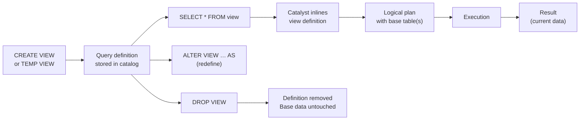

# :material-eye: View Overview

A view stores a SQL query definition in the catalog. Every time you query the view,
Spark re-executes that definition against the current underlying data.

---

## :material-sitemap: View Lifecycle



---

## :material-code-braces: Core DDL Commands

### Create or replace

```sql
-- Permanent view (persists in metastore)
CREATE OR REPLACE VIEW sales_db.active_customers AS
SELECT customer_id, name, region
FROM sales_db.customers
WHERE status = 'active';

-- Temporary view (session-scoped)
CREATE OR REPLACE TEMP VIEW recent_orders AS
SELECT * FROM orders WHERE order_date >= CURRENT_DATE - INTERVAL 7 DAYS;

-- Global temporary view (app-scoped, cross-session)
CREATE OR REPLACE GLOBAL TEMP VIEW shared_products AS
SELECT product_id, name, category FROM products WHERE is_published = true;
```

### Show and describe

```sql
-- List all views in current database
SHOW VIEWS;
SHOW VIEWS IN sales_db;
SHOW VIEWS LIKE 'active_*';

-- Show full DDL including the defining query
SHOW CREATE TABLE sales_db.active_customers;

-- Metadata: owner, comment, creation time, definition
DESCRIBE TABLE EXTENDED sales_db.active_customers;

-- Columns and types only
DESCRIBE sales_db.active_customers;
```

### Alter a view

```sql
-- Change the defining query
ALTER VIEW sales_db.active_customers AS
SELECT customer_id, name, region, tier
FROM sales_db.customers
WHERE status = 'active' AND tier IN ('gold', 'platinum');

-- Rename a view
ALTER VIEW sales_db.active_customers RENAME TO sales_db.premium_customers;
```

### Drop a view

```sql
DROP VIEW IF EXISTS sales_db.active_customers;
DROP VIEW IF EXISTS global_temp.shared_products;  -- global temp
-- TEMP views are dropped automatically at session end; can also drop explicitly:
DROP VIEW IF EXISTS recent_orders;
```

---

## :material-information: Behavior Notes

| Behavior | Detail |
|----------|--------|
| No data storage | Querying a view always re-reads base tables |
| Predicate pushdown | Filters on the view are pushed through to the base table scan |
| Column pruning | Only columns referenced in the outer query are read |
| Schema binding | Spark SQL uses **late binding** — schema is resolved at query time, not creation time |
| Stale after schema change | If a base column is dropped/renamed, the view query fails at runtime |
| Permissions | In Unity Catalog: grant privileges on the **view** — base table privileges flow through |
| Circular views | Not allowed — Catalyst detects and rejects cycles |

---

## :material-shield-check: Security Views (Column / Row Masking)

Views are the primary way to implement column masking and row-level security without
Unity Catalog column masks (which require Premium tier).

```sql
-- Row-level security: each user sees only their own region
CREATE OR REPLACE VIEW orders_secure AS
SELECT * FROM orders
WHERE region = current_user_region();  -- UDF that returns user's region

-- Column masking: hide PII for non-privileged users
CREATE OR REPLACE VIEW customers_safe AS
SELECT
    customer_id,
    CASE WHEN is_admin() THEN email ELSE '***@***' END AS email,
    region
FROM customers;
```

---

## :material-compare: View vs Materialized View

| Aspect | View | Materialized View |
|--------|------|-------------------|
| Data stored | No | Yes (Delta) |
| Query speed | Base table performance | Fast (pre-computed) |
| Freshness | Always current | Depends on refresh |
| Storage cost | None | Yes |
| Supports DML | No | No (refresh only) |
| Best for | Logic abstraction | Heavy aggregations, dashboards |
