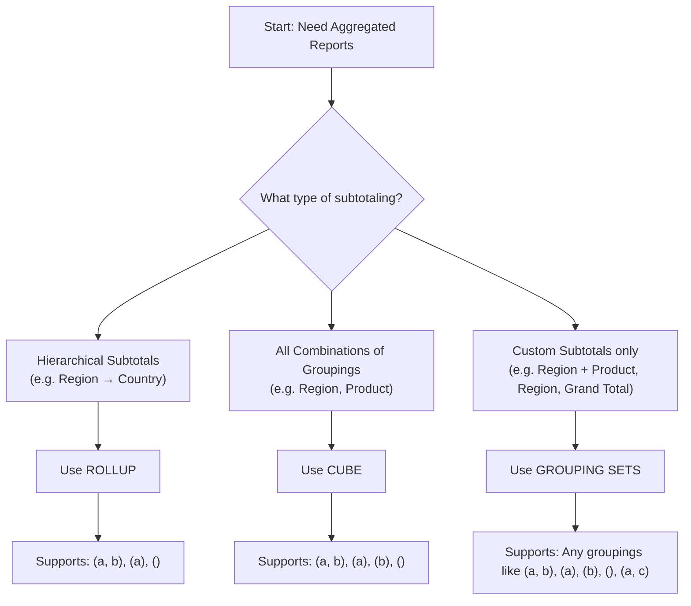

# Cube

The `CUBE` operation in SQL is used in `OLAP (Online Analytical Processing)` to perform `multi-dimensional` analysis.

It helps generate subtotals for all combinations of a set of `dimensions`, including `a grand total`.

CUBE generates all possible combinations of the columns in the `GROUP BY` clause, producing a comprehensive set of grouped aggregations.

In Spark SQL, the CUBE operation is used to generate multiple groupings of data, producing all possible combinations of groupings based on specified columns.

It's similar to ROLLUP but more comprehensive as it generates subtotals and grand totals for all possible combinations of the grouping columns.

## 🔷 Syntax of CUBE

```sql
SELECT 
    column1, 
    column2, 
    ..., 
    AGGREGATE_FUNCTION(column)
FROM table_name
GROUP BY CUBE (column1, column2, ...);
```

## 🔍 What's Happening?

Regular GROUP BY (Region, Product) gives detailed combinations.

CUBE(Region, Product) adds:

1. Subtotals per Region
2. Subtotals per Product
3. A grand total

## ✅ When to Use CUBE

1. When you need all possible subtotal combinations for multi-dimensional data.
2. Especially useful in reporting and BI (Business Intelligence) tools.

## When to Use What?

Use Case                 | Use
-------------------------|--------------
Subtotals with hierarchy | ROLLUP
All possible subtotals   | CUBE
Custom combinations      | GROUPING SETS

## Flow



## Example

Using the same sales table, if you want to calculate total sales for all combinations of date, region, and product:

### 1. Create table

```sql
CREATE TABLE sales_dt (
        date DATE,
        region STRING,
        product STRING,
        amount DOUBLE
);
```

### 2. Load data

```sql
INSERT INTO sales_dt VALUES
    (DATE '2024-07-01', 'East', 'ProductA', 1000.50),
    (DATE '2024-07-01', 'West', 'ProductB', 1500.75),
    (DATE '2024-07-02', 'East', 'ProductA', 1200.25),
    (DATE '2024-07-02', 'West', 'ProductB', 1800.30),
    (DATE '2024-07-03', 'East', 'ProductA', 900.75),
    (DATE '2024-07-03', 'West', 'ProductB', 1600.20);
```

## 3. Query using cube

```sql
    SELECT 
        date,
        region,
        product,
        SUM(amount) AS total_sales
    FROM 
        sales_dt
    GROUP BY 
        CUBE(date, region, product);
```

## Null data handling

```sql
    SELECT
        COALESCE(date, 'All') AS date,
        COALESCE(region, 'All') AS region,
        COALESCE(product, 'All') AS product,
        SUM(amount) AS total_sales,
        GROUPING(date) AS is_date_grouping,
        GROUPING(region) AS is_region_grouping,
        GROUPING(product) AS is_product_grouping
    FROM
        sales_dt
    GROUP BY
        CUBE(date, region, product)
    ORDER BY
        date, region, product;
```
