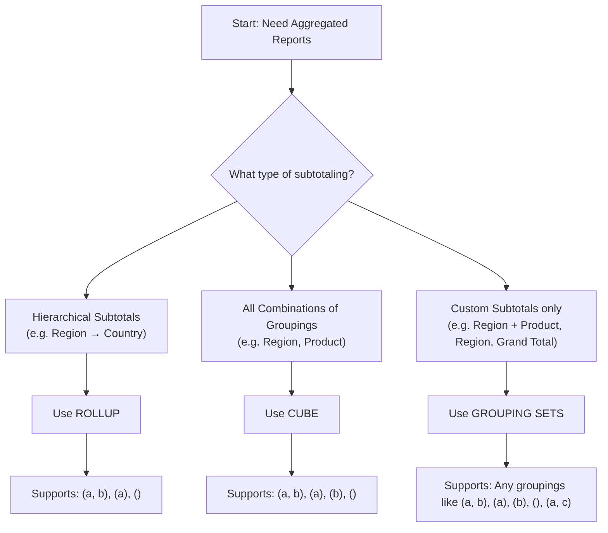

# roll up

In Spark SQL, the ROLLUP operation is used for generating subtotal rows across groups of data.

It's particularly useful in data warehousing and analytics scenarios where you want to summarize data at different levels of aggregation.

ROLLUP generates grouped aggregations in a `hierarchical order`, starting from the `most detailed level and rolling up to higher levels`, including subtotals and a grand total.

## Use Case

When you need `hierarchical or cumulative aggregations`, usually along a hierarchy of columns.

## When to Use What?

Use Case                 | Use
-------------------------|--------------
Subtotals with hierarchy | ROLLUP
All possible subtotals   | CUBE
Custom combinations      | GROUPING SETS

## Flow



## Create table

```sql


CREATE TABLE sales (
        date DATE,
        region STRING,
        amount DOUBLE
)
```

## Load data

```sql

INSERT INTO sales VALUES
(DATE '2024-07-01', 'East', 1000.50),
(DATE '2024-07-01', 'West', 1500.75),
(DATE '2024-07-02', 'East', 1200.25),
(DATE '2024-07-02', 'West', 1800.30),
(DATE '2024-07-03', 'East', 900.75),
(DATE '2024-07-03', 'West', 1600.20);
```

## Query the data

```sql

    SELECT 
        region,
        SUM(amount) AS total_sales
    FROM 
        sales
    GROUP BY 
        ROLLUP(region)
```

## Replacing NULL with Descriptive Labels

GROUPING helps distinguish between actual NULL values and those generated by ROLLUP.

```sql

SELECT
        COALESCE(date, 'All Dates') AS date,
        COALESCE(region, 'All Regions') AS region,
        SUM(amount) AS total_sales,
        GROUPING(date) AS is_date_rollup,
        GROUPING(region) AS is_region_rollup
FROM
        sales
    GROUP BY
        ROLLUP(date, region)
    ORDER BY
        date, region;
```

## Grouping

The GROUPING function returns 1 if the column is a result of a rollup operation (i.e., it's NULL because it's a subtotal or grand total), and 0 otherwise.

## Summary

1. ROLLUP generates subtotal and grand total rows with NULL values.
2. GROUPING helps distinguish between actual NULL values and those generated by ROLLUP.
3. COALESCE can replace NULL values with descriptive labels for better readability.
